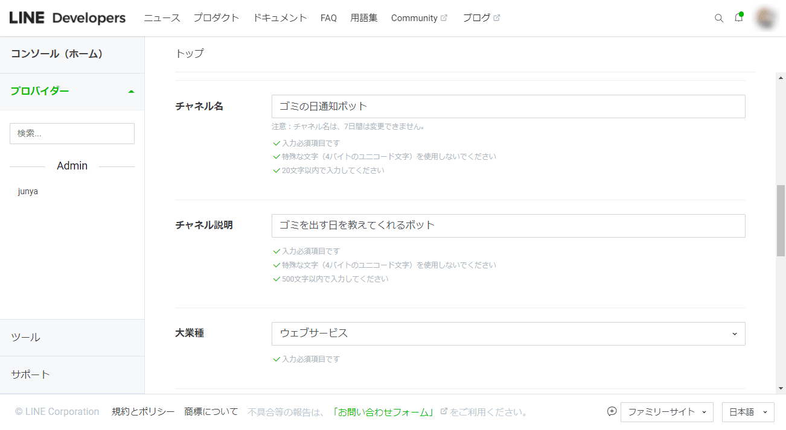
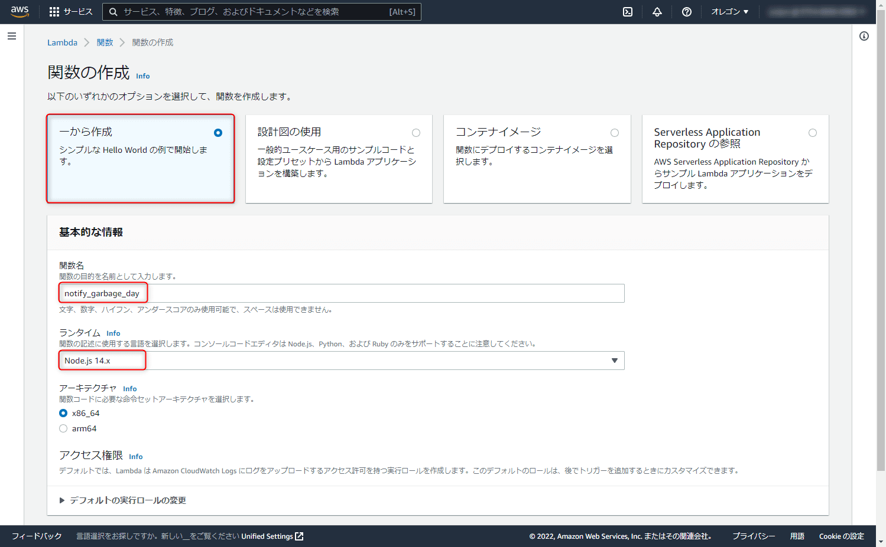
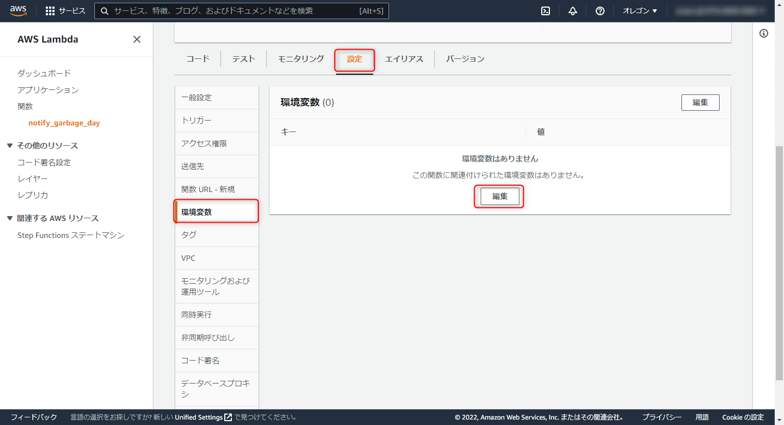
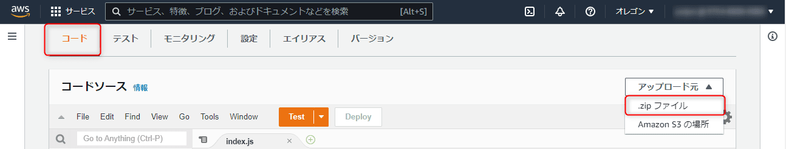

こんにちは、じゅんじゅんです。突然ですが、私の住居では水曜日と日曜日がゴミを出す日です。日曜日は大丈夫なのですが、水曜日は週の真ん中ということもあり気付きにくく、ついゴミを出すのを忘れてしまいます。

ということで「**水曜日と日曜日の21時になったら "ゴミを出せ！" というメッセージを送る LINE Bot**」を Lambda と EventBridge を使ったサーバーレス構成で作成しましたので、作り方を紹介します。

### 対象読者
- AWS 初心者でサーバーレスに興味がある方
- LINE Bot 開発に興味がある方

### 1. LINE Message API の準備
LINE のメッセージを送るには LINE 公式の API である [Message API](https://developers.line.biz/ja/services/messaging-api/) を使用します。今回は任意のタイミングでユーザーにメッセージを送信する「プッシュメッセージ」という機能を使います。ちなみに Message API ではほかにもユーザーからのメッセージに応答したり、友達になってくれたユーザーにメッセージを送信したりできます。

#### LINE デベロッパーコンソールにログイン
[LINE デベロッパーコンソール](https://developers.line.biz/ja/) を開き、右上の「ログイン」をクリックします。

")

自身の LINE アカウントでログインします。

")

#### 新規プロバイダーの作成
ログインできたらまずは**プロバイダー**を作成します。プロバイダーとは、公式で以下のように説明されています。

> サービスを提供し、利用者の情報を取得する個人の開発者、企業、組織のことです。

ようするに開発ユーザーのアカウントです。プロバイダーは複数作成できます。

「プロバイダー」タブから「作成」をクリックします。


「プロバイダー名」に好きな名前を入力したら「作成」をクリックします。


#### チャネルの作成
次に**チャネル**を作成します。チャネルはプロバイダーが Messaging API を使用するための通信路のことです。

作成したプロバイダーページの「チャネル設定」タブから「新規チャネル作成」をクリックします。


「Message API」を選択します。


チャネル名、業種、メールアドレスなど必須項目を入力し、利用規約にチェックを入れたら「作成」をクリックします。



最後に表示される利用規約についての画面で「同意する」をクリックするとチャネルが作成されます。

作成されたチャネルをクリックし、「Message API設定」タブに表示されている QR コードをスマートフォンの LINE でスキャンして友達追加しておきます。

#### チャネルアクセストークンの発行
次に**チャネルアクセストークン**を発行します。チャネルアクセストークンは Messaging API で使用するアクセストークンです。

チャネルのページの「Message API設定」タブから、一番下の「チャネルアクセストークン（長期）」という欄にある「発行」ボタンをクリックします。


すぐに発行されるので控えておきます。


ここまで設定できれば LINE デベロッパーでの設定はいったん終了です。


### 2. Lambda 関数の準備

#### Lambda 関数を新規作成
ではいよいよ Lambda 関数を作成していきます。AWS コンソールにログインし、「サービス」から Lambda を選択したら「関数の作成」ボタンをクリックします。


「一から作成」を選択し、関数名を「notify_garbage_day」、ランタイムは「Node.js 14.x」としておきます。ほかは特に触らずに「関数の作成」ボタンをクリックします。



「notify_garbage_day」関数が作成されました。


#### 環境変数の設定

次に、 Messaging API をたたくために必要な**チャネルアクセストークン**とメッセージの送信先の**ユーザー ID** を環境変数に設定します。「notify_garbage_day」関数のページの「設定」タブから「環境変数」タブ、「編集」をクリックします。



「環境変数の追加」をクリックします。


キーに「ACCESS_TOKEN」、「USER_ID」と入力します。値のほうは、「ACCESS_TOKEN」については先ほど発行した「チャネルアクセストークン」を入力します。「USER_ID」は LINE デベロッパーコンソールの「チャネル基本設定」の一番下にある「あなたのユーザー ID」に記載されている文字列を入力します。


入力できたら「保存」をクリックします。


これで環境変数の設定ができました。

#### index.js の準備

いよいよコーディングをしていきます。作業用ディレクトリを作成したらそのディレクトリで以下のコマンドを実行して npm と LineBot SDK をインストールします。

`npm init`

`npm i @line/bot-sdk`

`index.js` を作成し、以下のように記載します。

```js:title=index.js
const line = require("@line/bot-sdk");

const client = new line.Client({
  channelAccessToken: process.env.ACCESS_TOKEN
});

exports.handler = async event => {
  try {
    const message = {
      "type": "text",
      "text": "ゴミを出せ！"
    };
    
    await client.pushMessage(process.env.USER_ID, message);
  } catch (error) {
    console.log(error);
  }
};
```

`pushMessage` 関数の第一引数に送信先のユーザー ID 、第二引数にメッセージのオブジェクトを指定することで送信できます。

記載ができたら、`index.js` があるディレクトリで `zip -r deploy_package.zip *` コマンドを実行するなどして zip 化します。

以下の記事に zip 化の際の注意点を記載していますので合わせてどうぞ。

> [[AWS] Lambda 実行時に発生するハンドラーやモジュールが見つからないエラーの解決法](https://mseeeen.msen.jp/how-to-solve-lambda-error-that-handler-or-module-cannot-be-found/)

「notify_garbage_day」関数の「コード」タブから「アップロード元」の「.zip ファイル」を選択します。



表示されるダイアログの「アップロード」をクリックし、作成した zip ファイルを選択し、「保存」をクリックします。


これで Lambda によってメッセージを送信する準備ができました。

### 3. EventBridge のルールを作成

最後に EventBridge で毎週水曜日と日曜日の21時に「notify_garbage_day」関数が実行されるよう設定します。

[EventBridge](https://docs.aws.amazon.com/ja_jp/eventbridge/latest/userguide/eb-what-is.html) とは、**イベントを通じてさまざまなアプリケーションどうしを簡単に接続できるようにするサービス**です (元々は CloudWatch Events というサービスでした)。

イベントは今回のようにスケジュールをトリガーにしたり、「Auto Scaring がインスタンスを増減させたら」など別の AWS リソースの状態変化をトリガーにできます。

「notify_garbage_day」関数のページ上部の「トリガーの追加」をクリックします。


「トリガーの設定」のプルダウンから「EventBridge」を選択し、「ルール」は「新規ルールの追加」を選択します。「ルール名」、「ルールの説明」はなんでもいいですが「Wednesday_and_Sunday」、「毎週水曜日と日曜日の21時に実行」としておきます。


「ルールタイプ」は「スケジュール式」を選択し、今回は cron 式でスケジュールを記載します。

cron 式は「分、時間、日、月、曜日、年」を空白で区切って指定していきます (詳しくは[ルールのスケジュール式](https://docs.aws.amazon.com/ja_jp/AmazonCloudWatch/latest/events/ScheduledEvents.html) を参照) 。

毎週水曜日と日曜日の21時なら以下のようになります。

```
cron(0 12 ? * 1,4 *)
```

最初 (一番左) は「分」ですが、21時ちょうどに通知してほしいので「0」にします。

「時間」については、**EventBridge の cron 式はタイムゾーンが UTC（協定世界時）となっている**ため、21時を指定する場合は9時間前の12時にする必要があります。

次に「日」ですが、今回は曜日を水曜日と日曜日に指定するため、特定の日に決まりません。こういう場合は「?」とします。

月と年についてはどの月、年においても適用させたいので、「すべて」を意味する「*」にします。

最後に「1,4」としている曜日ですが、1が日曜日、2が月曜日…と順番に数字が割り振られているため、日曜日と水曜日を表す「1,4」としています。

ではスケジュール式に「cron(0 12 ? * 1,4 *)」と入力して「追加」をクリックします。


「notify_garbage_day」 関数にトリガーを追加できました。


結果、ちゃんと水曜日と日曜日の21時に「ゴミを出せ！」というメッセージが通知されていました！


### まとめ
今回は固定のメッセージを送信していましたが、 DynamoDB などのデータベースと合わせるとよりいろんな用途に活用できそうです。

AWS のサービスを学んでいくにつれて、組み合わせ次第でできることがどんどん増えていくので楽しいですね。

### 参考
- [サーバーレスを学ぼう AWS Lambda DynamoDB API GatewayでLINEボット作成](https://www.amazon.co.jp/%E3%82%B5%E3%83%BC%E3%83%90%E3%83%BC%E3%83%AC%E3%82%B9%E3%82%92%E5%AD%A6%E3%81%BC%E3%81%86-AWS-Lambda-DynamoDB-Gateway%E3%81%A7LINE%E3%83%9C%E3%83%83%E3%83%88%E4%BD%9C%E6%88%90-ebook/dp/B084RM69FX)
- [LINE Developers Messaging APIリファレンス](https://developers.line.biz/ja/reference/messaging-api/)
