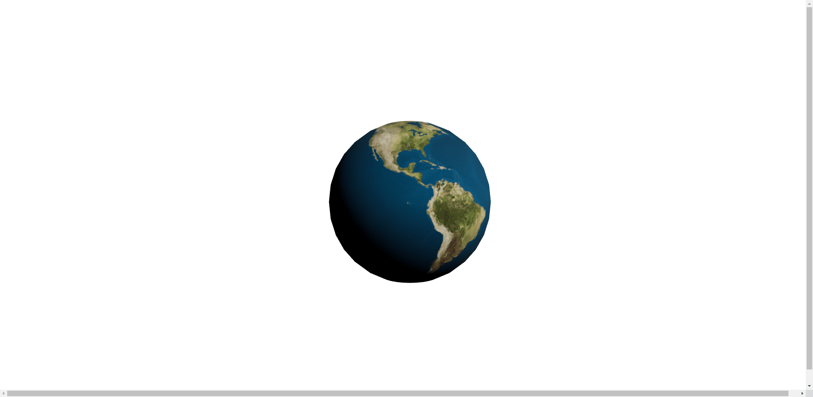

---
title: React Three Fiber で 3D の地球をブラウザに表示させる
date: 
author: junya-gera
tags: [React Three Fiber, Three.js, 3D, React, Web]
description: React Three Fiber を使って 3D の地球をブラウザに表示させる方法を解説します。
--- 

こんにちは、じゅんじゅんです。先日社内の勉強会で前々から興味があった Three.js を使用して 3D の地球をブラウザに表示させる方法を発表しました。

Three.js について調べていたとき、 Three.js を React で記述できる React Three Fiber というライブラリーがあることを知りました。

今回は 3D の地球を React Three Fiber で表示させる方法を Three.js での書き方と比較しながら紹介します。

### 環境

- react: 18.1.0
- @react-three/fiber: 8.0.19
- three: 0.141.0

### 対象読者

- 3D コンテンツの制作に興味がある方
- React で Three.js を扱いたい方

### Three.js で 3D の地球を表示
まずは Three.js で 3D の地球を表示させるコードを紹介します。以下を参考に作成しました。

> [Three.jsをかじる本](https://zenn.dev/sdkfz181tiger/books/735e854bee9fc9)
> [Three.jsのマテリアルの基本](https://ics.media/tutorial-three/material_basic/)

```js:title=three.html
<html>

<head>
  <meta charset="utf-8" />
  <script src="https://unpkg.com/three@0.137.4/build/three.min.js"></script>
  <script>
    window.onload = () => {
      // シーンを作成
      const scene = new THREE.Scene();

      // カメラを作成
      const camera = new THREE.PerspectiveCamera(45, 960 / 540);
      camera.position.set(0, 0, 1000);

      // ライトを作成
      const directionalLight = new THREE.DirectionalLight(0xffffff);
      directionalLight.position.set(1, 1, 1);
      // ライトをシーンに追加
      scene.add(directionalLight);

      // ジオメトリを作成
      const geometry = new THREE.SphereGeometry(300);
      // 画像を読み込む
      const loader = new THREE.TextureLoader();
      const texture = loader.load('./earthmap1k.jpg');
      // マテリアルに画像を設定
      const material = new THREE.MeshStandardMaterial({
        map: texture,
      });
      // メッシュを作成
      const mesh = new THREE.Mesh(geometry, material);
      // 3D空間にメッシュを追加
      scene.add(mesh);

      // レンダラーを作成
      const renderer = new THREE.WebGLRenderer({
        canvas: document.querySelector('#myCanvas'),
      });
      renderer.setSize(width, height);

      function animate() {
        requestAnimationFrame(animate)
        renderer.render(scene, camera)
      }

      animate()
    }

  </script>
</head>

<body>
  <canvas id="myCanvas"></canvas>
</body>

</html>
```

地球の画像は[こちら](http://planetpixelemporium.com/earth.html)のサイトからお借りしました。

このコードによりブラウザに地球が表示されます。
これを React Three Fiber に書き換えていきます。

### React Three Fiber で 3D の地球を表示

#### React Three Fiber の導入
作業ディレクトリを作成したら、以下のコマンドを実行して React Three Fiber をインストールします。

```
npm install three @react-three/fiber
```

#### Canvas コンポーネントを配置

まずは App.js を以下のように記述し、`Canvas` コンポーネントを配置します。

```js:title=App.js
import { Canvas } from '@react-three/fiber';
import './App.css';

const App = () => {
  return (
    <div id="canvas-container">
      <Canvas
        camera={{
          position: [0, 0, 1000],
          aspect: 960 / 540,
        }
      }>
      </Canvas>
    </div >
  );
}

export default App;
```

`Canvas` コンポーネントは、**レンダリングに必要な基本要素であるシーンとカメラを裏側で設定してくれています**。

また、 `Canvas` コンポーネントに対して `camera` プロパティーを記述してカメラの設定ができます。

 Three.js では以下のように記述していた部分です。

```js:title=Three.js
// シーンを作成
const scene = new THREE.Scene();

// カメラを作成
const camera = new THREE.PerspectiveCamera(45, 960 / 540);
camera.position.set(0, 0, 1000);
```

さらに、**Canvas コンポーネントはフレームごとにシーンをレンダリングする役割も持っています**。レンダラーを用意したり、`render` 関数を使用する必要はありません。Three.js では以下の部分です。

```js:title=Three.js
// レンダラーを作成
const renderer = new THREE.WebGLRenderer({
  canvas: document.querySelector('#myCanvas'),
});
renderer.setSize(width, height);

function animate() {
  requestAnimationFrame(animate)
  renderer.render(scene, camera)
}

animate()
```

これらの処理は `Canvas` コンポーネントが舞台裏で行ってくれます。

ここで、 `Canvas` のサイズを設定しておきます。 `Canvas` は親ノードの大きさに合わせて変更されるため、 App.css で `canvas-container` 属性に対して `width` と `height` を以下のように設定して全画面にします。

```css:title=App.css
#canvas-container {
  width: 100vw;
  height: 100vh;
}
```

#### ライトを作成

次はライトを作成します。App.js を以下のように修正します。

```js{12}:title=App.js
import { Canvas } from '@react-three/fiber';
import './App.css';

const App = () => {
  return (
    <div id="canvas-container">
      <Canvas
        camera={{
          position: [0, 0, 1000],
          aspect: 960 / 540,
        }}>
        <directionalLight color="white" position={[1, 1, 1]} />
      </Canvas>
    </div>
  );
}

export default App;
```

`Canvas` コンポーネント下にライトの要素を置くだけでシーンに設置できます。今回は平行光源である `directionalLight` を置いていますが、 `AmbientLight` など他のライトでも同様です。

Three.js ではライトに対して `set()` を使って `color` や `position` を設定していましたが、 react Three Fiber では `directionalLight` 要素の属性として設定できます。

紹介のため `color="white"` と記載していますが、 `color` はデフォルトで白ですので記述は不要です。

Three.js では以下のようにライトを作成していました。

```js:title=Three.js
// ライトを作成
const directionalLight = new THREE.DirectionalLight(0xffffff);
directionalLight.position.set(1, 1, 1);
// ライトをシーンに追加
scene.add(directionalLight);
```

#### メッシュを作成

次はメッシュを作成します。**メッシュはオブジェクトの形状を 3D 空間で表現するためのジオメトリ (オブジェクトの種類) やマテリアル (オブジェクトの質感) を保持します**。

`mesh` コンポーネントを `Canvas` コンポーネント下に置くことでメッシュを配置できます。App.js を以下のように修正します。

```js{3-5,8,17-20}:title=App.js
import { Canvas } from '@react-three/fiber';
import './App.css';
import { useLoader } from "@react-three/fiber";
import * as THREE from 'three';
import img from "./earthmap1k.jpg";

const App = () => {
  const texture = useLoader(THREE.TextureLoader, img);
  return (
    <div id="canvas-container">
      <Canvas
        camera={{
          position: [0, 0, 1000],
          aspect: 960 / 540,
        }
        }>
        <mesh>
          <sphereGeometry args={[300]} />
          <meshStandardMaterial map={texture} />
        </mesh>
        <directionalLight color="white" position={[1, 1, 1]} />
      </Canvas>
    </div>
  );
}

export default App;
```

`mesh` コンポーネントの子要素としてジオメトリとマテリアルを置くだけで、自動的に親の `mesh` コンポーネントに割り当てられます。

今回は地球を表示させるのでジオメトリは `sphereGeometry` 、マテリアルはスタンダードな `meshStandardMaterial` にしています。

Three.js では `sphereGeometry` の半径をコンストラクターで指定していました。

```js
const geometry = new THREE.SphereGeometry(300);
```

React Three Fiber では `args` という属性に配列を渡すことで指定できます。

```js
<sphereGeometry args={[300]} />
```

これで `npm run start` を実行するとブラウザに地球が表示されているのが確認できます。



メッシュの作成とシーンへの追加は Three.js では以下のように記述していました。

```js:title=Three.js
// ジオメトリを作成
const geometry = new THREE.SphereGeometry(300);
// 画像を読み込む
const loader = new THREE.TextureLoader();
const texture = loader.load('./earthmap1k.jpg');
// マテリアルに画像を設定
const material = new THREE.MeshStandardMaterial({
  map: texture,
});
// メッシュを作成
const mesh = new THREE.Mesh(geometry, material);
// 3D空間にメッシュを追加
scene.add(mesh);
```

### 完成したコード

最終的に App.js は以下のようになりました。

```js:title=App.js
import { Canvas } from '@react-three/fiber';
import './App.css';
import { useLoader } from "@react-three/fiber";
import * as THREE from 'three';
import img from "./earthmap1k.jpg";

const App = () => {
  const texture = useLoader(THREE.TextureLoader, img);
  return (
    <div id="canvas-container">
      <Canvas
        camera={{
          position: [0, 0, 1000],
          aspect: 960 / 540,
        }
        }>
        <mesh>
          <sphereGeometry args={[300]} />
          <meshStandardMaterial map={texture} />
        </mesh>
        <directionalLight color="white" position={[1, 1, 1]} />
      </Canvas>
    </div>
  );
}

export default App;
```

Three.js よりもとても少ない行数で書けています。

また、基本的にコンポーネントを配置していくだけで必要な要素が追加されていくので直感的に書くことができ、コードを読んだときの理解もしやすいと思います。

### まとめ
とりあえず 3D オブジェクトを表示するという基本的な部分をやってみました。今後はアニメーションやイベントなどを扱えるようになりたいと思います。
