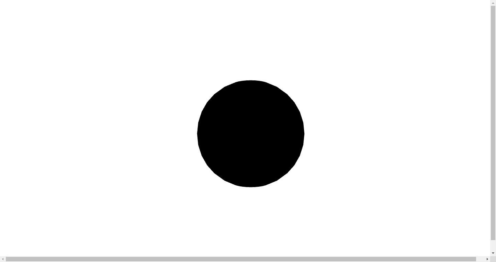

---
title: React Three Fiber で 3D の地球をブラウザに表示させる
date: 
author: junya-gera
tags: [3D, React, React Three Fiber, Three.js]
description: 
--- React Three Fiber を使って 3D の地球をブラウザに表示させる方法を解説します。

こんにちは、じゅんじゅんです。先日社内の勉強会で、前々から興味があった Three.js を使用して 3D の地球をブラウザに表示させる方法を発表しました。

Three.js について調べていたとき、 Three.js を React で記述できる React Three Fiber というライブラリがあることを知りました。

今回は 3D の地球を React Three Fiber で表示させる方法を Three.js での書き方と比較しながら紹介します。

### 前提


### 対象読者


### Three.js で 3D の地球を表示
まずは Three.js で 3D の地球を表示させるコードを紹介します。以下を参考に作成しました。

```js:title=Three.js
<html>

<head>
  <meta charset="utf-8" />
  <script src="https://unpkg.com/three@0.137.4/build/three.min.js"></script>
  <script>
    window.onload = () => {
      // サイズを指定
      const width = 960;
      const height = 540;

      // シーンを作成
      const scene = new THREE.Scene();

      // カメラを作成
      const camera = new THREE.PerspectiveCamera(45, width / height);
      camera.position.set(0, 0, +1000);

      // ライトを作成
      const directionalLight = new THREE.DirectionalLight(0xffffff);
      directionalLight.position.set(1, 1, 1);
      // ライトをシーンに追加
      scene.add(directionalLight);

      // ジオメトリを作成
      const geometry = new THREE.SphereGeometry(300);
      // 画像を読み込む
      const loader = new THREE.TextureLoader();
      const texture = loader.load('imgs/earthmap1k.jpg');
      // マテリアルに画像を設定
      const material = new THREE.MeshStandardMaterial({
        map: texture,
      });
      // メッシュを作成
      const mesh = new THREE.Mesh(geometry, material);
      // 3D空間にメッシュを追加
      scene.add(mesh);

      // レンダラーを作成
      const renderer = new THREE.WebGLRenderer({
        canvas: document.querySelector('#myCanvas'),
      });
      renderer.setSize(width, height);

      render();
      
      function render() {
        // レンダリング
        renderer.render(scene, camera);
        // 地球を回転させる
        mesh.rotation.y += 0.01;
        // 1フレームごとに更新
        requestAnimationFrame(render);
      }
    }

  </script>
</head>

<body>
  <canvas id="myCanvas"></canvas>
</body>

</html>
```

これを React Three Fiber に書き替えていきます。

### React Three Fiber で 3D の地球を表示

#### React Three Fiber の導入
作業ディレクトリを作成したら、以下のコマンドを実行して React Three Fiber をインストールします。

```
npm install three @react-three/fiber
```

#### Canvas コンポーネントを配置

まずは App.js を以下のように記述し、Canvas コンポーネントを配置します。

```js:title=App.js
import ReactDOM from 'react-dom';
import { Canvas } from '@react-three/fiber';
import './App.css';

const App = () => {
  return (
    <div id="canvas-container">
      <Canvas
        camera={{
          position: [0, 0, 1000],
          aspect: 960 / 540,
        }
      }>
      </Canvas>
    </div >
  );
}

ReactDOM.render(<App />, document.getElementById('root'));
export default App;
```

Canvas コンポーネントは、レンダリングに必要な基本要素であるシーンとカメラを裏側で設定しています。`camera` 属性でカメラの設定を行っています。

 Three.js では以下のように記述していた部分です。

```js:title=Three.js
// 1. シーンを作成
const scene = new THREE.Scene();

// 2. カメラを作成
const camera = new THREE.PerspectiveCamera(45, 960 / 540);
camera.position.set(0, 0, +1000);
```

さらに、Canvas コンポーネントはフレームごとにシーンをレンダリングする役割も持っています。レンダラーを用意したり、`render` 関数を使用する必要はありません。Three.js では以下の部分です。

```js:title=Three.js
// 5. レンダラーを作成
const renderer = new THREE.WebGLRenderer({
  canvas: document.querySelector('#myCanvas'),
});
renderer.setSize(width, height);

render();

function render() {
  // レンダリング
  renderer.render(scene, camera);
  // 地球を回転させる
  mesh.rotation.y += 0.01;
  // 1フレームごとに更新
  requestAnimationFrame(render);
}
```

これらの処理は Canvas コンポーネントが舞台裏で行ってくれます。

ここで、 Canvas のサイズを設定しておきます。 Canvas は親ノードの大きさに合わせて変更されるため、 App.css で `canvas-container` 属性に対して `width` と `height` を以下のように設定します。

```css:title=App.css
#canvas-container {
  width: 100vw;
  height: 100vh;
}
```

#### メッシュを作成

次は 3D 空間に地球を表示させるために、 mesh コンポーネントを追加します。Three.js では以下のように書いていた部分です。

```js:title=Three.js
// ジオメトリを作成
const geometry = new THREE.SphereGeometry(300);
// 画像を読み込む
const loader = new THREE.TextureLoader();
const texture = loader.load('imgs/earthmap1k.jpg');
// マテリアルに画像を設定
const material = new THREE.MeshStandardMaterial({
  map: texture,
});
// メッシュを作成
const mesh = new THREE.Mesh(geometry, material);
// 3D空間にメッシュを追加
scene.add(mesh);
```

まずは球体を表示させてみます。React Three Fiber では以下のように記述します (`camera` についての記述は省略しています)。

```js
<Canvas>
  <mesh>
    <sphereGeometry args={[300]} />
    <meshStandardMaterial />
  </mesh>
</Canvas>
```

mesh コンポーネントの子要素としてジオメトリとマテリアルを置くだけで、自動的に親の mesh コンポーネントに割り当てられます。今回は球体を表示させるのでジオメトリは `sphereGeometry` 、マテリアルはスタンダードな `meshStandardMaterial` にしています。

Three.js では `sphereGeometry` の半径をコンストラクタで指定していました。

```js:title=Three.js
const geometry = new THREE.SphereGeometry(300);
```

r3f では `args` という属性に配列を渡すことで指定します。

```js:title=r3f.js
<sphereGeometry args={[300]} />
```

`npm run start` して確認してみるとブラウザに球体が表示されているはずです。



真っ黒で不気味なので、この球体を地球にしましょう。


#### ライトを作成

次はライトを作成します。Three.js では以下のようなライトを作成していました。

```js:title=Three.js
// ライトを作成
const directionalLight = new THREE.DirectionalLight(0xffffff);
directionalLight.position.set(1, 1, 1);
// ライトをシーンに追加
scene.add(directionalLight);
```

React Three Fiber では以下のように記述します。

```js:title=r3f.js
<Canvas>
  <directionalLight color="white" position={[1, 1, 1]} />
```

Canvas コンポーネント下にライトの要素を置くだけでシーンに設置できます。今回は平行光源である directionalLight を置いていますが、AmbientLight など他のライトでも同様です。

Three.js ではライトに対して `set()` を使って `color` や `position` を設定していましたが、 r3f では directionalLight 要素の属性として設定できます (`color` はデフォルトで白ですので本来は記述は不要です) 。


```js
import ReactDOM from 'react-dom'
import { Canvas } from '@react-three/fiber'
import Earth from './earth';
import './App.css'

const App = () => {
  return (
    <div id="canvas-container">
      <Canvas
        camera={{
          position: [0, 0, 1000],
          aspect: 960 / 540,
          }
        }
        >
        <ambientLight intensity={0.1} />
        <directionalLight position={[1, 1, 1]} />
        <Earth />
      </Canvas>
    </div>
  );
}

ReactDOM.render(<App />, document.getElementById('root'))
export default App;
```