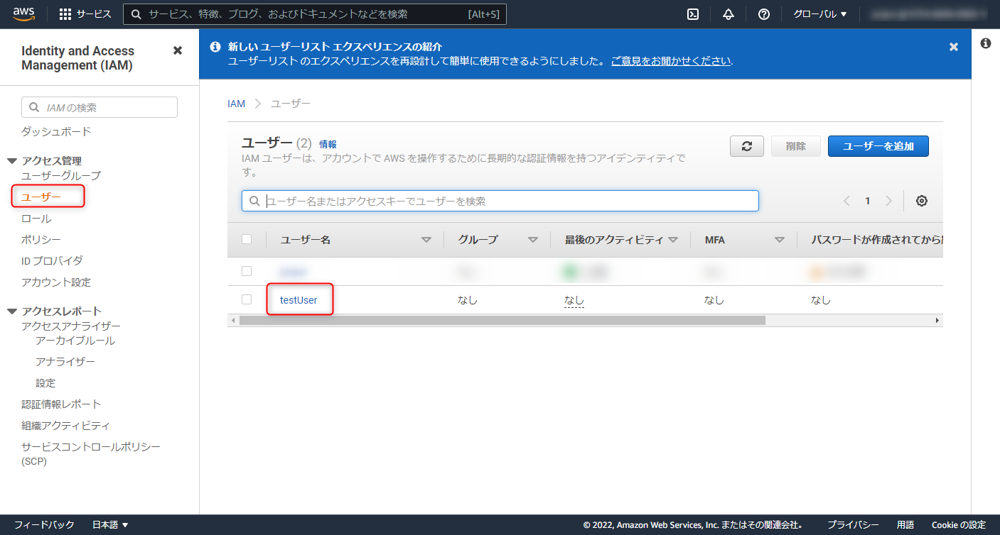
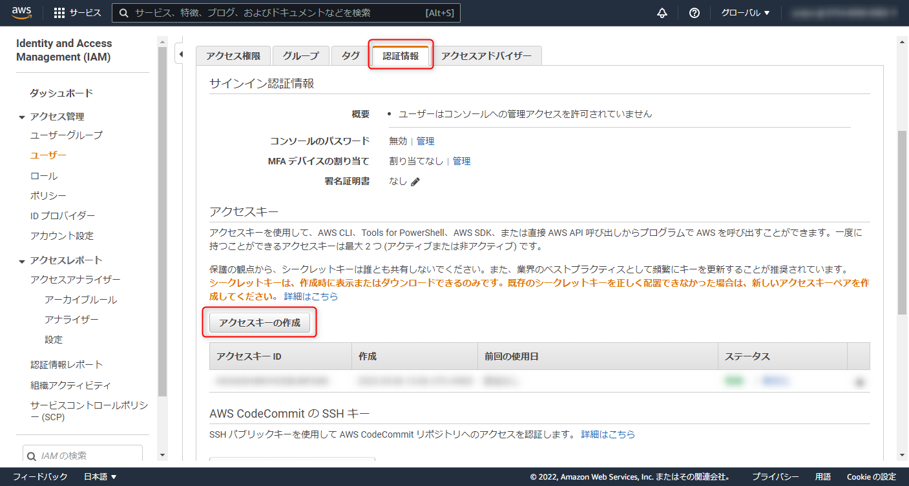
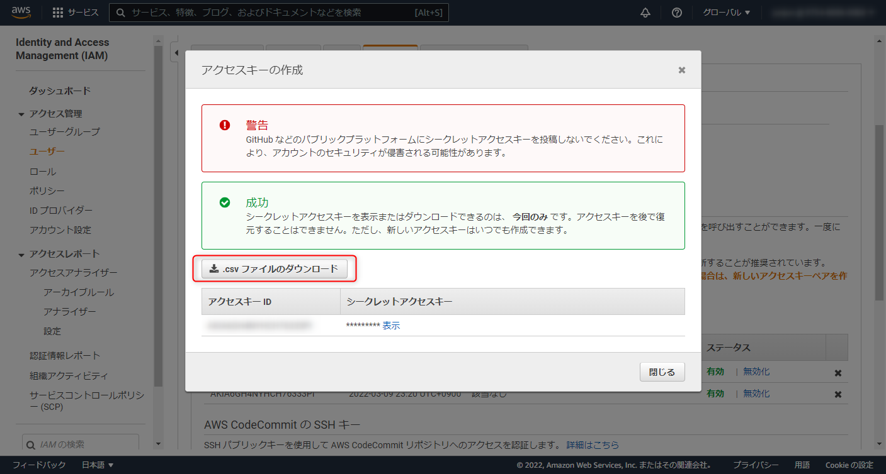

こんにちは、じゅんじゅんです。AWS を使用される方の中には個人用、社内用など複数の環境のアカウントを所持している人も多いと思います。今回は**プロファイルという機能を使用して AWS CLI で複数のアカウントを使い分ける方法**を紹介します。

## 前提
- aws-cli 2.2.27

個人用アカウントを持っているが業務でも AWS を使用することになったため、**個人用・社内用アカウントを AWS CLI から使い分けられるよう設定をする**という体で進めていきます。個人用 CLI の認証情報を登録するところから始めます。

## 個人用 CLI の認証情報を登録する
### ユーザーのアクセスキーを作成する
AWS CLI を使用するため、まずはアクセスキーを作成します。**アクセスキー (アクセスキー ID 、シークレットキー) は AWS CLI や AWS SDK の認証情報として利用します**。これらはコンソールの IAM から作成します（作成手順を知っている方は飛ばしていただいて大丈夫です）。

IAM の「ユーザー」からアクセスキーを作成するユーザーを選択します。今回は testUser とします。



「認証情報」タブにある「アクセスキーの作成」からアクセスキーが作成できます。



シークレットキーを表示できるのは作成時のみですので、 csv ファイルをダウンロードしておくと安心です（アクセスキー自体はいつでも作成し直せます）。



### 認証ファイルを作成する
AWS CLI の認証情報はホームディレクトリにある `.aws` ディレクトリの `.config` ファイルと `.creadincails` ファイルに記述します。 `aws configure` コマンドを実行してこれらのファイルを作成します。

```
$ aws configure
AWS Access Key ID [None]: ********************
AWS Secret Access Key [None]: ********************
Default region name [None]: ap-northeast-1
Default output format [None]: json
```

アクセスキー ID 、シークレットキー、リージョン、結果の出力形式を順番に聞かれるので入力します。ここでは例としてリージョンは ap-northeast-1 、出力形式は json にしています。作成されたファイルを確認すると以下のようになっていると思います。

`~/.aws/credentials`
```
[default]
aws_access_key_id = ********************
aws_secret_access_key = ********************
```

`~/.aws/config`
```
[default]
region = ap-northeast-1
output = json
```

これでひとまず個人用 CLI 認証情報を設定できました。

### 社内用 CLI の認証情報を登録する (プロファイルを使用)
今度は社内用 CLI の認証情報を登録します。先ほど設定した個人用の認証情報には [default] と書かれていたと思います。これは `aws configure` コマンドで作成した場合につけられ、CLI コマンドを実行するときは基本的にこの認証情報で実行されることになります。

[default] 以外のアカウントを作成する場合は **プロファイル** と呼ばれる認証情報ごとにつけられる名前を指定して作成します。

`$ aws configure --profile プロファイル名`

`--profile` の後のプロファイル名がこの認証情報の名前になります。プロファイルを使うことで複数の認証情報を区別することになります。ちなみに [default] は明示的にプロファイル名を指定しなかったときに参照されるプロファイルです。

個人用の場合と同様の手順で社内用のアクセスキーを作成したら、社内用のプロファイルを **company** というプロファイル名で作成します。

```
$ aws configure --profile company
AWS Access Key ID [None]: ********************
AWS Secret Access Key [None]: ********************
Default region name [None]: us-west-2
Default output format [None]: json
```
こちらは region を us-west-2 にしてみました。設定ファイルを確認すると以下のようになっていると思います。

`~/.aws/credentials`
```
[default]
aws_access_key_id = ********************
aws_secret_access_key = ********************
[company]
aws_access_key_id = ********************
aws_secret_access_key = ********************
```

`~/.aws/config`
```
[default]
region = ap-northeast-1
output = json
[profile company]
region = us-west-2
output = json
```

これで社内用 CLI の認証情報も登録できました。登録されているプロファイル名の一覧を表示させるコマンド `aws configure list-profiles` を実行してみましょう。

```
$ aws configure list-profiles
default
company
```
ちゃんと default と company が表示されました。

## 使用するプロファイルを設定する
2つの認証情報を設定できましたが、このままでは CLI コマンドを実行しても [default] プロファイルが呼び出されてしまいます。試しにプロファイルの設定情報を表示させるコマンド `aws configure list` を実行してみます。

```
$ aws configure list
      Name                    Value             Type    Location
      ----                    -----             ----    --------
   profile                <not set>             None    None
access_key     ******************** shared-credentials-file
secret_key     ******************** shared-credentials-file
    region           ap-northeast-1      config-file    ~/.aws/config
```
region は [default] で設定している ap-northeast-1 になっており、 [default] で実行されていることがわかります。これを [company] プロファイルで実行するには2種類の方法があります。

### 1. CLI コマンドに --profile (プロファイル名) オプションをつける
今回の場合は `--profile company` というオプションをつけることで [company] プロファイルで実行できます。

```
$ aws configure list --profile company
      Name                    Value             Type    Location
      ----                    -----             ----    --------
   profile                  company           manual    --profile
access_key     ******************** shared-credentials-file
secret_key     ******************** shared-credentials-file
    region                us-west-2      config-file    ~/.aws/config
```
プロファイル名の `company` が表示され、region も us-west-2 となっているので[company] プロファイルで実行できています。

### 2. コマンドラインに AWS_PROFILE 環境変数を設定する
1 の方法では CLI コマンドを実行するたびに `--profile` オプションをつける必要があるので複数回コマンドを実行する際は手間がかかります。`AWS_PROFILE` という環境変数に使用するプロファイルを設定することで、オプションなしに使用するプロファイルを切り替えることができます。設定するコマンドは以下です。

- Linux または macOS
```
export AWS_PROFILE=(プロファイル名)
```

- Windows コマンドプロンプト
```
set AWS_PROFILE=(プロファイル名)
```

試しに Windows のコマンドプロンプトで `AWS_PROFILE` を [company] プロファイルに切り替えてみます。
```
$ set AWS_PROFILE=company
```
そのうえで `--profile` オプションをつけずに `aws configure list` コマンドを実行します。
```
$ aws configure list
      Name                    Value             Type    Location
      ----                    -----             ----    --------
   profile                  company              env    ['AWS_PROFILE', 'AWS_DEFAULT_PROFILE']
access_key     ******************** shared-credentials-file
secret_key     ******************** shared-credentials-file
    region                us-west-2      config-file    ~/.aws/config
```

上記のように [company] プロファイルの設定が表示されました。

Location のところに `['AWS_PROFILE', 'AWS_DEFAULT_PROFILE']` と表示されていますが、 `set AWS_PROFILE=company` コマンドによってデフォルトで使用されるプロファイルを [company] プロファイルに変更したことを意味します。

この設定はシェルのセッションが終了するまで変更されたままです。

## まとめ
プロファイルを使用して複数の AWS CLI アカウントを使い分ける方法を紹介しました。ちなみに筆者はやらかしても自分にしか被害がかからないよう個人用アカウントを [default] に設定しています。ほかにも IAM ロールや多要素認証を使用する方法もあるので、今後このあたりも紹介したいと思っています。

## 参考
https://docs.aws.amazon.com/ja_jp/cli/latest/userguide/cli-configure-profiles.html