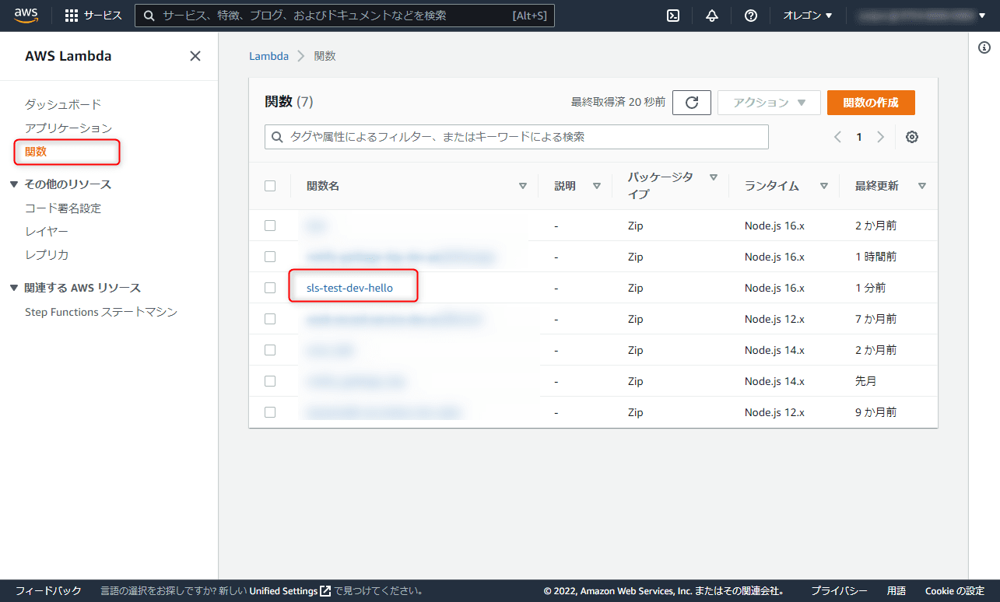
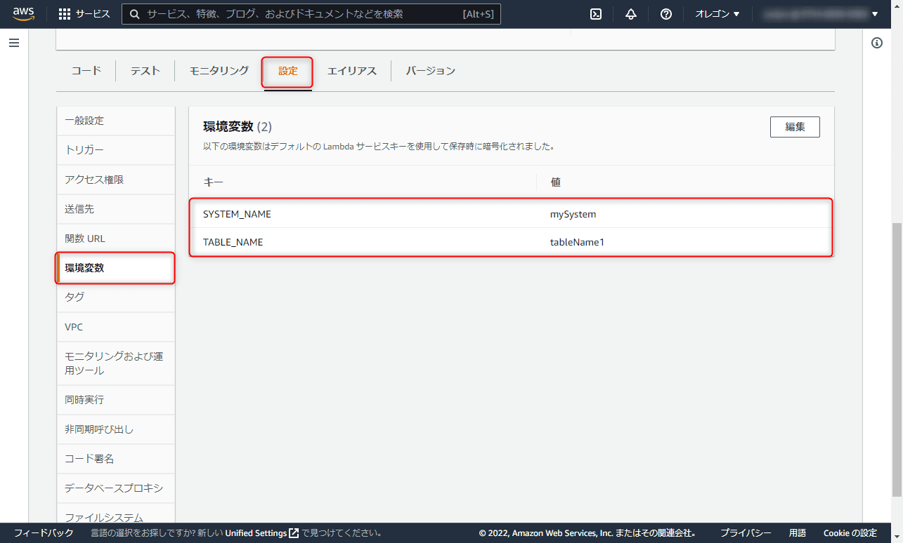

こんにちは、じゅんじゅんです。

以前、[AWS の Lambda と EventBridge を使って毎週水曜日と日曜日に「ゴミを出せ！」というメッセージを送信する Line Bot を作成する記事](https://mseeeen.msen.jp/create-line-bot-with-lambda-and-eventbridge/)を書きました。

この記事では zip ファイルを作成してアップロードすることで Lambda をデプロイしていましたが、これが結構手間です。

また、[こちらの記事](https://mseeeen.msen.jp/how-to-solve-lambda-error-that-handler-or-module-cannot-be-found/)に書いたとおり慣れていないと詰まりやすいエラーも発生します。

そういった理由からコマンドひとつで Lambda のデプロイができる Serverless Framework を使用することにしましたが、初めてだったためこれはこれで調べることがたくさんありました。

その中でも今回は .env ファイルを使って Serverless Framework で Lambda の環境変数を設定する方法について紹介します。


### 前提
- Serverless Framework 3.19.0

### サービスの作成
まずはサービス (Serverless Framework の実行環境) を作成します。

以下のコマンドを実行すると sls-test というディレクトリが作成され、その中に `serverless.yml` や `handler.js` が作成されます。

```
serverless create --template aws-nodejs --name sls-test --path sls-test
```

今回は Lambda の環境変数を設定するだけで Lambda は特に実行しないので、 `handler.js` の中身はそのままにしておきます。

### .env ファイルの作成
環境変数を記述するための `.env` ファイルを sls-test 下 (`serverless.yml` と同階層) に作成します。

今回はテストのため、中身は適当に以下のように記述しておきます。

```:title=.env
SYSTEM_NAME=mySystem
TABLE_NAME=tableName1
```

### serverless.yml の修正
次に serverless.yml を書き換えます。いったん不要なコメントアウトを削除し、 `region` を設定しておきます。どこでもいいですがここでは `us-west-2` としておきます。

```yml{8}:title=serverless.yml
service: sls-test

frameworkVersion: '3'

provider:
  name: aws
  runtime: nodejs16.x
  region: us-west-2

functions:
  hello:
    handler: handler.hello
```

環境変数を設定するため、以下のように追記します。

```yml{5,15-17}:title=serverless.yml
service: sls-test

frameworkVersion: '3'

useDotenv: true

provider:
  name: aws
  runtime: nodejs16.x
  region: us-west-2

functions:
  hello:
    handler: handler.hello
    environment:
      SYSTEM_NAME: ${env:SYSTEM_NAME}
      TABLE_NAME: ${env:TABLE_NAME}
```

`useDotenv: true` と書くことで `.env` ファイルから環境変数を読み込むことができるようになります。

次に、`functions` の `hello` 関数に `enviroment` を追加します。

Serverless Framework では `${env: 〇〇}` のように書くことで、実行環境の環境変数を参照することができます。

.env に記述した値についても `${env:SYSTEM_NAME}` で読み込めるので、 `SYSTEM_NAME` に対して設定します (TABLE_NAME も同様です)。

### サービスをデプロイして Lambda の環境変数が設定されているか確認
では以下のコマンドを実行してサービスをデプロイします。

```
sls deploy
```

では環境変数が設定されているか確認します。 AWS の Lambda のコンソール画面を開き、作成された sls-test-dev-hello 関数をクリックします。



「設定」タブから「環境変数」を選択すると、無事に `.env` に記述した値が環境変数として設定されていました！



### サービスの削除
今回はテスト用に作っただけですので、以下のコマンドでサービスを削除しておきます。
```
sls remove
```

### 感想
Serverless Framework を初めて触ったので今回のようなわからないことを調べる時間は必要でしたが、一度できるようになるとその便利さが実感できます。

複数の AWS サービスの設定をひとつの yml ファイルで完結させられたり、コマンドひとつでデプロイできるのは大きなメリットです。

とはいえ使っていくうえでわかりづらい部分も多く、ほかにもつまった箇所があるのでまた別の記事で紹介したいと思います。

### 参考

- [Resolution of environment variables](https://www.serverless.com/framework/docs/environment-variables/)

- [AWS Lambda Functions](https://www.serverless.com/framework/docs/providers/aws/guide/functions)
