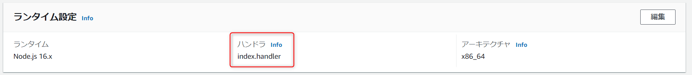
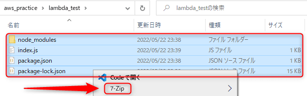

こんにちは、じゅんじゅんです。AWS Lambda を Node.js で使っていたとき、Lambda 実行時に **index.handler is undefined or not exported** や　**Cannot find module 'index'** というエラーに出くわしました。

今回はこちらの2つのエラーが発生する原因と解決法を紹介します。

### 1. ファイル名またはエクスポートする関数名が設定されているハンドラーと異なる

1つ目は**処理を記述しているファイル名、またはそのファイル中のエクスポートする関数名が設定されているハンドラーと異なる場合に発生するケース**です。

ファイル名が異なる場合は **Cannot find module 'index'** が、エクスポートする関数名が異なる場合は **index.handler is undefined or not exported** というエラーが発生します。

Lambda のコンソールの「コード」タブに「ランタイム設定」という部分があり、そこにハンドラーが書かれています。ここに記載されているハンドラーとは Lambda が呼び出されたときに実行される関数のことです。

このハンドラーはデフォルトで `index.handler` と設定されています。



私は `index.js` 内の `exports` の部分の関数名を別の名前にしてしまっていました。

`index.handler` は **`index.js` ファイルでエクスポートされている `handler` 関数** ということですので、以下のようにファイル名とエクスポートする関数名を合わせる必要があります。

```js:title=index.js
exports.handler = async event => {
  // 処理
}
```

### 2. デプロイパッケージを zip 化する際のパスが間違っている

2つ目は**デプロイパッケージとして zip ファイルを使用する際に、間違ったパスで zip 化したときに発生するケース**です。

この場合は **Cannot find module 'index'** というエラーが発生します。

例として、以下のようなパスの作業ディレクトリをデプロイパッケージとする場合を考えます。

`C:\Users\HogeHoge\Desktop\aws_practice\lambda_test`

↓ `lambda_test` の中身

- node_modules
- index.js
- package.json
- package-lock.json

zip 化するコマンドは `zip -r deploy_package.zip *` を使いましたが、私はこれを `aws_practice` がカレントディレクトリの状態で実行してしまいました。

これでは `lambda_test` ディレクトリごと zip 化し、 `index.js` がないと判断されてしまうので、 **`index.js` がある `lambda_test` をカレントディレクトリにして `zip` コマンドを実行する必要があります**。

ちなみに Windows のエクスプローラで 7-Zip を使って zip 化する場合は `lambda_test` に対してではなくその中身の `index.js` などをドラッグした状態で実行します。



## まとめ
「ハンドラーやモジュールが見つからない」という内容のエラーでしたが、発生する原因がわかりづらかったので悩まされました。

## 参考
[Node.js の AWS Lambda 関数ハンドラー](https://docs.aws.amazon.com/ja_jp/lambda/latest/dg/nodejs-handler.html)

[Lambda デプロイパッケージ](https://docs.aws.amazon.com/ja_jp/lambda/latest/dg/gettingstarted-package.html)

[teratail - ハンドラーが見つからず、index.jsを実行できない](https://teratail.com/questions/289341)
