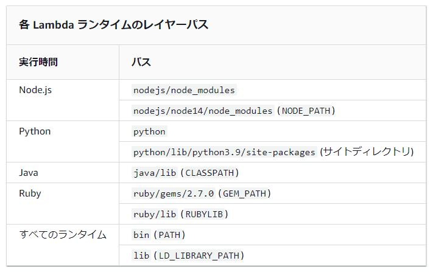

こんにちは、じゅんじゅんです。

Lambda で Node.js のライブラリーを使いたいとき、ライブラリーを含んだデプロイパッケージをアップロードする方法と、ライブラリーを Lambda レイヤーに配置する方法があります。

Serverless Framework を使ってライブラリーを含めた Lambda レイヤーを作成しましたが、**関数を実行しても「Cannot find module」のエラーが表示され苦しみました**。

今回は、このエラーが発生していた原因と解決法を紹介します。また Serverless Framework で Lambda レイヤーを作成し、ライブラリーを使用した関数を実行してみます。

## 前提
- Serverless Framework 3.19.0
- Node.js 16.0.0

今回は時間を扱う JavaScript のライブラリー「[Luxon](https://moment.github.io/luxon/#/)」をレイヤーに含め、現在時刻を出力するだけの Lambda を作成します。

## モジュールが読み込まれなかった原因

先に私がどこを間違えていたせいでモジュールが読み込まれなかったのかをお伝えします。

**ライブラリーを含んだ node_modules を格納するディレクトリには名前が決められていて、それ以外のディレクトリ名だと「Cannot find module」エラーが出る**ようです。

Node.js の場合は「**nodejs/node_modules**」というディレクトリ構成にする必要があります。私は nodejs ディレクトリが用意できていませんでした。

- [Node.js で Lambda コードを実行すると「モジュールをインポートできません」というエラーが表示されるのですが、どうすれば解決できますか?](https://aws.amazon.com/jp/premiumsupport/knowledge-center/lambda-import-module-error-nodejs/)

Node.js 以外の場合は以下に記載されていました。

- [Lambda レイヤーの作成と共有](https://docs.aws.amazon.com/ja_jp/lambda/latest/dg/configuration-layers.html)



公式ページにしっかり記載されていましたが、気付きませんでした...。

ではこのことに気を付けて、実際に Serverless Framework で Lambda レイヤーを作成します。

## Serverless Framework で Lambda レイヤーを作成する

### サービスの作成

今回もまずはサービス (Serverless Framework の実行環境) の作成から始めます。

以下のコマンドを実行すると sls-test というディレクトリが作成されます。

`serverless create --template aws-nodejs --name sls-test --path sls-test`

sls-test ディレクトリ下には以下の2種類のファイルが作成されています。

- `handler.js`
- `serverless.yml`

sls-test ディレクトリに移動し、以下のコマンドを実行して npm の初期化と Luxon のインストールを行います。

```
npm init
npm i luxon
```

### handler.js の記述

`handler.js` には Luxon で現在時刻を出力する処理を記述します。

関数名は `getTime` とします。

```js:title=handler.js
const { DateTime } = require("luxon");

module.exports.getTime = async (event) => {
    console.log(`現在時刻: ${DateTime.local().setZone('Asia/Tokyo').toFormat('yyyy-MM-dd HH:mm:ss')}`);
};
```

### レイヤーの定義、デプロイ

次にレイヤーの定義を `serverless.yml` に記述します。

不要なコメントアウトを削除し、 `region` を設定しておきます。`functions` に記述する関数を `getTime` に修正します。

```yml{8,11,12}:title=serverless.yml
service: sls-test

frameworkVersion: '3'

provider:
  name: aws
  runtime: nodejs16.x
  region: us-west-2

functions:
  getTime:
    handler: handler.getTime
```

次にレイヤーを定義します。以下のように `layers` の部分を記述します。

```yml{14-16}:title=serverless.yml
service: sls-test

frameworkVersion: '3'

provider:
  name: aws
  runtime: nodejs16.x
  region: us-west-2

functions:
  getTime:
    handler: handler.getTime
    
layers:
  sampleLayer:
    path: sample-layer
```

今回は `sampleLayer` という名前のレイヤーを作成します。

あとで `sls-test` ディレクトリ下、 `serverless.yml` と同じ階層に `sample-layer` というディレクトリを作成するので、 `path` は `sample-layer` とします。

これだけでは定義しただけで関数から呼ぶことができないので、 `getTime` 関数に `layers` を呼ぶ処理を追記します。

```yml{13-14}:title=serverless.yml
service: sls-test

frameworkVersion: '3'

provider:
  name: aws
  runtime: nodejs16.x
  region: us-west-2

functions:
  getTime:
    handler: handler.getTime
    layers:
      - {Ref: SampleLayerLambdaLayer}

layers:
  samplelayer:
    path: sample-layer
```

`Ref` 関数は CloudFormation の関数で、指定したリソースの値を取得します。

Ref 関数で指定するレイヤー名は、ハイフンなどをなくし、最初の文字を大文字にして後ろに `LambdaLayer` をつけます。

これで `serverless.yml` にレイヤーの設定が記述できました。

### ディレクトリ構成

では `serverless.yml` で設定したとおりにディレクトリを配置します。

`sample-layer` というディレクトリを作成し、中に `nodejs` というディレクトリを作成します。さらにその中に `node_modules` を格納します。以下のような構成になります。

```
.
├── handler.js
├── sample-layer
│   └── nodejs
│       └── node_modules
│           └── luxon
│
└── serverless.yml
```

### デプロイ、関数の実行

これで準備ができたので、`sls deploy` コマンドを実行してデプロイします。

「✔ Service deployed to stack sls-test-dev」と表示されればデプロイ成功です。

では `serverless invoke --function getTime --log` で `getTime` 関数を実行します。 `--log` をつけることで CloudWatch に出力されるログを表示してくれるので、現在時刻が出力されるか確認できます。

結果、以下のように現在時刻が出力されました。

```
START
2022-10-09 00:17:24.737 INFO    現在時刻: 2022-10-09 00:17:24
END RequestId: 68eacc13-fe8c-4c89-8f45-6057a915b68c
END Duration: 36.02 ms (init: 147.66 ms) Memory Used: 67 MB
```

## あとがき

エラーメッセージでは「モジュールが見つからない」としか表示されないため、原因を見つけるのに苦労しました。

初めて触る技術についてはしっかり公式を読み込むようにしようと思いました。