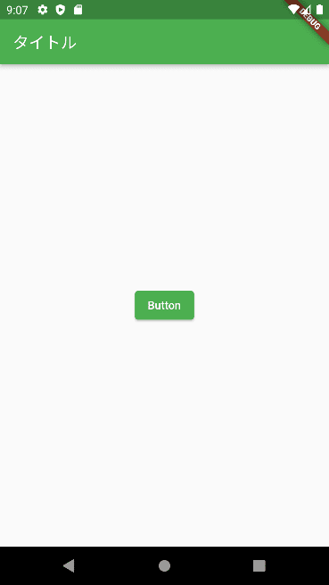

こんにちは、じゅんじゅんです。

最近趣味で [Flutter](https://flutter.dev/) を触り始めたのですが、 `flutter_lints` という Flutter 用の Linter による警告がたくさん発生し、逐一調べる日々を送っています。

今回はその中でも、 `print()` を使用した際に表示される「Avoid print calls in production code.」という警告の意味とその解消法を紹介します。

## 環境

- Flutter 3.3.3
- flutter_lints 2.0.0
- Dart 2.18.2
- エミュレーター Pixel 6 API 33 x86_64

## 警告を発生させる

まずは警告を発生させてみます。といっても簡単で `print()` を使用するだけです。

`print()` は指定した値をコンソールに出力する関数です。

以下のように、クリックすると `print()` でコンソールに「ボタンが押されました」と出力させるボタンを配置します。

```dart
class _MyHomePageState extends State<MyHomePage> {
  @override
  Widget build(BuildContext context) {
    return Scaffold(
        appBar: AppBar(
          title: const Text("タイトル"),
        ),
        body: Center(
          child: ElevatedButton(
            style: ElevatedButton.styleFrom(),
            onPressed: () => {print("ボタンが押されました")},
            child: const Text('Button'),
          ),
        ));
  }
}
```



ボタンをクリックするとコンソールにちゃんとメッセージが出力されました。

```
I/flutter (18666): ボタンが押されました
```

このとき、 `print()` の部分で以下のような警告メッセージが表示されています。


## 警告の意味

この警告は、書いてあるとおり「製品版のコードで `print` を呼ぶのは避けましょう」ということを伝えています。

Flutter には以下の3種類のビルドモードがあります。

### デバッグモード

その名のとおり開発時にデバッグを行うときに使用するモードです。

ホットリロードやエミュレーターでの動作確認ができますが、アプリが最適化されないので実行速度はほか2つのモードより劣ります。

デバッグモードでビルドするには `flutter run` コマンドを使用します。

### リリースモード

アプリをリリースする際に実行するモードです。

デバッグの機能は使えませんが、アプリを最大限に最適化、パッケージを最小化するのでパフォーマンスは高くなります。

リリースモードでビルドするには `flutter run --release` コマンドを使用します。

### プロフィールモード

いくつかのデバッグ機能を維持したまま、リリースモードに近いパフォーマンスで実行できるモードです。パフォーマンスを分析する場合に使用します。

プロフィールモードでビルドするには `flutter run --profile` コマンドを使用します。

各モードについては下記をご覧ください。

> [Flutter's build modes](https://docs.flutter.dev/testing/build-modes)

開発中、デバッグの際に `print()` を使用して出力結果などを確認する場合があると思います。

しかしこれではリリースモードでも出力されてしまいます。それを教えてくれるのがこの警告です。

リリースモードでビルドする際に `print()` が記述されている部分を削除して回るのは面倒ですし、必要な部分を間違えて削除しかねません。

いくつか対処法があるので以下で紹介します。

## 警告の解消法

### `DebugPrint()` を使用する

`print()` の代わりに `debugPrint()` を使うことで、デバッグモードでのみ実行されるようになります。

```dart
onPressed: () => {debugPrint("ボタンが押されました")},
```

### `kDebugMode` が 真の場合のみ実行するように条件を追加する

`kDebugMode` とは**デバッグモードの場合のみ真となる定数**です。

> [kDebugMode top-level constant](https://api.flutter.dev/flutter/foundation/kDebugMode-constant.html)

`kDebugMode` が `true` なら `print()` が実行されるような条件にしておけば警告は表示されません。

```dart
onPressed: () => {
  if (kDebugMode) {print("ボタンが押されました")}
},
```

実際に、この2種類の動作を各ビルドモードで試してみます。

リリースモード・プロフィールモードではエミュレーターが使用できずボタンを押すことができないため、 `_MyHomePageState` クラスに以下を追記し、画面初期化の段階で実行されるようにします。

`initState()` は画面の初期化時に呼び出されるメソッドです。

```dart:title=debugPrint()を利用する場合
  void initState() {
    super.initState();
    debugPrint("テストテスト");
  }
```

```dart:title=kDebugModeを利用する場合
  void initState() {
    super.initState();
    if (kDebugMode) {print("テストテスト")}
  }
```

この2パターンをデバッグモードでビルドしたところ、どちらもコンソールに「テストテスト」と出力されました。

```
I/flutter ( 7385): テストテスト
```

リリースモード、プロフィールモードではどちらも出力されませんでした。

逆に `print()` ではどのビルドモードでも「テストテスト」が出力されました。

## 補足

今回はエミュレーターに Android の「Pixel 6 API 33 x86_64」を使用しました。

エミュレーターを Android ではなく Chorme にし、 Web アプリとして起動するとリリースモードでは `print()` による出力はされませんでした。

ただし、どちらにしろ警告は表示されるので、 `debugPrint()` などを使用するほうが無難かと思います。

## あとがき

先日社内の勉強会で以下の[ツイート](https://twitter.com/t_wada/status/9000231741?s=20&t=bP2UCppXZhx96Yoom7M0AQ)を紹介していただきました。


これまでは簡単そうなところは眺めるだけにして、気になる部分だけ写経していましたが、これを期にこのツイートの内容を実践してみました。

今回の lint の警告については参考にしていた記事では触れられていなかったため、写経しないと気付けないままでした。

また、簡単そうなところだとしても、眺めるだけより手を動かして書いたほうが、新しい言語を学ぶ上では手に馴染むスピードが早いと感じました。

## 参考
- [Flutter 実践入門](https://zenn.dev/kazutxt/books/flutter_practice_introduction)
- [avoid print](https://dart-lang.github.io/linter/lints/avoid_print.html)