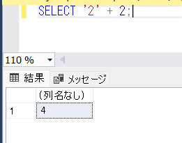

こんにちは、じゅんじゅんです。

先日、 SQL Server で一時テーブルを作成し、その一時テーブルにレコードを追加したときのことです。

`varchar` として定義した列に対して文字列の値を挿入しているのに、**varchar の値 'B2' をデータ型 int に変換できませんでした。** というエラーメッセージが表示され、レコードの追加ができませんでした。

**原因は「2」のような整数リテラルと、「'B2'」のような文字列を同じ列に挿入しようとしていたからでした。**

このことから SQL Server における「データ型の優先順位」について学びましたので、紹介します。

## エラーが発生する SQL

まず冒頭でお話したエラーについて、どのような SQL で発生したか紹介します。

以下のような SQL の場合、「`varchar` の値 `'B2'` をデータ型 `int` に変換できませんでした。」というエラーが発生します。

```sql:title=一時テーブルへの値の挿入が失敗する&nbsp;SQL
BEGIN TRAN;

DECLARE @user TABLE (
  NAME nvarchar(20)
, AGE int
, RANK nvarchar(10)
)

INSERT INTO @user
VALUES
  ('hogehoge', 28, 'B2')
, ('piyopiyo', 31, 2)
;

SELECT
  *
FROM @user
;

ROLLBACK;
```

実行すると以下のようなメッセージが表示され、 `INSERT` が失敗します。


## エラーが発生する原因

「`varchar` の値 `'B2'`」を代入しようとしているカラムは `nvarchar` 型の `RANK` ですが、**なぜか `int` に変換しようとしています**。 `B2` はもちろん `int` 型にはなれないので変換に失敗します。

今回 `RANK` 列に挿入しようとした値は `'B2'`、`2` です。

挿入しようとした値に `'B2'` のような文字列 (`varchar` 型) と `2` のような整数リテラル (`int` 型) が混ざっていたため、優先順位の高い `int` 型と評価されました。

## データ型の優先順位とは

Microsoft のドキュメントには以下のように記載されています。

> 演算子でデータ型が異なる 2 つの式を結合すると、最初に優先順位の低いデータ型が優先順位の高いデータ型に変換されます。 暗黙的な変換がサポートされていない場合は、エラーが返されます。 同じデータ型を持つオペランド式を結合する演算子の場合、演算の結果も同じデータ型になります。
> <cite>[データ型の優先順位](https://learn.microsoft.com/ja-jp/sql/t-sql/data-types/data-type-precedence-transact-sql?view=sql-server-ver16)</cite>

SQL Server のデータ型の優先順位は以下のように定義されています。

|順位|型|
|:----|:----|
|1| ユーザー定義データ型 (最高)|
|2| sql_variant|
|3| xml|
|4| datetimeoffset|
|5| datetime2|
|6| datetime|
|7| smalldatetime|
|8| date|
|9| time|
|10| float|
|11| real|
|12| decimal|
|13| money|
|14| smallmoney|
|15| bigint|
|16| int|
|17| smallint|
|18| tinyint|
|19| bit|
|20| ntext|
|21| text|
|22| image|
|23| timestamp|
|24| uniqueidentifier|
|25| nvarchar (nvarchar(max) など)|
|26| nchar|
|27| varchar (varchar(max) など)|
|28| char|
|29| varbinary (varbinary(max) など)|
|30| binary (最低)|

たとえば以下の式では `varchar` 型 (27 位) である `2` はより優先順位の高い `int` 型 (16 位) へと変換され、結果は `int` 型の `4` となります。



しかし、次の式だと `B2` は `int` 型に変換ができないため、「varchar の値 'B2' をデータ型 int に変換できませんでした。」というメッセージが表示されます。


同じ事象が、複数の型を挿入しようとした `INSERT` でも発生したものと思われます。

## エラーの解決法

言うまでもないですが、 `nvarchar` に定義した列には整数リテラルではなく文字列を挿入する必要がありました。

以下のようにすればエラーが出ず `INSERT` が成功します。

```sql{12,13}:title=一時テーブルへの値の挿入が成功する&nbsp;SQL
BEGIN TRAN;

DECLARE @user TABLE (
  NAME nvarchar(20)
, AGE int
, RANK nvarchar(10)
)

INSERT INTO @user
VALUES
  ('hogehoge', 28, 'B2')
, ('piyopiyo', 31, '2')
;

SELECT
  *
FROM @user
;


ROLLBACK;
```

## あとがき

実際は `VALUES` がもっとたくさんあったので、なかなか原因の特定ができませんでした。型に対する認識が甘かったです...。

SQL に限らず他の言語でも型をより意識して作業しようと誓いました。
