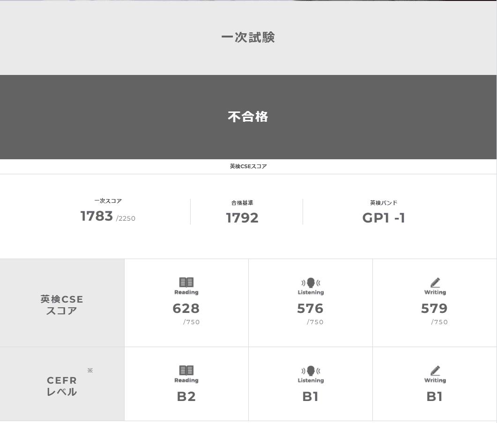
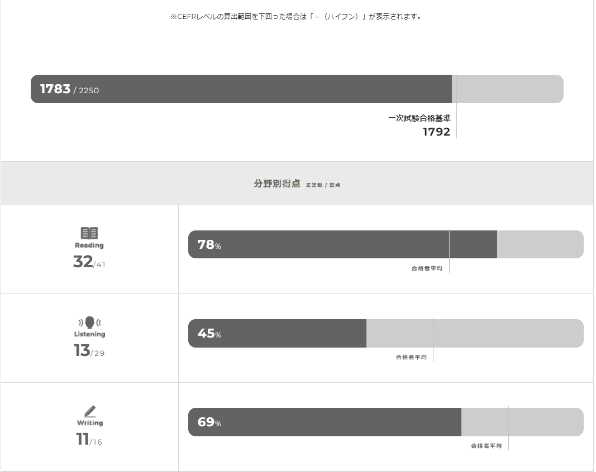
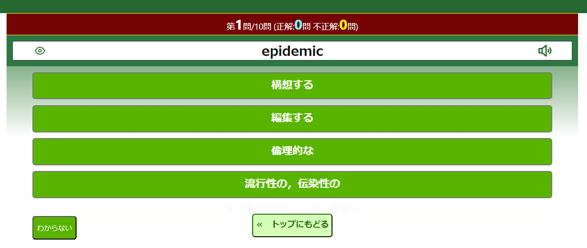

こんにちは、じゅんじゅんです。

先日、英検準 1 級の一次試験を受験してきました。

以前英検 2 級に合格していて、準1級は初めての挑戦でした。

今回は英検準 1 級の一次試験を受験した結果と、私が行った勉強法を紹介します。

## 英検準 1 級の試験概要

まずは簡単に英検準1級の試験概要を紹介します。詳しくは[公式ページ](https://www.eiken.or.jp/eiken/exam/grade_p1/solutions.html)をご覧ください。

英検では**リーディング・リスニング・ライティング・スピーキングの 4 技能**を測定します。

このうち、スピーキング (面接試験) 以外の 3 種が一次試験となります。

レベルについては以下のように記載されていました。

> 最終目標である1級の手前まで着実に力をつけているレベルで、およそ大学中級程度とされています。
> 社会生活で求められる英語を十分理解し、また 使用できることが求められます。

個人的には 2 級と比べてリスニングとライティングのレベルがかなり上がっていると感じました。

## 結果

結果としては残念ながら不合格でした...。



一次試験合格基準 1792 点に対して 1783 点と、たった 9 点差での不合格となりました。無念。



分野別で見るとリーディングは合格者平均以上でしたが、リスニング、ライティングが合格者平均に届きませんでした。

自分で思っていたよりも**ライティングでの減点が多かった**です。

## 問題の形式と勉強法

各問題の形式と、結果としては不合格でしたが、私が行った勉強法について紹介します。

### リーディング

リーディングの出題形式と私の正答数は以下です。

- 大問1. 短文の語句 空所補充 20 問 / 25 問
- 大問2. 長文の語句 空所補充 3 問 / 6 問
- 大問3. 長文の内容 一致選択 9 問 / 10 問

TOEIC で言うとそれぞれ Part5、6、7 に近いと思います。

ただ、 TOEIC や英検準 2 級と異なり、**大問 1 に文法問題は出題されず、すべて語彙問題**となっています。

出題されうる単語数がとても多いですが、しっかりと暗記できれば高得点を狙えます。

私は以下の Web サイトで学習しました。

[英語漬け.com 英検準1級](https://www.eigo-duke.com/tango/eikenjun1index.html)

こちらのサイトでは、全 3000 語もの単語のテストができます。以下のように表示された単語に対して 4 択から正しい意味を選択します。



問題が表示される際に英語音声も流れるため、発音も一緒に覚えることが可能ですので、リスニング対策にもなります。

間違えた回数が記録されていたり、間違えた問題だけのテストができ、苦手な単語も確実に定着するまで反復できます。

私は最終的に 3000 語のテストを 2 周しました。


英単語帳で覚えることが苦手なのでこのサイトを利用したところ、 25 問中 20 問正解できたので結果としてこちらを選択して良かったです。

大問 2、3 については、 TOEIC や英検準 2 級との差はそこまで感じませんでした。

長文問題には慣れていたことと、大問 1 対策で単語を覚えまくっていたので、特別な対策は行いませんでしたが良い点数が取れました。

### リスニング

リーディングの出題形式と私の正答数は以下です。

- Part1. 会話の内容 一致選択 4 問 / 12 問
- Part2. 文の内容 一致選択 6 問 / 12 問
- Part3. Real-Life 形式の内容 一致選択 3 問 / 5 問

リスニングについてはあまり得意ではなかったので半分いけばいいぐらいの想定でいましたが、半分もいきませんでした...。

リーディングと比べてリスニングは TOEIC や英検準 2 級よりも明確に難しい気がします。

また、これは TOEIC でも同じですが、家でイヤホンを使って聴いているときと違い、**広い部屋でスピーカーから流れる英文は響くのでとても聞き取りづらく感じました**。

Part1 は複数人の会話を聴き、質問に対する回答を 4 択から選ぶ問題です。1 つの音声に対して 1 つの質問が出題されます。

Part2 はスピーカー 1 人によるナレーションを聴き、質問に対する回答を 4 択から選ぶ問題です。ここを**英検準 1 級の最難関**と呼ぶ声が多いです。

こちらは1 つの音声に対して 2 つの質問が出題されるのですが、**音声が 1 分から 2 分あり、とにかく長いので集中力を続かせるのが難しいです**。

幸い、1 つ目の質問は前半に、 2 つ目の質問は後半に答えがあることが多いため、片方を諦めて 1 問だけは取る、という方法も可能です。

Part3 は TOEIC や英検準 2 級にはない形式で、問題ごとに Situation と Question が問題用紙に記載されていて、音声が流れる前に 10 秒間それを読む時間が与えられます。

その後、流れる音声を聴き、 Question に対する回答を 4 択から選びます。

こちらは問題文が問題用紙に記載されているため、 Part1、2 と比べるとやさしいです。

勉強法としては[過去問](https://www.eiken.or.jp/eiken/exam/grade_p1/)を解くこと以外に、発音練習と音読練習を行いました。

そもそもまだ英語の音声を聴き取る力が不足していると感じているため、発音練習と音読練習をすることで英語の音声に慣れ、自分のものにしようと思いました。

これには以下の本を利用しました。

[改訂３版　英語耳 発音ができるとリスニングができる](https://www.amazon.co.jp/%E6%94%B9%E8%A8%823%E7%89%88-%E8%8B%B1%E8%AA%9E%E8%80%B3-%E7%99%BA%E9%9F%B3%E3%81%8C%E3%81%A7%E3%81%8D%E3%82%8B%E3%81%A8%E3%83%AA%E3%82%B9%E3%83%8B%E3%83%B3%E3%82%B0%E3%81%8C%E3%81%A7%E3%81%8D%E3%82%8B-%E6%9D%BE%E6%BE%A4-%E5%96%9C%E5%A5%BD/dp/4041112591)

[みるみる英語力がアップする音読パッケージトレーニング](https://www.amazon.co.jp/%E3%81%BF%E3%82%8B%E3%81%BF%E3%82%8B%E8%8B%B1%E8%AA%9E%E5%8A%9B%E3%81%8C%E3%82%A2%E3%83%83%E3%83%97%E3%81%99%E3%82%8B%E9%9F%B3%E8%AA%AD%E3%83%91%E3%83%83%E3%82%B1%E3%83%BC%E3%82%B8%E3%83%88%E3%83%AC%E3%83%BC%E3%83%8B%E3%83%B3%E3%82%B0-CD-BOOK-%E6%A3%AE%E6%B2%A2-%E6%B4%8B%E4%BB%8B/dp/4860642465)

どちらも音声を聴きながらそれを真似て声に出す練習をしました。ただ、今回はまだ練習が足りなかったのか点数には結び付きませんでした。一朝一夕ではいかなさそうです。

### ライティング

準 1 級のライティングは 2 級と比べて語数の目安が 80 ～ 100 語から 120 ～ 140 語に増えているため、難易度が上がっています。

提示された TOPIC についての意見を、 4 つの POINTS のうち 2 つを使って書きます。

採点の観点と私の点数は以下です。

1. 内容 3 点 / 4 点
2. 構成 3 点 / 4 点
3. 語彙 2 点 / 4 点
4. 文法 3 点 / 4 点

対策としては、まず構成を覚えることと、文章の型をひたすら暗記することの 2 つを行いました。

構成についてはある程度決まっていて、以下が基本となります。

1. Introduction
2. Body1 (理由 1)
3. Body2 (理由 2)
4. Conclusion

文章の型については、特に Introduction と Conclusion は書く文章をあらかじめ決めておき、 TOPIC に合わせて内容を変えるだけで済むようにしていました。

```:title=Introduction
I think that (TOPIC に賛成か反対か).
There are two reasons to support my opinion.
```

```:title=Conclusion
According to the reasons stated above, (TOPIC に賛成か反対か).
```

この () の中以外を決めておくことで、少ない時間の中で考えないといけないことが減り、単語数もわかりやすいので管理しやすいです。

後はこの意見に対しての理由を 2 点書く部分に使えそうな表現を暗記し、どんな内容の TOPIC でもスッと書けるように練習問題をネットで探して練習しました。

覚えた表現の例です。

- These days, more and more 主語 are ~ing (最近～が増えている)
- 主語 have positive(negative) effects (良い・悪い影響がある) 
- The number of A will increase in the future. (A の数は増えるだろう)
- It goes without saying that S + V (S が V するのは言うまでもない)

練習で書いた英文は ChatGPT に添削してもらいました。より良い表現や、冠詞の有無などの細かい文法もチェックしてくれるのでとても助かりました。

## 次回に向けて改善したいこと

次回のリベンジに向けて、以下のように勉強法をより改善して望みたいと思います。

### リーディング

単語に関しては引き続き英語漬けを利用します。 3000 語を定着させ続けることはたいへんですので、ひたすら反復を続けます。

長文に関しては過去問や、 TOEIC の Part6、7 でも代用できると思うので TOEIC も合わせて対策します。

### リスニング

今一番ボトルネックとなっているリスニングについては、とにかく聴き取り力を上げるため、発音練習と音読練習、シャドーイングを繰り返します。

聴き取れるようになってきたら Part2 の過去問を練習し、長い音声でも聴き取り続けられるよう訓練するつもりです。

また、部屋の遠くに置いた PC から音声を流し、響く音にも対応できるように練習したいです。

### ライティング

どの部分を減点されたのかは教えてくれないのですが、おそらく細かい文法のミスや同じ表現の使いすぎで減点されたのではないかと思っています。

そこまで難しい文法は使っていないため、 ChatGPT に指摘された文法ミスをメモするなどして本番で繰り返さないよう工夫します。

また、別の書き換えが思いつかずつい同じ表現を繰り返してしまうことが多いので、語彙を増やしたり、同じ意味で違う書き方 (for example と for instance など) をインプットします。

ChatGPT に英文を記載するとき、 **英文を PC に打ち込む必要がないよう、紙に書いた英文の写真からテキストを検出してくれるツール**を作成したので、次はこれも活用したいです。

- [S3 に保存した画像から Amazon Textract でテキストデータを取得する](https://mseeeen.msen.jp/extract-text-from-s3-images-with-amazon-textract)
- [[Serverless Framework] S3 に保存した画像から Amazon Textract でテキストデータを取得する](https://mseeeen.msen.jp/serverless-framework-s3-image-textract-text)

## 感想

結構頑張って勉強し、手ごたえもあったのですが、ギリギリ不合格となってしまい悔しかったです。

原因がリスニングであることはわかっているので、しっかり練習を続けていきます。

今度は二次試験のレポートもできるよう頑張ります。