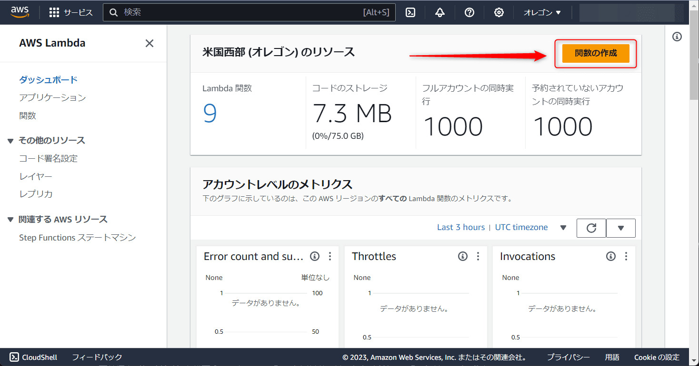
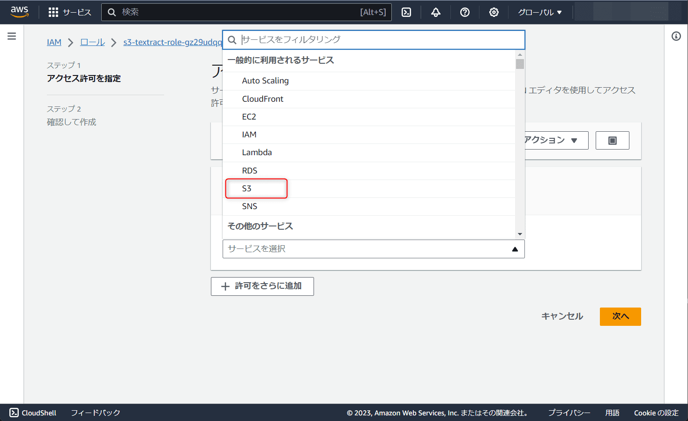

こんにちは、じゅんじゅんです。

先日英検準1級があり、9月はずっと英検の勉強に集中していました。

英検にはライティングの試験もあり、紙に書いた英文を PC で ChatGPT に打ち込んで添削してもらっていたのですが、紙に書いた後同じ英文を打ち込むのが面倒でした。

最初から PC に打ち込むことも考えましたが、本番を想定して紙と鉛筆で練習がしたかったのです。

せっかくですので、書いた英文を写真に撮り、 Amazon Textract を使って写真の文字を検出してテキストデータにする Lambda 関数を作ろうと考えました。

今回はその方法を紹介します。

↓ Serverless Framework を使って作成した記事はこちら。

[[Serverless Framework] S3 に保存した画像から Amazon Textract でテキストデータを取得する](https://mseeeen.msen.jp/serverless-framework-s3-image-textract-text)

## 前提

- Node.js v18.16.0

## Amazon Textract とは

[Amazon Textract](https://docs.aws.amazon.com/ja_jp/textract/latest/dg/what-is.html) は、スキャンしたドキュメントのテキストや手書き文字を検出する機械学習サービスです。

紙の文書を写真に撮ったり PDF 化したものから文字を読み取り、テキストデータとして使用できます。使用方法はシンプルで、機械学習についての知識も必要ありません。

現在 (2023年10月) サポートしている言語は英語、スペイン語、ドイツ語、イタリア語、フランス語、ポルトガル語であり、日本語には未対応ですが、今回は英文をテキストデータにしたいので問題ありません。

サポートしているファイル形式は PDF、TIFF、JPEG、PNG の4種です。

## 構成

今回は S3 のイベント通知を利用し、 S3 に画像がアップロードされたら Textract で文字を検出する処理を記載した Lambda を実行します。

検出したテキストデータはテキストファイルにし、別の S3 にアップロードします。


## 1. S3 バケットの作成

まずは S3 バケットを作成します。今回作成するバケットは以下の 2 種類です。

- 20231028-image-bucket (文字を読み取りたい画像をアップロードするバケット)
- 20231028-text-bucket (検出した文字を記載したテキストファイルをアップロードするバケット)

S3 のコンソール画面から「バケットの作成」をクリックします。


バケット名を入力し、リージョンを選択します。今回は us-west-2 (オレゴン) にします。他の設定はデフォルトのままでページ下の「バケットを作成」をクリックします。


これでバケットが作成できたので、 20231028-text-bucket のほうも同様に作成します。

## 2. Lambda 関数の作成

次に Lambda 関数を作成します。Lambda のコンソール画面から「関数の作成」をクリックします。



今回関数名は「s3-textract」とし、ランタイムは「Node.js 18.x」を選択します。他の設定はデフォルトのままでページ下の「関数を作成」をクリックします。


これで Lambda 関数が作成されました。先にタイムアウトの時間を延ばしておきます。「設定」→「一般設定」→「編集」をクリックします。


タイムアウトの部分を「3秒」から「1分」に変更し、「保存」をクリックします。


次にアップロードするファイルを準備します。作業用ディレクトリを作成したら以下のコマンドを実行して npm の初期化と AWS SDK のインストールを行います。

```
npm init
npm install aws-sdk
```

`index.mjs` を作成し、以下のように記載します。

```js:title=index.mjs
import AWS from 'aws-sdk';

const textract = new AWS.Textract();
const s3 = new AWS.S3();

export const detectText = async (event) => {
  // S3 のイベントからオブジェクトの情報を取得
  const bucket = event.Records[0].s3.bucket.name;
  const objectKey = event.Records[0].s3.object.key;

  const params = {
    DocumentLocation: {
      S3Object: {
        Bucket: bucket,
        Name: objectKey
      }
    }
  };

  try {
    // Textractを呼び出し、テキストを抽出
    const response = await textract.startDocumentTextDetection(params).promise();
    
    // Textractのジョブが完了するのを待つ
    const jobId = response.JobId;
    await waitForJobCompletion(jobId);

    // テキストを取得
    const text = await getTextractText(jobId);
    console.log(text);
    
    // テキストを使用して必要な処理を行う
    const putparams = {
      Bucket: '20231028-text-bucket',
      Key: 'sample.txt',
      Body: text,
      ContentType: 'text/plain',
    };

    await s3.putObject(putparams).promise();

    return {
      statusCode: 200,
      body: 'Text file uploaded successfully.'
    };
  } catch (error) {
    return {
      statusCode: 500,
      body: JSON.stringify(error.message)
    };
  }
};

// Textractのジョブが完了するのを待つ
async function waitForJobCompletion(jobId) {
  const delay = (ms) => new Promise(resolve => setTimeout(resolve, ms));

  while (true) {
    const response = await textract.getDocumentTextDetection({ JobId: jobId }).promise();

    if (response.JobStatus === 'SUCCEEDED') {
      break;
    }

    if (response.JobStatus === 'IN_PROGRESS') {
      await delay(5000);
    }
  }
}

// Textractからテキストを取得
async function getTextractText(jobId) {
  const response = await textract.getDocumentTextDetection({ JobId: jobId }).promise();
  const text = response.Blocks
    .filter(block => block.BlockType === 'LINE')
    .map(block => block.Text)
    .join('\n');
  
  return text;
}
```

[`startDocumentTextDetection()`](https://docs.aws.amazon.com/ja_jp/textract/latest/dg/API_StartDocumentTextDetection.html#API_StartDocumentTextDetection_ResponseSyntax) は S3 バケットに保存されているオブジェクトからテキストデータの検出を開始します。

どのバケットのどのオブジェクトから検出するかの情報を第一引数 (`params`) に渡します。  

今回は 20231028-image-bucket にオブジェクトが配置されたイベント通知による `event` 引数からバケット名とオブジェクトのキーを取得し、 `params` に設定しています。

`response` の中身は以下のようになっています。

```js:title=response&nbsp;の中身
{
   "JobId": "string"
}
```

この `JobId` を使用して `waitForJobCompletion` にて Textract により検出し、完了まで待ちます。

```js:title=waitForJobCompletion()
// Textractのジョブが完了するのを待つ
async function waitForJobCompletion(jobId) {
  const delay = (ms) => new Promise(resolve => setTimeout(resolve, ms));

  while (true) {
    const response = await textract.getDocumentTextDetection({ JobId: jobId }).promise();

    if (response.JobStatus === 'SUCCEEDED') {
      break;
    }

    if (response.JobStatus === 'IN_PROGRESS') {
      await delay(5000);
    }
  }
}
```

[getDocumentTextDetection](https://docs.aws.amazon.com/textract/latest/dg/API_GetDocumentTextDetection.html#API_GetDocumentTextDetection_ResponseSyntax) はテキスト検出した結果を取得する関数です。

`getDocumentTextDetection()` は非同期処理であり、検出には時間がかかるため、検出が完了するまで `waitForJobCompletion()` でポーリングしています。

検出が完了すると `response.JobStatus` が `IN_PROGRESS` から `SUCCEEDED` になるので、 `waitForJobCompletion()` のループを終えます。

`getDocumentTextDetection()` の `responce` は以下のようになっています。

```json:title=getDocumentTextDetection()&nbsp;の&nbsp;responce&nbsp;の中身
{
   "Blocks": [ 
      { 
         "BlockType": "string",
         "ColumnIndex": number,
         "ColumnSpan": number,
         "Confidence": number,
         "EntityTypes": [ "string" ],
         "Geometry": { 
            "BoundingBox": { 
               "Height": number,
               "Left": number,
               "Top": number,
               "Width": number
            },
            "Polygon": [ 
               { 
                  "X": number,
                  "Y": number
               }
            ]
         },
         "Id": "string",
         "Page": number,
         "Query": { 
            "Alias": "string",
            "Pages": [ "string" ],
            "Text": "string"
         },
         "Relationships": [ 
            { 
               "Ids": [ "string" ],
               "Type": "string"
            }
         ],
         "RowIndex": number,
         "RowSpan": number,
         "SelectionStatus": "string",
         "Text": "string",
         "TextType": "string"
      }
   ],
   "DetectDocumentTextModelVersion": "string",
   "DocumentMetadata": { 
      "Pages": number
   },
   "JobStatus": "string",
   "NextToken": "string",
   "StatusMessage": "string",
   "Warnings": [ 
      { 
         "ErrorCode": "string",
         "Pages": [ number ]
      }
   ]
}
```

`getTextractText()` では、検出が完了した `JobId` に対する検出結果の文字列を取得しています。

```js:title=getTextractText()
// Textractからテキストを取得
async function getTextractText(jobId) {
  const response = await textract.getDocumentTextDetection({ JobId: jobId }).promise();
  console.log(JSON.stringify(response.Blocks));
  const text = response.Blocks
    .filter(block => block.BlockType === 'LINE')
    .map(block => block.Text)
    .join('\n');
  
  return text;
}
```

`BlockType` には `PAGE` ・ `LINE` ・ `WORD` などの種類があり、それぞれページごと、行ごと、単語ごとのブロックを表します。

ここでは `LINE` で `filter` することで、行ごとに検出しています。

これで `index.mjs` の準備ができたので、 `zip -r deploy_package.zip *` コマンドで zip 化し、コンソールにアップロードします。

アップロード時の注意点は「[[AWS] Lambda 実行時に発生するハンドラーやモジュールが見つからないエラーの解決法](https://mseeeen.msen.jp/how-to-solve-lambda-error-that-handler-or-module-cannot-be-found/)」を参考にしてください。

## 3. Lambda 関数に S3 のイベント通知を設定

Lambda 関数が作成できたので、この関数を実行するためのトリガーを設定します。

今回は「20231028-image-bucket」バケットに文字を読み取りたい画像がアップロードされたときとします。

「s3-textract」関数の画面の「トリガーを追加」をクリックします。


ソースは「S3」、バケットは「20231028-image-bucket」、Event Types は「All object create events」を選択します。


「recursive invocation」のところにチェックを入れるところがあるのでチェックします。

ここでは「入力と出力に同じバケットを使用すると、 Lambda 関数が再帰的に呼び出され、 Lambda 関数の使用量とコストが増大する可能性があること」を認めるかどうかのチェックになります。

今回、 Lambda 関数内で作成したテキストファイルは別のバケット (20231028-text-bucket) にアップロードするため、問題ありません。

「追加」を押してトリガーの設定は完了です。


## 4. IAM ロールに S3 と Textract の操作権限を追加

Lambda に S3 と Textract を使用するための権限を与えるため、 IAM ロールに権限を追加します。

Lambda 関数を作成したとき、 IAM ロールも作成されているので、「設定」→「一般設定」→「アクセス権限」でロール名を確認します。


IAM のコンソール画面でそのロールを選択し、「許可を追加」→「インラインポリシーを作成」をクリックします。


「サービスを選択」の部分でまずは「S3」を選択します。



「読み取り」から「GetObject」を、「書き込み」から「PutObject」を探してチェックを入れます。

次に「許可をさらに追加」をクリックし、今度は「Textract」を選択します。

こちらは「読み取り」から「GetDocumentTextDetection」を、「書き込み」から「StartDocumentTextDetection」を選択します。選択が完了したら「次へ」をクリックします。

「ポリシー名」は適当に「textractTest」とし、「ポリシーを作成」をクリックします。


これで IAM ロールに S3 と Textract の権限を追加できました。

## 5. 英文の画像をアップロードしてみる

以上で準備が整いましたので、英文の画像をアップロードしてみます。

実際に英検の勉強中に書いた以下の英作文の画像を使用します。


S3 のコンソール画面から「20231028-image-bucket」を選択し、英作文の画像 (`sample.png`) をドラッグ&ドロップでアップロードします。


「20231028-text-bucket」を見るとテキストファイルが作成されていました！


中身を見ると画像中の英文がテキストで記載されていました (日本語の部分は謎の文章になっています)。


## 感想

英検の勉強中にふと思い立ってやってみたら結構時間がかかってしまい、実は完成したのは英検が終わってからでした...。

今回実際に活用できませんでしたが、次回受験時に使ってみようと思います。

スマホで写真を撮ってから PC に移すのが面倒ですので、 LINE API を連携させて LINE に画像を送ると英文が返ってくるようにするのも良さそうです。
