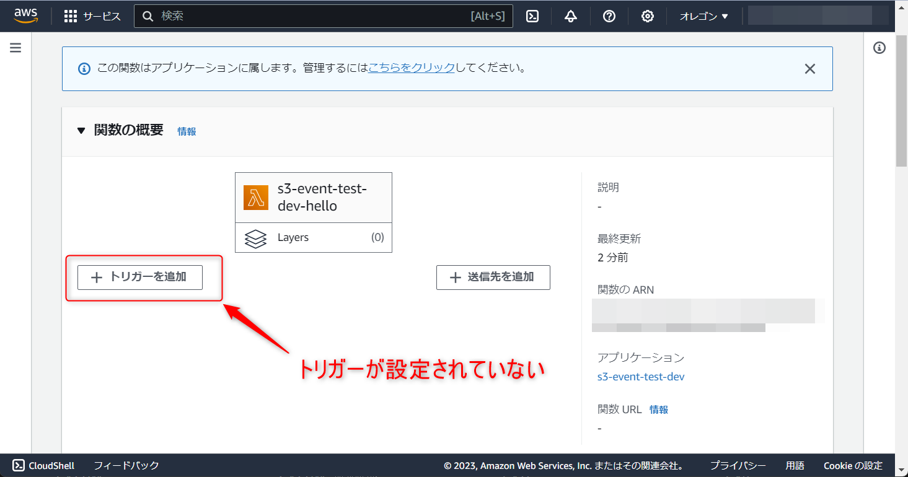
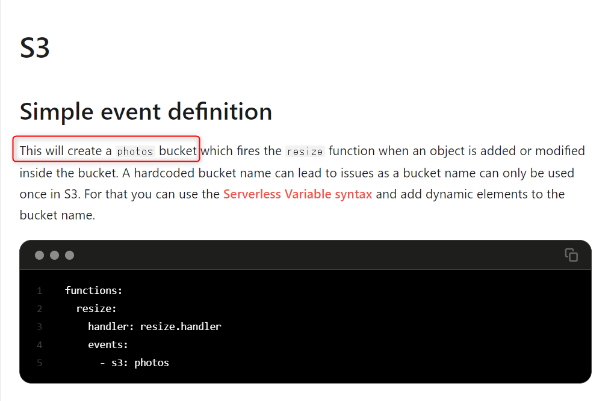
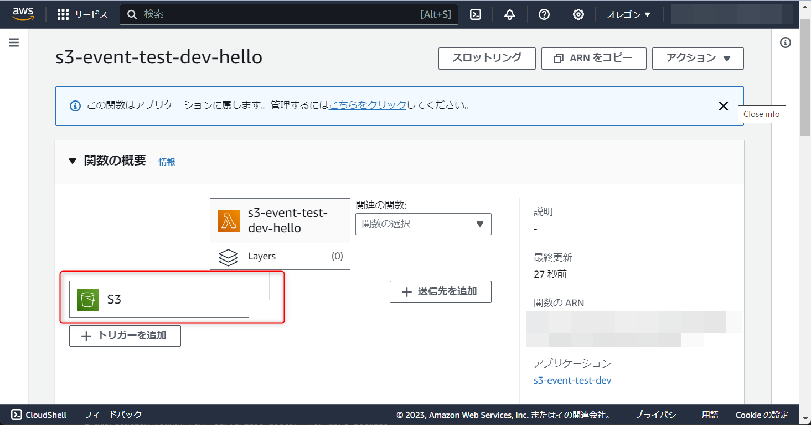
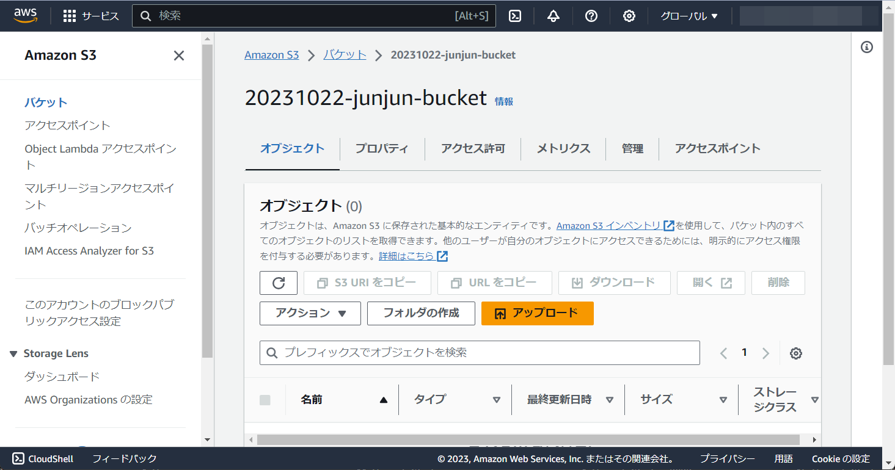

こんにちは、じゅんじゅんです。

先日、 Serverless Framework を使って S3 と Lambda 関数を作成し、 S3 にイベント通知を設定しようとしたときのことです。

バケットにオブジェクトが保存されると Lambda 関数が実行されるというイベントを設定していたつもりだったのですが、なぜかデプロイしても Lambda 関数にイベントトリガーが設定されませんでした。

また、ほかにも「bucket already exists in stack」というエラーにも遭遇しました。

今回は上記のように Serverless Framework でデプロイしても Lambda に S3 のイベント通知が設定されないときの対処法を紹介します。

## Lambda 関数にイベントが設定されない

作成した serverless.yml は以下です (最低限の部分のみ記載しています)。

```yml:title=serverless.yml
service: s3-event-test

frameworkVersion: "3"

provider:
  name: aws
  runtime: nodejs18.x
  region: us-west-2
  iam:
    role:
      statements:
        - Effect: Allow
          Action:
            - s3:*
          Resource:
            - "arn:aws:s3:::20231022-junjun-bucket/*"

functions:
  hello:
    handler: handler.hello
    events:
      - S3:
          bucket: 20231022-junjun-bucket
          event: s3:ObjectCreated:*

resources:
  Resources:
    20231022JunjunBucket:
      Type: AWS::S3::Bucket
      Properties:
        BucketName: 20231022-junjun-bucket
```

この状態で `sls deploy` コマンドを実行するとデプロイが成功するのですが、コンソールで Lambda 関数を見ても S3 のトリガーが紐づいていませんでした。



デプロイ時にエラーも出ておらず、 ChatGPT に聞いても「正しく設定されているように見えます」と言われてしまいました。

### 原因と対処法

考えてもわからなかったので [kenzauros](https://mseeeen.msen.jp/authors/kenzauros/) さんに聞いたところ、原因がわかりました。

`events` に記載していた `S3` の `S` が大文字になっていたことが原因でした...。

```yml{5}:title=serverless.yml&nbsp;の&nbsp;events&nbsp;部分
functions:
  hello:
    handler: handler.hello
    events:
      - S3:
          bucket: 20231022-junjun-bucket
          event: s3:ObjectCreated:*
```

この部分を `s3` に修正したところ、今度は以下のエラーが発生しました。

```
Error:
CREATE_FAILED: S3Bucket20231022junjunbucket (AWS::S3::Bucket)
20231022-junjun-bucket already exists in stack arn:aws:cloudformation:us-west-2:****:stack/s3-event-test-dev/
```

## バケットがすでに存在しているというエラー

「`20231022-junjun-bucket` バケットがすでに存在しています」と言われています。

そりゃこの serverless.yml で作成しているのだから存在しているのでは？

### 原因と対処法

どうやら、 S3 のイベント通知を Lambda に設定した時点で、指定したバケットが作成されるようです。

[Serverless Framework ドキュメント](https://www.serverless.com/framework/docs/providers/aws/events/s3) の S3 イベントの部分に「This will create a bucket」という記載がありました。



対処法としては `resources` で S3 バケットを定義している部分を削除するか、 `events.s3` の部分に `existing: true` を追加するとデプロイが成功するようになりました。

コンソールで Lambda を確認すると、ちゃんと S3 のイベントトリガーが設定されていました。



また、バケットもちゃんと作成されていました。



正しい `serverless.yml` は以下のようになりました (コメント部分を記載していても OK)。

```yml:title=serverless.yml
service: s3-event-test

frameworkVersion: "3"

provider:
  name: aws
  runtime: nodejs18.x
  region: us-west-2
  iam:
    role:
      statements:
        - Effect: Allow
          Action:
            - s3:*
          Resource:
            - "arn:aws:s3:::20231022-junjun-bucket/*"

functions:
  hello:
    handler: handler.hello
    events:
      - s3:
          bucket: 20231022-junjun-bucket
          event: s3:ObjectCreated:*
#           existing: true

# resources:
#   Resources:
#     20231022JunjunBucket:
#       Type: AWS::S3::Bucket
#       Properties:
#         BucketName: 20231022-junjun-bucket
```

### まとめ

いったいなぜ `s3` が `S3` になってしまったのか、全然思い出せませんでした。

Serverless がエラーを出さなかったのもありますが、 ChatGPT に聞いても問題ないと言われたことでタイプミスという可能性を消してしまっていました。

ChatGPT を信用しすぎるのはよくないという教訓になりました。

### 参考

- [Serverless Framework - S3](https://www.serverless.com/framework/docs/providers/aws/events/s3)
