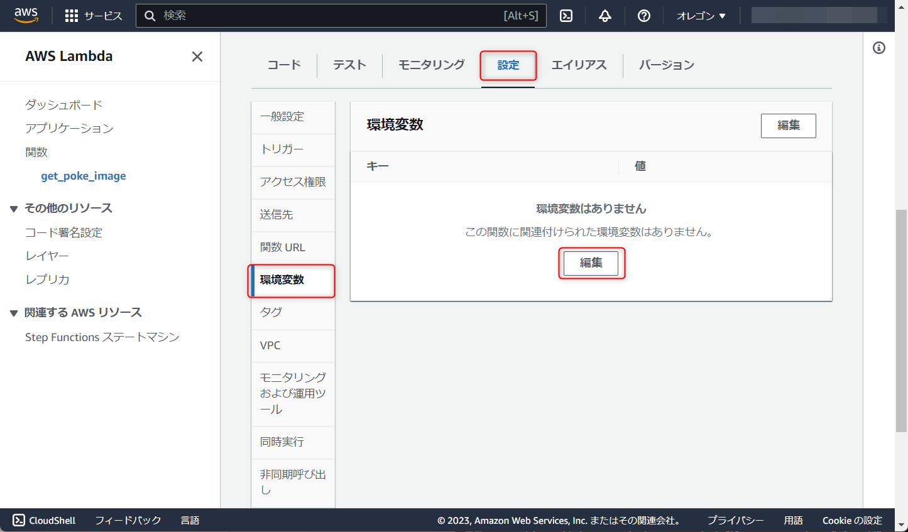
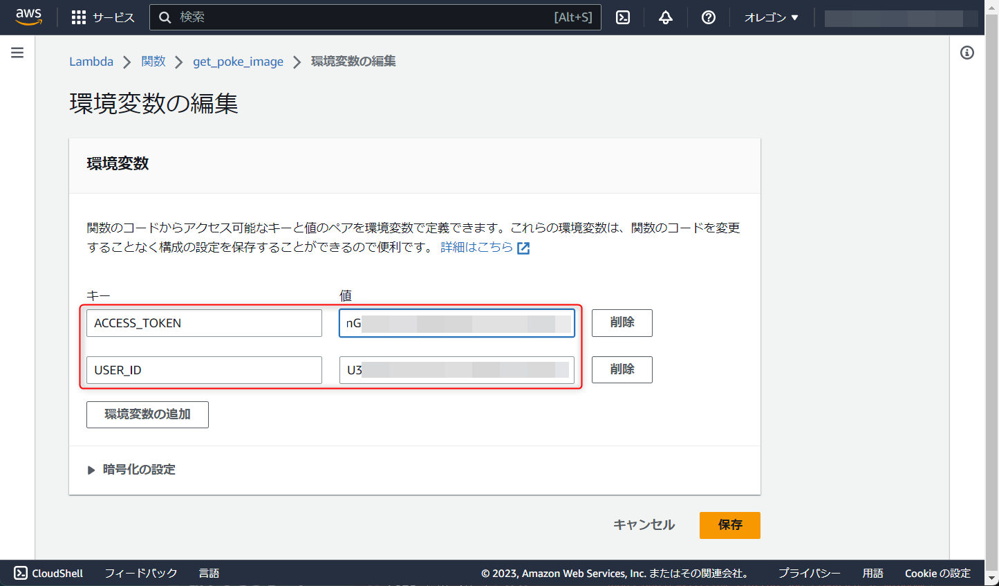
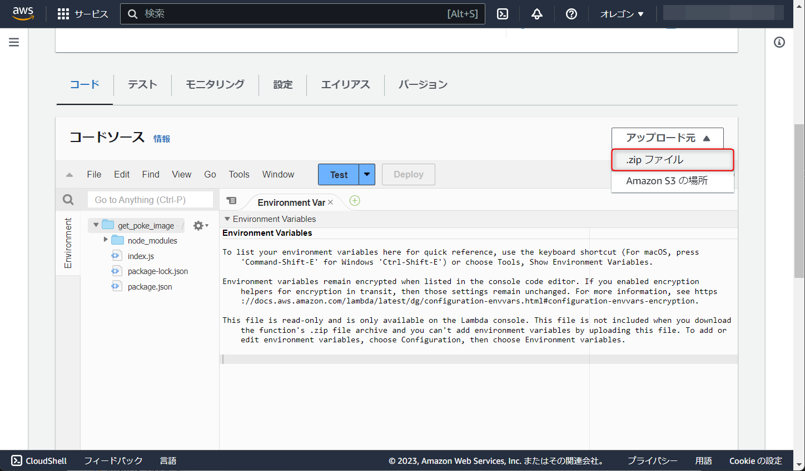

こんにちは、じゅんじゅんです。

2022 年 4 月ごろ、 Lambda に [Lambda 関数 URL](https://docs.aws.amazon.com/ja_jp/lambda/latest/dg/lambda-urls.html) という機能が追加されました。

Lambda 関数 URL は「**Lambda 関数のための専用 HTTP エンドポイント**」です。

HTTP 経由で Lambda を実行する際は API Gateway で HTTP リクエストを受け取ってから実行する必要がありますが、関数 URL を使用すると直接 Lambda を実行できます。

Webhook など、特に API Gateway でないとできない機能が必要ない場合に最適です。

まだこの機能を使ったことがなかったので、 Lambda 関数 URL を使って LINE から直接 Lambda を実行してみようと思います。

## 概要

今回は、 **LINE に数字を送信すると、該当する図鑑番号のポケモンの画像を返す** LINE Bot を作成します。ポケモンの画像を取得する部分は [Poke API](https://pokeapi.co/) を使用します。

作成手順は以下です。

1. LINE Developer コンソールでチャネルを作成する
2. LINE にメッセージを返す Lambda 関数を作成する
3. LINE Message API の Webhook に 2 で作成した Lambda の関数 URL を設定する
4. QR コードを読み取って友達追加し、メッセージを送る

## 1. LINE Developer コンソールでチャネルを作成する

まずは LINE Developer コンソールで新たにチャネルを作成します。

チャネルの作成方法については過去の記事 [[AWS] Lambda と EventBridge でリマインダー LINE Bot を作成する](https://mseeeen.msen.jp/create-line-bot-with-lambda-and-eventbridge/) の「1. LINE Message API の準備」に記載していますので、そちらをご参照ください。

作成したチャネルのページの「Message API設定」タブから、一番下の「チャネルアクセストークン（長期）」という欄にある「発行」ボタンをクリックし、どこかに控えておいてください。


## 2. LINE にメッセージを返す Lambda 関数を作成する

次に、 **LINE から送信された番号を使って Poke API をたたき、取得した画像を LINE に返信する** という処理を行う Lambda 関数を準備します。

### Lambda 関数の作成

AWS コンソールにログインし、 Lambda のページから「関数の作成」をクリックします。


「一から作成」を選択し、関数名は「get_poke_image」としておきます。ランタイムは「Node.js 18.x」を選択します。


画面下へ進むと「詳細設定」という部分があるのでクリックして開きます。「関数 URL を有効化」にチェックを入れることで関数 URL を使用できます。

認証タイプを選択します。「AWS_IAM」は記載のとおり、 Lambda を呼び出す権限 (`lambda:InvokeFunctionUrl`) が付与されている IAM ユーザー・ロールのみ実行できるようになります。今回パブリックのエンドポイントとして使用するので「NONE」を選択します。


「関数の作成」をクリックすると「get_poke_image」が作成されます。

### 環境変数の設定

次に、 Message API をたたくために必要なチャネルアクセストークンとメッセージの送信先のユーザー ID を環境変数に設定します。「get_poke_image」関数のページの「設定」タブから「環境変数」タブ、「編集」をクリックします。



キーに「ACCESS_TOKEN」、「USER_ID」と入力します。値のほうは、「ACCESS_TOKEN」については先ほど発行した「チャネルアクセストークン」を入力します。「USER_ID」は LINE デベロッパーコンソールの「チャネル基本設定」の一番下にある「あなたのユーザー ID」に記載されている文字列を入力します。


入力できたら「保存」をクリックします。



これで環境変数の設定ができました。

### タイムアウトを変更する

Lambda 関数は実行数や実行時間に応じて支払いが発生するため、無期限に実行されないようにタイムアウト設定がなされています。

デフォルトでは 3 秒に設定されていますが、 3 秒では処理が終わらないかもしれないので、30 秒に伸ばします。

「設定」→「編集」をクリックします。


タイムアウトの部分を 30 秒に変更し、「保存」をクリックします。


### index.js の準備

次に、LINE から送信された番号を使って Poke API をたたき、取得した画像を LINE に返信する処理を `index.js` に記述します。

作業用ディレクトリを作成したら、そのディレクトリで以下のコマンドを実行して npm の初期化と LineBot SDK のインストールを行います。

```
npm init
npm i @line/bot-sdk
```

`index.js` を作成し、中身は以下のようにします。

```js{numberLines:1}:title=index.js
const line = require("@line/bot-sdk");

const client = new line.Client({
  channelAccessToken: process.env.ACCESS_TOKEN
});

async function getPokeImageUrl(zukanNumber) {
  const url = `https://pokeapi.co/api/v2/pokemon/${zukanNumber}`;
  const options = {
    'method': 'GET',
    'headers': {
        'Content-Type': 'application/json',
    },
  };

  try {
    const response = await fetch(url, options);

    if (!response.ok) {
      switch (response.status) {
        case 400:
          throw new Error("リクエストが不正です");
        case 404:
          throw new Error("該当するポケモンはいません");
        case 500:
          throw new Error("サーバーエラーが発生しました");
        default:
          throw new Error(`予期しないエラーが発生しました。ステータスコード: ${response.status}`);
      }
    }
    
    const json = await response.json();
    return json.sprites.front_default;
    
  } catch (error) {
    console.error("Error:", error.message);
    return error.message;
  }
}

exports.handler = async event => {
  try {
    const body = JSON.parse(event.body);
    const zukanNumber = JSON.parse(JSON.stringify(body.events[0].message.text));

    if (isNaN(zukanNumber)) {
      const message = {
        type: "text",
        text: "数値を入力してね"
      };
      await client.pushMessage(process.env.USER_ID, message);
      return;
    }

    const pokeImageUrl = await getPokeImageUrl(zukanNumber);
    if (!pokeImageUrl.endsWith(".png")) {
      const message = {
        type: "text",
        text: pokeImageUrl
      };
      await client.pushMessage(process.env.USER_ID, message);
      return;
    }

    const message = {
      type: "image",
      originalContentUrl: pokeImageUrl,
      previewImageUrl: pokeImageUrl
    };
    await client.pushMessage(process.env.USER_ID, message);

  } catch (error) {
    console.log(error);
  }
};
```

7 行目の `getPokeImageUrl()` は、渡された番号のポケモンの画像の URL を返す関数です。

8 行目は[ポケモンの情報を取得する poke API](https://pokeapi.co/docs/v2#pokemon) の URL です。`zukanNumber` には LINE から送られてきた数字が入ります。

```js:title=8&nbsp;行目
const url = `https://pokeapi.co/api/v2/pokemon/${zukanNumber}`;
```

17 行目の `fetch()` 関数で poke API をたたきます。 `response` のステータスがエラーコードでなければ、33 行目でポケモンの画像 (`json.sprites.front_default`) を返します。

```js:title=17～33&nbsp;行目
    const response = await fetch(url, options);

    if (!response.ok) {
      switch (response.status) {
        case 400:
          throw new Error("リクエストが不正です");
        case 404:
          throw new Error("該当するポケモンはいません");
        case 500:
          throw new Error("サーバーエラーが発生しました");
        default:
          throw new Error(`予期しないエラーが発生しました。ステータスコード: ${response.status}`);
      }
    }
    
    const json = await response.json();
    return json.sprites.front_default;
```

43～44 行目では `hander` 関数の `event` 引数から LINE で送信されたテキストを取得しています。

関数 URL を実行した際に渡される `event` 引数の中身は、 API Gateway から Lambda を呼び出した際の形式と同じです。

> [Lambda 関数 URL の呼び出し - リクエストとレスポンスのペイロード](https://docs.aws.amazon.com/ja_jp/lambda/latest/dg/urls-invocation.html#urls-payloads)

```js:title=43～44&nbsp;行目
const body = JSON.parse(event.body);
const zukanNumber = JSON.parse(JSON.stringify(body.events[0].message.text));
```

数字以外が送られた場合、46～53 行目で「数字を入力してね」というメッセージを LINE に返します。

```js:title=46～53&nbsp;行目
if (isNaN(zukanNumber)) {
  const message = {
    "type": "text",
    "text": "数字を入力してね"
  };
  await client.pushMessage(process.env.USER_ID, message);
  return;
}
```

数字が送られた場合、55 行目で `getPokeImageUrl()` を実行します。

```js:title=55&nbsp;行目
const pokeImageUrl = await getPokeImageUrl(zukanNumber);
```

`getPokeImageUrl()` の戻り値が画像の URL ではなくエラーメッセージだった場合、56～63 行目でそのエラーメッセージを LINE に送信します。

```js:title=56～63&nbsp;行目
if (!pokeImageUrl.endsWith(".png")) {
  const message = {
    type: "text",
    text: pokeImageUrl
  };
  await client.pushMessage(process.env.USER_ID, message);
  return;
}
```

65～70 行目でポケモンの画像を LINE に返します。

```js:title=65～70&nbsp;行目
const message = {
  "type": "image",
  "previewImageUrl": pokeImageUrl
  "originalContentUrl": pokeImageUrl,
};
await client.pushMessage(process.env.USER_ID, message);
```

pushMessage() の第二引数のオブジェクトの `type` を `image` とすることで、 LINE に画像を送信できます。

`previewImageUrl` がトークに表示される画像、 `originalContentUrl` がタップして表示したときの画像を表します。今回はどちらも同じにします。

> [Messaging APIリファレンス - 画像メッセージ](https://developers.line.biz/ja/reference/messaging-api/#image-message)

### index.js をアップロード

`index.js` に処理を記述できましたので、コンソール画面からアップロードを行います。

作業ディレクトリの以下 2 つのファイルを zip 化します (こちらの記事に zip 化する際の注意を記載しています[[AWS] Lambda 実行時に発生するハンドラーやモジュールが見つからないエラーの解決法](https://mseeeen.msen.jp/how-to-solve-lambda-error-that-handler-or-module-cannot-be-found/)) 。

- node_modules
- index.js

Lambda の画面にある「アップロード元」をクリックし、「.zip ファイル」を選択します。



zip ファイルをドラッグ&ドロップし、「保存」をクリックします。


`index.js` や `node_module` などをアップロードできました。

## 3. LINE Message API の Webhook に 2 で作成した Lambda の関数 URL を設定する

「get_poke_image」関数の「関数の概要」の部分を見ると、この Lambda の関数 URL が表示されています。


この URL にアクセスするだけで「get_poke_image」関数を実行できるようになります。

LINE にメッセージが送信されたときに「get_poke_image」関数が実行されるよう、 LINE Message API の Webhook に関数 URL を設定します。

LINE チャネルの「Message API 設定」画面にある「Webhook 設定」の Webhook URL の部分に「get_poke_image」関数の関数 URL を入力します。

また、「Webhook の利用」を有効にします。


LINE にメッセージを送信したとき、デフォルトで応答メッセージが返ってくるようになっていますが、今回は不要ですので「無効」にしておきます。


これで準備が整いました！

## 4. QR コードを読み取って友達追加し、メッセージを送る

それでは「Messaging API設定」画面に表示されている QR コードをスマホで読み込んで友達登録し、「25」と入力して送信してみます。


無事ピカチュウの画像が表示されました！


「701」と入力すると私の一番好きなポケモンであるルチャブルもちゃんと表示されました。かっこいい。

2023年7月14日現在、ポケモン図鑑には「1010」まで登録されていますので、試しに「1011」を送信してみます。


「該当するポケモンはいません」と返ってきました。では「こんにちは」と打ってみます。


「数字を入力してね」と返ってきましたので、このあたりの分岐についてもうまくいっているようです。

## まとめ

API Gateway を間に挟むことなく Lambda 関数を呼び出すことができました。

今回は LINE Message API の Webhook として使用したので関数 URL でも問題ありませんでしたが、以下のユースケースでは API Gateway を使用する必要があります。

- Cognito の認証を使用する場合
- WebSocket API でリアルタイムに通信する場合
- カスタムドメインを使用する場合

引き続き、 AWS のサーバーレスサービスについて学習したことを記事にしていきたいと思います。

## 参考
- [【初心者】AWS Lambda Function URLs (関数URL) を使ってみる](https://qiita.com/mksamba/items/42509af5ead1c9910db9)
- [新機能AWS Lambda Function URLsをServerlessFrameworkで対応😎メリットデメリットも語ります🚀](https://www.ragate.co.jp/blog/articles/12061)
- [AWS Lambda Function URLs vs. Amazon API Gateway](https://www.serverlessguru.com/blog/aws-lambda-function-urls-vs-amazon-api-gateway)