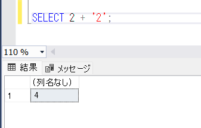

こんにちは、じゅんじゅんです。

先日、 SQL Server で一時テーブルを作成し、その一時テーブルにレコードを追加したときのことです。

`varchar` に定義した列に対して文字列の値を入れているのに、**varchar の値 'B2' をデータ型 int に変換できませんでした。** というエラーメッセージが表示され、レコードの追加ができませんでした。

今回は SQL Server で `INSERT` 時に別の型として判断されてしまう場合の原因と解決法を紹介します。

## エラーが発生する SQL

以下のような SQL の場合、「`varchar` の値 `'B2'` をデータ型 `int` に変換できませんでした。」というエラーが発生します。

```sql:title=一時テーブルに値を挿入する&nbsp;SQL
BEGIN TRAN;

DECLARE @user TABLE (
  NAME NVARCHAR(20)
, AGE INT
, RANK NVARCHAR(10)
)

INSERT INTO @user
VALUES
  ('hogehoge', 28, 2)
, ('piyopiyo', 31, 'B2')
, ('fugafuga', 23, 3)
;

SELECT
  *
FROM @user
;


ROLLBACK;
```

実行すると以下のようなメッセージが表示され、 `INSERT` が失敗します。


## エラーが発生する原因

「`varchar` の値 `'B2'`」を代入しようとしているカラムは `NVARCHAR` 型の `RANK` ですが、**なぜか `int` に変換しようとしています**。 `B2` はもちろん `int` 型にはなれないので変換に失敗します。

`int` に変換しようとする原因は **`VALUES` の 1 つ目で `RANK` に対して `2` という int の値を代入していたから**です。

文字列の `'2'` を入力するべきところを数値の `2` と記載していたことで**暗黙的な型変換**がはたらき、 `RANK` は `int` 型と判断されたのでした。

## 暗黙的な型変換とは

Microsoft のドキュメント「[暗黙的な変換と明示的な変換](https://learn.microsoft.com/ja-jp/sql/t-sql/data-types/data-type-conversion-database-engine?view=sql-server-ver16#implicit-and-explicit-conversion)」には以下のように記載されています。

> 暗黙的な変換はユーザーが意識する必要はありません。 SQL Server がデータのデータ型を自動的に変換します。 たとえば、smallint 型を int 型と比較する場合、比較を実行する前に、smallint 型から int 型に暗黙的に変換されます。

**異なる型を比較する場合や、今回のように `INSERT` をするときに、データベースが自動的に型を同じものに変換してくれる機能**なのですが、これが逆に悪さをしていました。

ドキュメントの同ページに、どの型がどの型に変換できるかを示した表があります (見づらいですが...) 。



たとえば画像の矢印で記した部分を見ると、 `varchar` から `int` へ変換可能なことがわかります。

そのため、**今回の `VALUES` の 1 つ目のように `2` という `int` 型は文字列 `2` に変換が可能なので `int` として代入され、結果 `RANK` が `int` 型の列だと判断されてしまいました**。

暗黙的な型変換は一見すると変換が不要なので楽に見えますが、**バグの元であり原因もわかりづらいため、これに頼らず正しい型を記述したり、明示的に型変換するほうが賢明です**。

## あとがき

実際は `VALUES` がもっとたくさんあったので、なかなか原因の特定ができませんでした。型に対する認識が甘かったです...。

SQL に限らず他の言語でも型をより意識して作業しようと誓いました。
