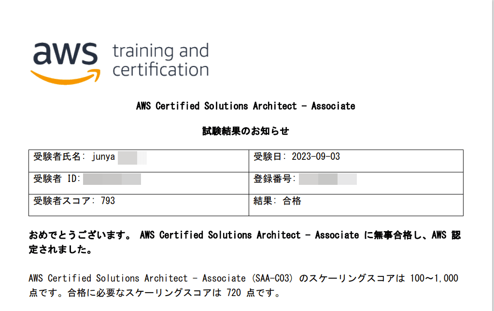

こんにちは、じゅんじゅんです。

タイトルのとおり、先日 AWS 認定試験の SAA (ソリューションアーキテクト - アソシエイト) に合格しました。

すでに CLF (クラウドプラクティショナー) には合格していましたが、難易度が桁違いでかなり苦戦しました。

今回は私が行った勉強法と、 SAA を受験した感想について書いていきます。

### 勉強法

私が主に使用したのは Udemy の模擬試験です。

[【SAA-C03版】AWS 認定ソリューションアーキテクト アソシエイト模擬試験問題集（6回分390問）](https://www.udemy.com/course/aws-knan/)

CLF の勉強をしたときの記憶がある程度残っていたので、いきなり問題集を解き始めましたが、最初はほとんどわかりませんでした。

1 回分の模擬試験を解いた後、解説を読みながらサービスごとの要点をメモアプリにメモしていく作業を受験直前まで繰り返していました。

1 回の試験に 65 問もあり、1 問の問題文も長いので、1 回分を解いて解説を読み終わるだけで何日もかかりましたが、2 週目には合格点を取れるようになりました。

たまには問題を解くだけではなく、以下の YouTube の動画を見て全体を整理したりしていました。

[AWS ソリューションアーキテクト アソシエイト試験 対策動画](https://www.youtube.com/watch?v=fsz6G45A4H4)

各サービスの細かいところまで紹介されており、試験によく出るところ、丸暗記したほうがいいところ、覚える必要がないところなどを教えてくれて助かりました。

### 試験結果

試験結果は 1000 点満点中 793 点でした。 720 点以上で合格なのでけっこうギリギリでした。

結果は受験完了から 5 営業日以内に発表されます。

私の場合はテストセンターで受験して数時間後、電車で帰っているときに合格のメールが届きました。結果待ちのそわそわ期間が短く済みました。

### 感想

本当はもっと早くに受験する予定でしたが合格できる自信がなかなかつきませんでした。

幸い無料で日程変更できるため、 1 ヵ月スケジュールを延期しました ([AWS Certification のよくある質問](https://aws.amazon.com/jp/certification/faqs/) の「試験のスケジュールを立てる」タブ参照) 。

CLF と比べて、サービス名とそのサービスの主な機能を覚えているだけでは解けない問題ばかりでした。

具体的な要件を提示され、可用性やセキュリティ、コストなどを考慮し、さまざまなサービスを組み合わせた解決策を選択肢から最適解を選ぶ必要があります。

似たような要件でも、パフォーマンスを優先するのか、コスト最適化をめざすのかによって答えが変わるため、問題文をよく読んで状況をイメージしながら解くようにしました。

Udemy の模擬試験を解きながら、実際に試してみたいと思ったサービスの組み合わせをたくさんメモしているので、それらも記事にしていこうと思っています。

それに加えて来月は英検準1級があるので、どちらも頑張ります！