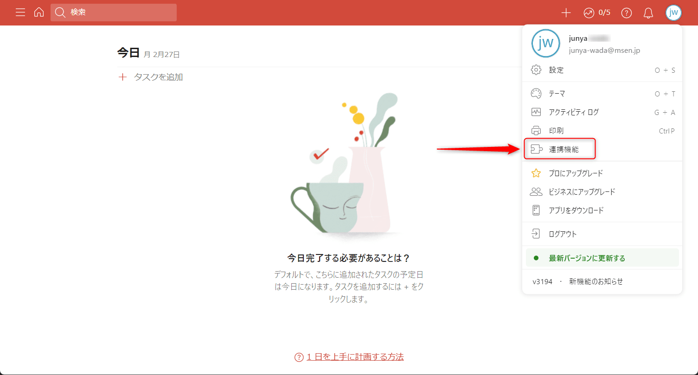
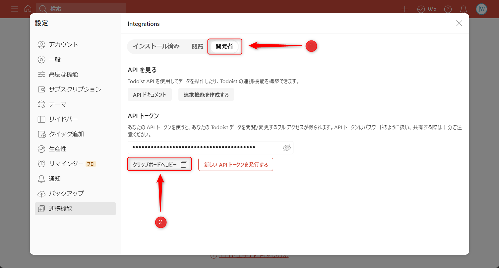
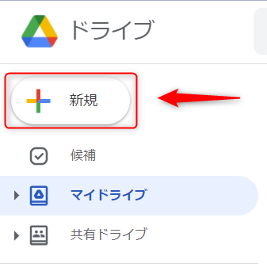
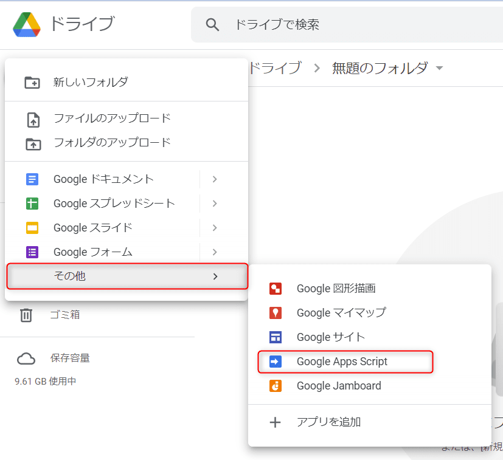
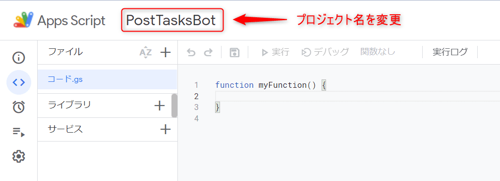
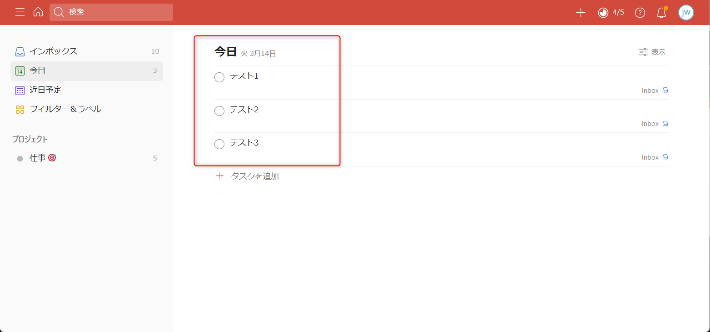

こんにちは、じゅんじゅんです。

弊社ではチャットツールに Slack を使用しており、毎朝その日にやることを投稿しています。

今回は GAS を使って Todoist に登録してある今日のタスクを自動的に Slack に投稿してくれる bot を作る方法を紹介します。

Todoist から今日のタスクを取ってくるところを前編、取ってきたタスクを Slack に投稿するところを後編でお送りします。

後編はこちら → [[GAS] Todoist の今日のタスクを Slack に投稿する【後編】](https://mseeeen.msen.jp/post-todays-todoist-task-in-gas-to-slack-part2)

## Todoist の API トークンを取得する

まずは Todoist API を使用するためのトークンを取得します。

Todoist にログインし、右上のプロフィールアイコンから「連携機能」をクリックします。



設定画面が開いたら「開発者」の下部にあるトークンをコピーし、どこかに控えておくか、この画面を開いた状態にしておきます。



## GAS のスクリプトファイルを作成する

Todoist API を使用する準備ができたので、次に GAS のコードを書くスクリプトファイルを作成します。

Google ドライブにアクセスします。

[Google ドライブ](https://drive.google.com/drive/my-drive?ths=true)

「新規」をクリックします。



「その他」→ 「Google Apps Script」をクリックします。



スクリプトファイルが作成されるので、プロジェクト名を入力します。今回は「PostTasksBot」としておきます。




## Todoist API を使って今日のタスクを取得する

スクリプトファイルが準備できたので、実際に Todoist API を使用して今日のタスクを取得します。

あらかじめ Todoist に今日のタスクをいくつか登録しておきます。



以下のコードで、今日のタスクを取得し、コンソールに表示します。

```js{numberLines:1}:title=PostTasksBot.gscript
function getTasks() {
  // Todoist の API トークン 
  const todoistToken = '***********';
  const endpoint = 'https://api.todoist.com/rest/v2/tasks?filter=today';

  const headers = {
    'Content-Type': 'application/json',
    'Authorization': 'Bearer ' + todoistToken,
  }

  const params = {
    'method': 'GET',
    'headers': headers,
  }

  const tasks = JSON.parse(UrlFetchApp.fetch(endpoint, params).getContentText());
  const taskTitles = tasks.map(task => '- ' + task.content).join('\n');
  console.log(taskTitles);
}
```

3 行目の定数 `todoistToken` にはあらかじめ控えておいた Todoist API トークンを入れます。
4 行目の定数 `endpoint` には、タスクを取得する Todoist API のエンドポイントを入れます。

[Todoist API の公式ドキュメント](https://developer.todoist.com/rest/v2/?shell#get-active-tasks)

クエリーパラメーターを `?filter=today` とすることで、今日のタスクに絞って取得できます。

16 行目の GAS の `UrlFetchApp` で `fetch` メソッドを使用することで、引数に指定した URL に対し HTTP リクエストを送ることができます。

[GAS の公式ドキュメント](https://developers.google.com/apps-script/reference/url-fetch/url-fetch-app?hl=ja)

返される HTTP レスポンスに対し `getContentText` メソッドを使用することでコンテンツを文字列に変換します。ここではさらに `JSON.parse` することでオブジェクトにしています。

変数 `tasks` は以下のような状態になっています。

```js:title=tasks
[ { id: '6692075690',
    assigner_id: null,
    assignee_id: null,
    project_id: '2308534565',
    section_id: null,
    parent_id: null,
    order: 23,
    content: 'テスト1',
    description: '',
    is_completed: false,
    labels: [],
    priority: 1,
    comment_count: 0,
    creator_id: '43245281',
    created_at: '2023-03-11T13:03:40.396330Z',
    due: 
     { date: '2023-03-14',
       string: '3月14日',
       lang: 'ja',
       is_recurring: false },
    url: 'https://todoist.com/showTask?id=6692075690' },
  { id: '6692075729',
    assigner_id: null,
    assignee_id: null,
    project_id: '2308534565',
    section_id: null,
    parent_id: null,
    order: 24,
    content: 'テスト2',
    description: '',
    is_completed: false,
    labels: [],
    priority: 1,
    comment_count: 0,
    creator_id: '43245281',
    created_at: '2023-03-11T13:03:43.124807Z',
    due: 
     { date: '2023-03-14',
       string: '3月14日',
       lang: 'ja',
       is_recurring: false },
    url: 'https://todoist.com/showTask?id=6692075729' },
  { id: '6692100385',
    assigner_id: null,
    assignee_id: null,
    project_id: '2308534565',
    section_id: null,
    parent_id: null,
    order: 25,
    content: 'テスト3',
    description: '',
    is_completed: false,
    labels: [],
    priority: 1,
    comment_count: 0,
    creator_id: '43245281',
    created_at: '2023-03-11T13:17:46.019402Z',
    due: 
     { date: '2023-03-14',
       string: '3月14日',
       lang: 'ja',
       is_recurring: false },
    url: 'https://todoist.com/showTask?id=6692100385' } ]
```

3 つのタスクが配列に格納されています。

`tasks` に対し `map` を使用してタスクのタイトル (`content`) だけを抜き出しています。

変数 `taskTitles` は以下のようになります。

```
- テスト1
- テスト2
- テスト3
```

これで今日のタスクのタイトルを取得できました。

後編ではこれを Slack に投稿する方法を解説します。

### 参考

- [todoistのAPIを用いて日付を指定してタスクを追加するサンプル](https://shinshin86.hateblo.jp/entry/2022/02/13/171131)
- [Help with Todoist API Parameters in Siri Shortcuts (Easy fix, but confused)](https://talk.automators.fm/t/help-with-todoist-api-parameters-in-siri-shortcuts-easy-fix-but-confused/8660/4)