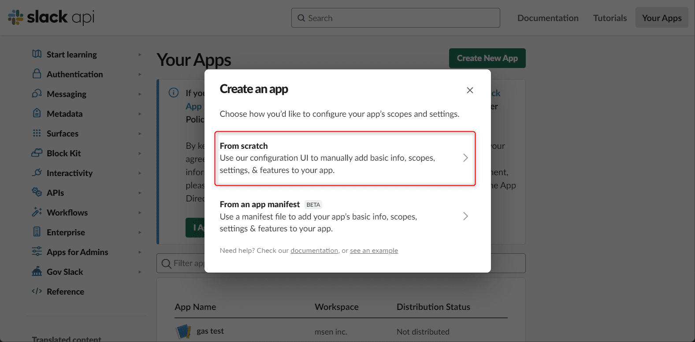
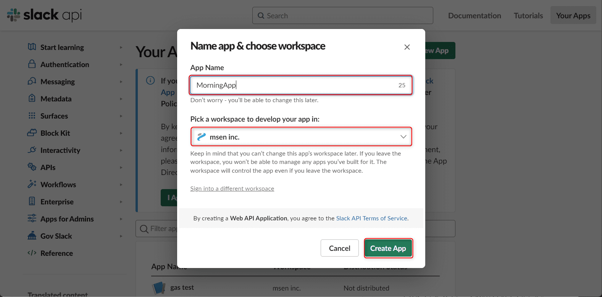
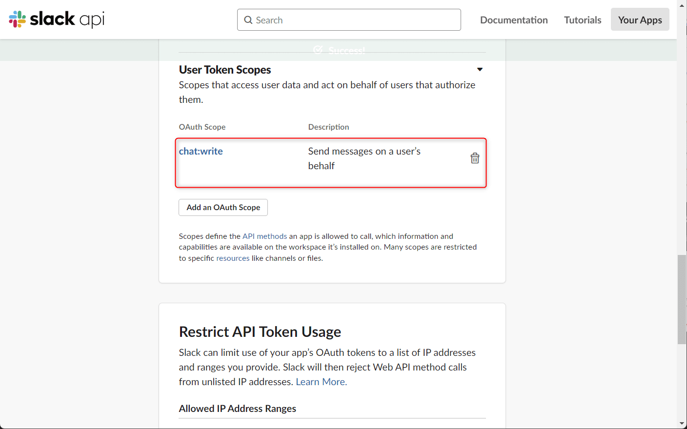
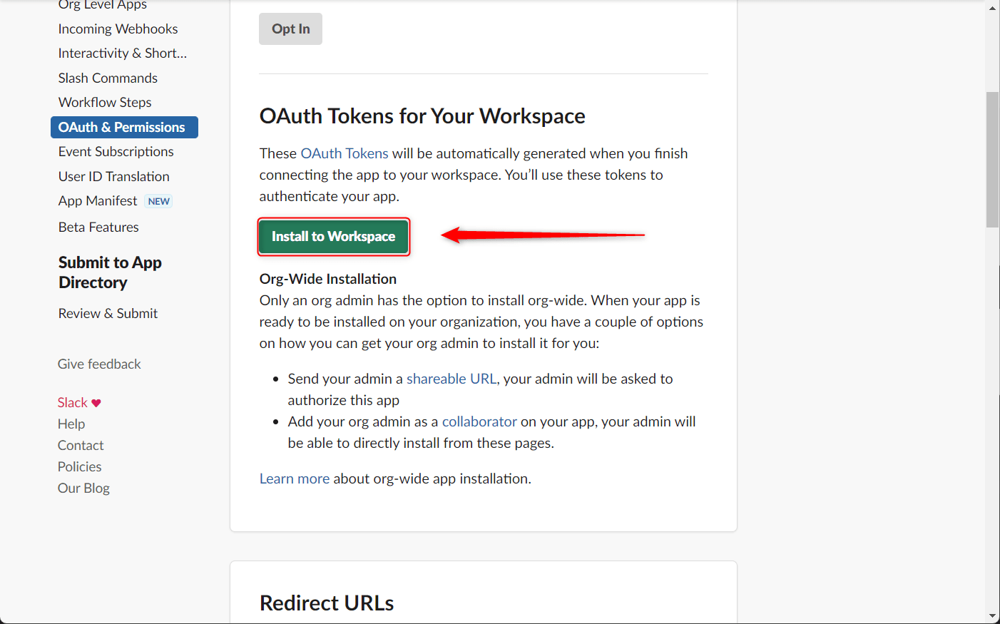
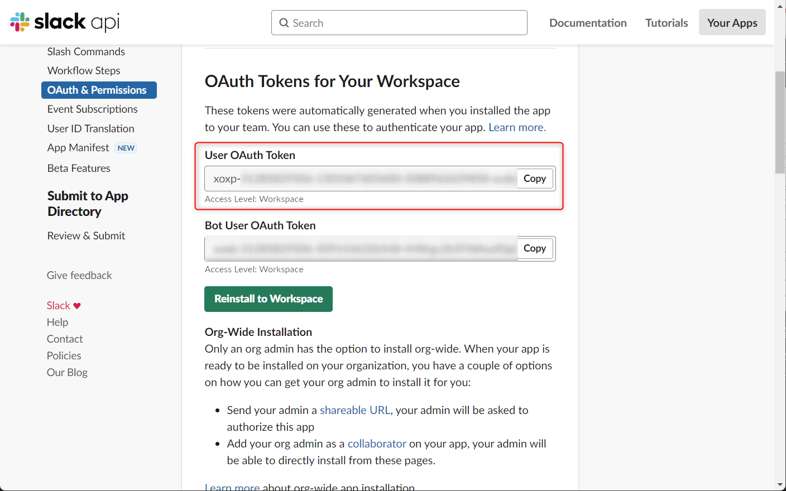
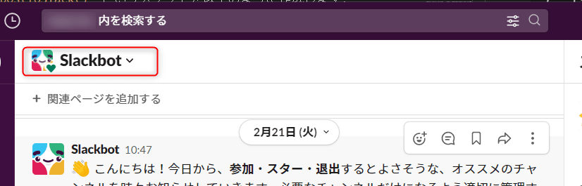

こんにちは、じゅんじゅんです。

この記事はGAS を使って Todoist に登録してある今日のタスクを自動的に Slack に投稿してくれるボットを作る方法の後編です。

前編はこちら → [[GAS] Todoist から取ってきた今日のタスクを Slack に投稿する【前編】](https://mseeeen.msen.jp/post-todays-todoist-task-in-gas-to-slack-part1)

前編では Todoist に登録された今日のタスクを取ってくる部分までできましたので、後編では取ってきたタスクを Slack に投稿する方法を紹介します。

## Slack の API トークンを取得する

GAS で Slack API を使い、Slack にメッセージを投稿します。そのために必要な API のトークンを取得します。

Slack のワークスペースにアクセスします。

https://api.slack.com/

「Create an app」をクリックします。


「From scratch」をクリックします。



アプリ名を入力し、対象のワークスペースを選択します。アプリ名は「MorningApp」としておきます。指定できたら「Create App」をクリックします。



Slack アプリが作成されたら、メニューの「OAuth & Permissions」をクリックします。


「Scopes」という部分にある「User Token Scopes」の「Add an OAuth Scope」をクリックします。


ちなみに「Bot Token Scopes」のほうは Bot として投稿するためのものです。今回はユーザーとして投稿する「User Token Scopes」を使用します。

Slack のチャンネルに対してメッセージを送るための権限「chat:write」を選択します。




Scopes の設定ができたので、ワークスペースに Slack アプリをインストールします。

同じページの上部にある「Install to Workspace」をクリックします。



内容に問題がなければ、「許可する」をクリックします。


「OAuth & Permissions」のページに「User OAuth Token」が発行されているので、コピーして控えておきます。



## GAS で Slack API を使ってタスクを投稿する

Slack API の準備ができたので、 GAS に Slack へタスクを投稿するスクリプトを作成します。

以下は前編で Todoist から今日のタスクを取得したスクリプトです。この続きから書いていきます。

```js{numberLines:1}
function getTasks() {
  // Todoist の API トークン 
  const todoistToken = '***********';
  const endpoint = 'https://api.todoist.com/rest/v2/tasks?filter=today';

  const headers = {
    'Content-Type': 'application/json',
    'Authorization': 'Bearer ' + todoistToken,
  }

  const params = {
    'method': 'GET',
    'headers': headers,
  }

  const tasks = JSON.parse(UrlFetchApp.fetch(endpoint, params).getContentText());
  const taskTitles = tasks.map(task => '- ' + task.content).join('\n');
  console.log(taskTitles);
}
```

まず、前回書いた Todoist からタスクを取得する `getTasks()` を、取得した `taskTitles` を `return` するよう修正します。

```js{numberLines:1}{18}
function getTasks() {
  // Todoist の API トークン 
  const todoistToken = '***********';
  const endpoint = 'https://api.todoist.com/rest/v2/tasks?filter=today';

  const headers = {
    'Content-Type': 'application/json',
    'Authorization': 'Bearer ' + todoistToken,
  }

  const params = {
    'method': 'GET',
    'headers': headers,
  }

  const tasks = JSON.parse(UrlFetchApp.fetch(endpoint, params).getContentText());
  const taskTitles = tasks.map(task => '- ' + task.content).join('\n');
  return taskTitles;
}
```

`getTasks()` によって取得した `taskTitles` を Slack に投稿する `postToSlack()` というメソッドを以下のように作成します。

```js{numberLines:1}
function postToSlack() {
  const slackToken = '******';
  const channelId = '******';
  const url = 'https://slack.com/api/chat.postMessage';

  const payload = {
    channel: channelId,
    text: getTasks(),
  }

  const params = {
    method: 'post',
    contentType: 'application/json',
    headers: { 'Authorization': 'Bearer ' + slackToken },
    payload: JSON.stringify(payload),
  };
  UrlFetchApp.fetch(url, params);  
}
```

2 行目の `slackToken` には、あらかじめコピーしておいた User OAuth Token を入れます。

3 行目の `channelId` には、タスクを投稿するチャンネルの ID を入れます。

チャンネルの ID を確認するには、まず投稿したいチャンネル名の部分をクリックします。



チャンネルの詳細画面が開くので、一番下までスクロールするとチャンネル ID が記載されています。


4 行目の `url` に書かれているのは `chat.postMessage` という Slack に投稿するための API です。

[chat.postMessage](https://api.slack.com/methods/chat.postMessage)

8 行目、 `payload` の `text` には `getTask()` の結果である今日のタスクを渡しています。

全体のコードは以下のようになっています。

```js
function getTasks() {
  // Todoist の API トークン 
  const todoistToken = '******';
  const endpoint = 'https://api.todoist.com/rest/v2/tasks?filter=today';

  const headers = {
    'Content-Type': 'application/json',
    'Authorization': 'Bearer ' + todoistToken,
  }

  const params = {
    'method': 'GET',
    'headers': headers,
  }

  const tasks = JSON.parse(UrlFetchApp.fetch(endpoint, params).getContentText());
  const taskTitles = tasks.map(task => '- ' + task.content).join('\n');
  return taskTitles;
}

function postToSlack() {
  const slackToken = '******';
  const channelId = '******';
  const url = 'https://slack.com/api/chat.postMessage';

  const payload = {
    channel: channelId,
    text: getTasks(),
  }

  const params = {
    method: 'post',
    contentType: 'application/json',
    headers: { 'Authorization': 'Bearer ' + slackToken },
    payload: JSON.stringify(payload),
  };
  UrlFetchApp.fetch(url, params);  
}
```

では実際に Slack に投稿してみます。GAS の ① の部分 (実行するメソッド) を `postToSlack()` に設定し、「実行」をクリックします。

 を実行")

結果、以下のように指定したチャンネルに今日のタスクが投稿されていました！


### GAS を定期実行させる

最後に、この GAS を毎朝定期実行させるための設定を行います。

GAS の画面左の時計のマークをクリックします。


「トリガー」という画面が開くので、右下にある「トリガーを追加」をクリックします。


「PostTasksBot のトリガーを編集」というモーダルが開きました。この画面では GAS をどのようなタイミングで実行するかを細かく指定することができます。


今回は毎朝 8 時ぐらいに実行してほしいため、上記のように設定し、右下の「保存」をクリックすると準備完了です。

「時刻を選択」の部分に「午前 8 時～ 9 時」と書いてあるように、午前 8 時から 9 時の間のどこかで実行されます。

日付だけでなく、分や時間、週や月ごとに指定することもできます。

これで次の日の朝 8 時に今日のタスクが投稿されていました！


### あとがき

今回は GAS という便利なツールと、 Todoist 、Slack の API を使って、割と簡単に日々の作業を自動化することができました。

以下のページからたくさんの API を探すことができるので、もっといろんな API の組み合わせを試してみようと思います。

[APIbank](https://www.apibank.jp/ApiBank/api)