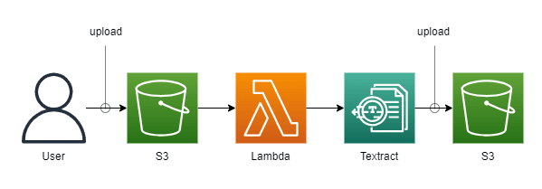
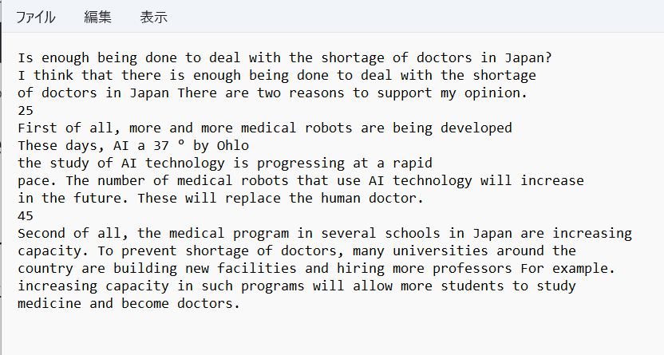

こんにちは、じゅんじゅんです。

以下の記事で、 AWS コンソール画面から S3 に保存した画像の文字を Textract でテキストデータとして取得する手順を紹介しました。

[S3 に保存した画像から Amazon Textract でテキストデータを取得する](https://mseeeen.msen.jp/extract-text-from-s3-images-with-amazon-textract)

しかし、コンソール画面からバケットを一つ一つ作成したり、 Lambda の zip をアップロードするのは面倒です。

今回は Serverless Framework を使って上記の記事と同じ構成を構築する方法を紹介します。

## 前提

- Node.js v18.16.0
- Serverless Framework 3.24.1

## 構成

今回は S3 のイベント通知を利用し、 S3 に画像がアップロードされたら Textract で文字を検出する処理を記載した Lambda を実行します。

検出したテキストデータはテキストファイルにし、別の S3 にアップロードします。



## サービスの作成

まずはサービス (Serverless Framework の実行環境) を作成します。

以下のコマンドを実行すると s3-textract というディレクトリが作成され、その中に serverless.yml や handler.js が作成されます。

```
serverless create --template aws-nodejs --name s3-textract --path s3-textract
```

## handler.mjs の作成

作成されたディレクトリに移動したら以下のコマンドを実行して npm の初期化と AWS SDK のインストールを行います。

```
npm init
npm install aws-sdk
```

`handler.js` を `handler.mjs` に修正し、中身を以下のようにします。

```js:title=handler.mjs
import AWS from 'aws-sdk';

const textract = new AWS.Textract();
const s3 = new AWS.S3();

export const detectText = async (event) => {
  // S3 のイベントからオブジェクトの情報を取得
  const bucket = event.Records[0].s3.bucket.name;
  const objectKey = event.Records[0].s3.object.key;

  const params = {
    DocumentLocation: {
      S3Object: {
        Bucket: bucket,
        Name: objectKey
      }
    }
  };

  try {
    // Textractを呼び出し、テキストを抽出
    const response = await textract.startDocumentTextDetection(params).promise();
    
    // Textractのジョブが完了するのを待つ
    const jobId = response.JobId;
    await waitForJobCompletion(jobId);

    // テキストを取得
    const text = await getTextractText(jobId);
    console.log(text);
    
    // テキストを使用して必要な処理を行う
    const putparams = {
      Bucket: '20231113-text-bucket',
      Key: 'sample.txt',
      Body: text,
      ContentType: 'text/plain',
    };

    await s3.putObject(putparams).promise();

    return {
      statusCode: 200,
      body: 'Text file uploaded successfully.'
    };
  } catch (error) {
    return {
      statusCode: 500,
      body: JSON.stringify(error.message)
    };
  }
};

// Textractのジョブが完了するのを待つ
async function waitForJobCompletion(jobId) {
  const delay = (ms) => new Promise(resolve => setTimeout(resolve, ms));

  while (true) {
    const response = await textract.getDocumentTextDetection({ JobId: jobId }).promise();

    if (response.JobStatus === 'SUCCEEDED') {
      break;
    }

    if (response.JobStatus === 'IN_PROGRESS') {
      await delay(5000);
    }
  }
}

// Textractからテキストを取得
async function getTextractText(jobId) {
  const response = await textract.getDocumentTextDetection({ JobId: jobId }).promise();
  const text = response.Blocks
    .filter(block => block.BlockType === 'LINE')
    .map(block => block.Text)
    .join('\n');
  
  return text;
}
```

バケット名以外は「[S3 に保存した画像から Amazon Textract でテキストデータを取得する](https://mseeeen.msen.jp/extract-text-from-s3-images-with-amazon-textract)」の記事に記載した内容と同じです。

## serverless.yml の作成

serverless.yml は以下のようにします。

```yml:title=serverless.yml
service: s3-textract

frameworkVersion: "3"

provider:
  name: aws
  runtime: nodejs18.x
  region: us-west-1
  iam:
    role:
      statements:
        - Effect: Allow
          Action:
            - s3:*
          Resource:
            - "arn:aws:s3:::20231113-image-bucket/*"
            - "arn:aws:s3:::20231113-text-bucket/*"
        - Effect: Allow
          Action:
            - textract:StartDocumentTextDetection
            - textract:GetDocumentTextDetection
          Resource:
            - "*"

functions:
  detectText:
    handler: handler.detectText
    timeout: 60
    events:
      - s3:
          bucket: 20231113-image-bucket
          event: s3:ObjectCreated:*
          existing: true
    layers:
      - {Ref: AwsLayerLambdaLayer}

resources:
  Resources:
    20231113ImageBucket:
      Type: AWS::S3::Bucket
      Properties:
        BucketName: 20231113-image-bucket
    20231113TextBucket:
      Type: AWS::S3::Bucket
      Properties:
        BucketName: 20231113-text-bucket

layers:
  awsLayer:
    path: aws-layer
```

### provider の部分

Amazon Textract は東京リージョン (ap-northeast-1) には未対応のため、今回 `region` は us-west-1 (北カリフォルニア) としています。

`iam.role.statements` では、 S3 と Textract の操作権限を付与しています。

S3 のほうは、画像をアップロードするバケットと、検出したテキストを記載したテキストファイルを保存するバケットに対する操作を許可しています。

Textract のほうは、 Lambda に記載した処理の中で使用している `StartDocumentTextDetection` と `GetDocumentTextDetection` という操作を許可しています。

### functions の部分

`functions` では先に作成した Lambda 関数についての設定を記載しています。

`events` の部分で `20231113-image-bucket` というバケットに対してイベント通知を設定しています。

`event` は `s3:ObjectCreated:*` としていて、このバケットにオブジェクトが保存されたときにこの関数が実行されます。

`functions` の下にある `resources` の部分で 2 つのバケットを定義しているため、 `events` の部分に `existing: true` が必要です ([Serverless Framework で Lambda に S3 のイベント通知が設定されないときの確認点](https://mseeeen.msen.jp/serverless-framework-lambda-s3-event-notification-checks/) 参照) 。

`layers` は `{Ref: AwsLayerLambdaLayer}` としていて、 yml の一番下に定義している `aws-layer` を呼び出しています ([[AWS] Lambda レイヤーの node_modules が読み込まれないときの解決法](https://mseeeen.msen.jp/how-to-solve-lambda-layer-error-in-serverless-framework/) 参照) 。

## Lambda レイヤーディレクトリの作成

serverless.yml で定義したように、 s3-textract ディレクトリ下に aws-layer というディレクトリを作成し、その中に nodejs というディレクトリを作成し、 node_modules を格納します。

```
.
├── handler.mjs
├── aws-layer
│   └── nodejs
│       └── node_modules
│
└── serverless.yml
```

## デプロイ

これで準備が整いました。以下のコマンドを実行してデプロイします。

```
sls deploy
```

`✔ Service deployed to stack s3-textract-dev` と表示されるとデプロイ完了です。

## AWS CLI で英文の画像をアップロードする

[S3 に保存した画像から Amazon Textract でテキストデータを取得する](https://mseeeen.msen.jp/extract-text-from-s3-images-with-amazon-textract) で行ったように S3 のコンソール画面からアップロードできますが、せっかくなのでここもコンソール画面を使わないでアップロードしてみます。

英文の画像は私が作文した以下 (sample.png) の画像を使用します。この画像ファイルを s3-textract ディレクトリに置きます。


sample.png を置いた s3-textract ディレクトリで以下の CLI コマンドを実行すると 20231113-image-bucket に sample.png をアップロードできます。

```
aws s3api put-object --bucket 20231113-image-bucket --key sample.png --body ./sample.png
```

以下のコマンドを実行し、 20231113-image-bucket に画像ファイルをアップロードできたか確認します。

```
aws s3api list-objects-v2 --bucket 20231113-image-bucket
```

以下のように表示されていればアップロードが成功しています。

```json:title=sample.png&nbsp;がアップロードされていることを確認
{
    "Contents": [
        {
            "Key": "sample.png",
            "LastModified": "2023-11-13T13:12:14+00:00",
            "ETag": "\"64e806e55d7fbb9ba011cf19599f97a4\"",
            "Size": 443275,
            "StorageClass": "STANDARD"
        }
    ]
}
```

次に以下のコマンドを実行し、 Textract によって抽出されたテキストが記載されたテキストファイルが 20231113-text-bucket に作成されているか確認します。

```
aws s3api list-objects-v2 --bucket 20231113-text-bucket
```

こちらも同様に以下のように表示されればテキストファイルが無事作成されています。

```json:title=sample.txt&nbsp;が作成されていることを確認
{
    "Contents": [
        {
            "Key": "sample.txt",
            "LastModified": "2023-11-13T13:13:08+00:00",
            "ETag": "\"616ca57c925f619bbd6647609be65a19\"",
            "Size": 800,
            "StorageClass": "STANDARD"
        }
    ]
}
```

作成されていることが確認できたら最後に以下のコマンドを実行し、作成されたテキストファイルを s3-textract ディレクトリに保存します。

```
aws s3api get-object --bucket 20231113-text-bucket --key sample.txt sample.txt
```

s3-textract ディレクトリに sample.txt が保存されました！中身は以下のようになっていました。



## 感想

コンソール画面から行う方法と Serverless Framework から行う方法のどちらも試してみましたが、慣れると断然 Serverless Framework のほうが楽であることを実感しました。

開発中はどうしてもトライ＆エラーを繰り返すことになるので、コマンドひとつでデプロイや関数の実行ができたり、合わせて AWS CLI も活用することでコンソール画面を極力使用せず動作確認まで行うことができました。

今後似たような構成を構築するときも今回作成した serverless.yml を参考にできるので、作れば作るほど効率が上がっていきそうです。
