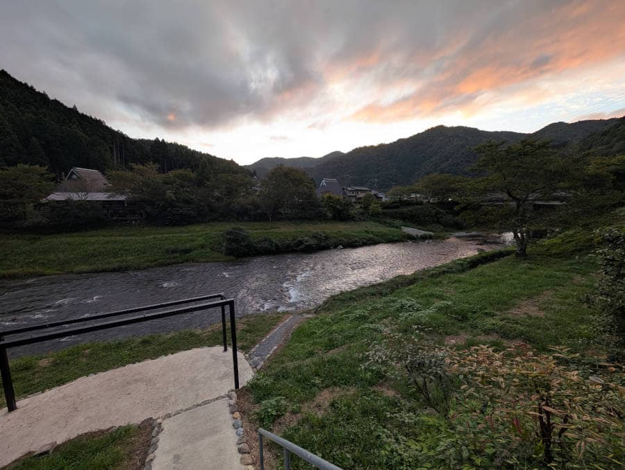
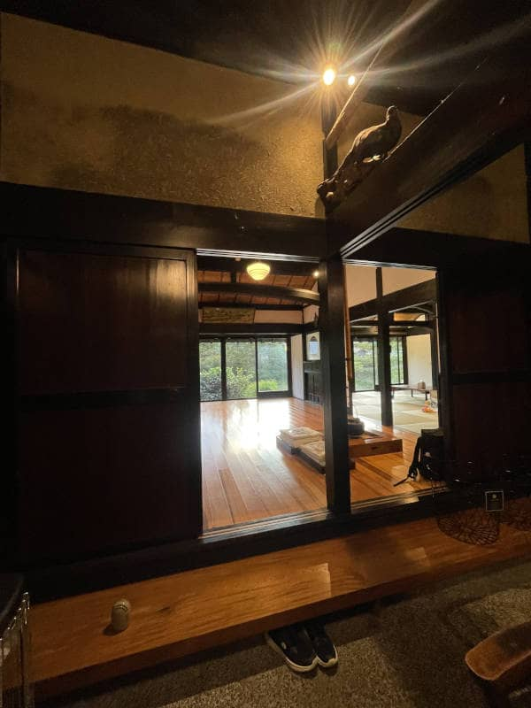
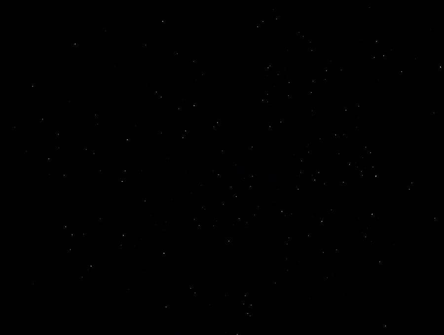

こんにちは、じゅんじゅんです。

MSEN ではレクリエーションとして定期的に BBQ をしたり社員旅行に出かけたりしています。

今回 2024年10月5日～6日にかけて京都へ行ってきましたので、その様子をお届けします。

# 1日目

## 昼食 ～京都若狭路レストランゆげ～

まずは[京都若狭路レストランゆげ](https://tabelog.com/kyoto/A2601/A260504/26014792/)にて早めの昼食です。

ソースカツ丼、ソースチキンカツ丼が一押しメニューの洋食屋さんです。

コロモはカリカリ、お肉はふわふわでとても美味しかったです。

## 美山かやぶきの里を散策

夜に行う BBQ のための買い出しを終え、次に向かうは[美山かやぶきの里](https://kayabukinosato.jp/)。

山の中にあるかやぶき屋根の家が並ぶ集落です。かやぶき屋根とは茅 (かや) と呼ばれる植物を厚く重ねて作られた屋根のことで、有名なところだと白川郷もかやぶき屋根の集落です。

とても空気が澄んでいて、歩いているだけで気持ち良かったです。

## 京都ミヤマシキテイにチェックイン

かやぶきの里を楽しんだ後はついに本日のお宿にチェックイン！

今回は、何度か姉妹店を利用させていただいた四季亭さんの新店、[京都ミヤマシキテイ](https://miyama.shikitei.info/)に宿泊しました。

自然に囲まれた静かな場所で、すぐそばに綺麗な川が流れていました。

新しいだけあって宿の中も綺麗で過ごしやすかったです。

## 流しそうめん

宿の庭で koya さんが持ってきてくれた流しそうめんセットで流しそうめんをしました。

## バーベキュー

夜はバーベキューを楽しみました！自然に囲まれてやるバーベキューが一番おいしいですね。

## 食後の花火

バーベキューの後は花火をしました。筆者的には何年ぶりかも思い出せないぐらい久しぶりだったので、とても懐かしい気持ちになっていました。

## 星がきれい

ふと夜空を見上げてみると、都会では見られないような輝く星たちが！

みんなテンション爆上がりで結構長いこと見てました。

2日目に続きます。