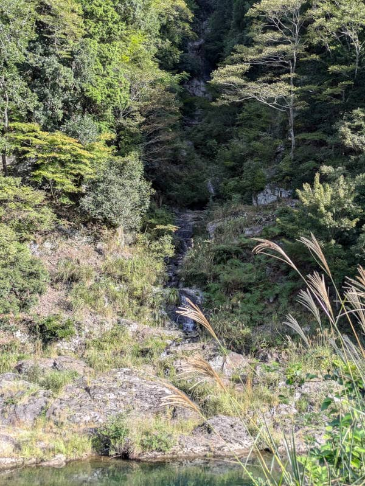
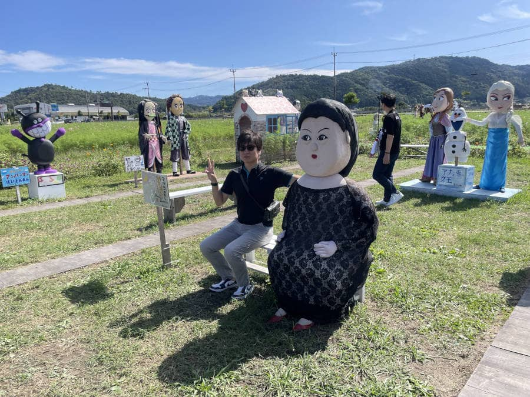
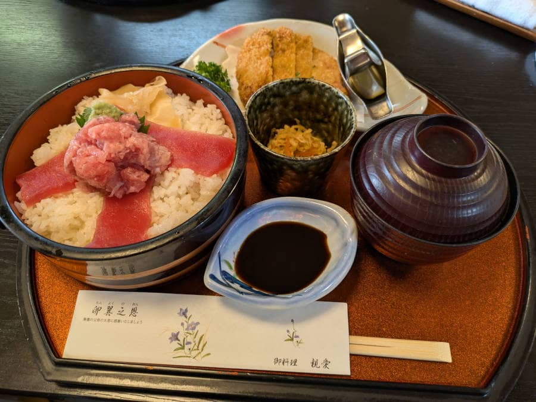

こんにちは、じゅんじゅんです。

[1日目](https://mseeeen.msen.jp/2024-recreation-in-kyoto-day1/) に引き続き、京都旅行2日目の記事です。

## 朝散歩

前日、早々に寝てしまった筆者は早めに目が覚めたので、散歩に出かけました。

1日目に続いて良い天気でした。

## 道の駅 美山ふれあい広場

片付けをしてチェックアウトしたら、すぐそばにある[道の駅 美山ふれあい広場](https://miyamanavi.com/sightseeing/fureaihiroba)にいきました。

美山牛乳を使用したジェラートを食べたり、お土産を買いました。

")

## 夢コスモス園

次はちょうど開催期間中だった京都亀岡の[夢コスモス園](https://yume-cosmos.com/)にいきました。

少し時期が早かったのか、満開とはいきませんでしたがじゅうぶんキレイでした。

2024年は11月4日まで開催されています。

園内では創作かかしコンテストが開催されており、どこかで見たことあるようなキャラのかかしが飾られていました。

## レストランしん愛

夢コスモス園を満喫した後は[レストランしん愛](https://www.shinainet.com/)にて昼食です。

みそとんかつが名物のお店で、 HP では以下のように説明されています。

> 西京味噌と九条ねぎ（青しそ）をたっぷりと豚肉に挟み、ジューシーに仕上げました。

重たくなくあっさりしていて食べやすかったです。

## 嵯峨野トロッコ列車に乗って渡月橋へ

午後は[嵯峨野トロッコ列車](https://www.sagano-kanko.co.jp/)に乗ってきました。

亀岡から乗って嵯峨野まで行き、渡月橋を観光してから亀岡まで戻るというルートでした。

トロッコからは渓谷の景色が楽しめました。

渡月橋はたくさんの観光客でにぎわっていました。ちょうど夕日が沈み始めた時間帯で、美しい情景が広がっていました。

## 解散

トロッコで亀岡まで戻ってきたところで解散です。

2日間天候に恵まれ、心地良い気温でとても過ごしやすく、楽しい時間を過ごせました。

運転手のみなさまありがとうございました！

