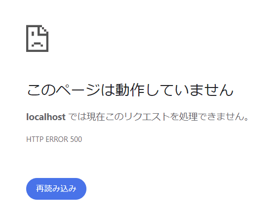

こんにちは、じゅんじゅんです。

現在、開発チームのメンバーで React の勉強をしています。

各々で英単語暗記アプリを作っていて、そのアプリに Auth.js の v5 で GitHub 認証を追加することにしました。

その際、認証時に以下のエラーが発生し、うまくいきませんでした。

```
TypeError: next_dist_server_web_exports_next_request__WEBPACK_IMPORTED_MODULE_0__ is not a constructor
```

今回はこのエラーが発生する原因と解決法を紹介します。

## 前提
- Next.js 14.1.0
- Auth.js (next-auth) ^5.0.0-beta.16

## 結論

結論から言いますと、 `.env` に `AUTH_URL` を記載していたことが原因でした。

```{2}:title=.env
AUTH_SECRET=
AUTH_URL=http://localhost:3000
AUTH_GITHUB_ID=
AUTH_GITHUB_SECRET=
```

Auth.js v5 では、 `.env` に `AUTH_URL` または `NEXTAUTH_URL` が記載されていた場合、上述した TypeError が発生するようです。

この問題について GitHub に issue が立てられており、 Next.js Canary では修正がされているようなので、いずれ安定版でも修正されるはずです。

- [NextAuth v5 TypeError: next_dist_server_web_exports_next_request__WEBPACK_IMPORTED_MODULE_0__ is not a constructor](https://github.com/nextauthjs/next-auth/issues/9922)

## AUTH_URL について

v5 以前は Next.js のアプリケーションを本番環境にデプロイする際、 `AUTH_URL` または `NEXTAUTH_URL` にサイトの正規の URL を設定する必要がありました。

しかし、 v5 では[公式ドキュメント](https://authjs.dev/getting-started/migrating-to-v5)に記載されているように不要となりました。

> The NEXTAUTH_URL/AUTH_URL is not strictly necessary anymore in most environments. We will auto-detect the host based on the request headers.

訳) NEXTAUTH_URL/AUTH_URL は、ほとんどの環境では厳密には必要なくなりました。リクエストヘッダーに基づいてホストを自動検出します。

## 修正前の状態

では実際のソースコードと画面を紹介します。まずは `AUTH_URL` を記載した状態を見てみます。

`.env` には上記の 4 行を記載しておきます。

以下のように `auth.ts` を作成し、 `handlers`・ `auth`・ `signIn`・ `signOut` をエクスポートします。

```TS:title=auth.ts
import NextAuth, { NextAuthConfig } from "next-auth";
import Github from "next-auth/providers/github";

export const config: NextAuthConfig = {
    providers: [Github({
        clientId: process.env.AUTH_GITHUB_ID,
        clientSecret: process.env.AUTH_GITHUB_SECRET
    })],
    basePath: "/api/auth",
}

export const {handlers, auth, signIn, signOut} = NextAuth(config);
```

`api/auth/[...nextauth]/route.ts` を作成し、 `auth.ts` からインポートした `handlers` の中にある GET メソッドを使って API を実装します。

```ts:title=api/auth/[...nextauth]/route.ts
import { handlers } from "@/auth";

export const { GET } = handlers;
```

`Auth.tsx` というコンポーネントを作成します (UI フレームワークに MUI を使用しています)。

ここでは SignIn と SignOut のボタンを用意しています。

```ts:title=components/Auth.tsx
import React from "react";
import { Button } from "@mui/material";
import { signIn, signOut } from "@/auth";

export function SignIn({
  provider,
  ...props
}: { provider?: string } & React.ComponentPropsWithRef<typeof Button>) {
  return (
    <form
      action={async () => {
        "use server";
        await signIn(provider);
      }}
    >
      <button variant="contained" size="large" {...props}>
        ログイン
      </button>
    </form>
  );
}

export function SignOut({
  provider,
  ...props
}: { provider?: string } & React.ComponentPropsWithRef<typeof Button>) {
  return (
    <form
      action={async () => {
        "use server";
        await signOut();
      }}
    >
      <button variant="contained" size="large" {...props}>
        ログアウト
      </button>
    </form>
  );
}
```

ログイン画面は以下のようにします。

ここでは簡単に、セッションがなければ SignIn ボタンを、セッションを取得できているなら SignOut ボタンとセッション情報を表示します。

```ts:title=login/page.tsx
"use strict";
import { auth } from "@/auth";
import { SignIn, SignOut } from "@/components/Auth";

export default async function Page() {
  const session = await auth();
  // セッションがない場合は SignIn ボタンを表示
  if (!session?.user) return <SignIn provider="github" />;
  else
    return (
      <>
        <SignOut provider="github" />
        <p>{JSON.stringify(session, null, 2)}</p>
      </>
    );
}
```


ログインボタンをクリックすると、500 エラーになります。



ターミナルを確認すると、上述した TypeError が表示されていました。

```
TypeError: next_dist_server_web_exports_next_request__WEBPACK_IMPORTED_MODULE_0__ is not a constructor
```

## 修正後の状態

では、 `.env` の `AUTH_URL` をコメントアウトします。

```{2}:title=.env
AUTH_SECRET=
# AUTH_URL=http://localhost:3000
AUTH_GITHUB_ID=
AUTH_GITHUB_SECRET=
```

そのうえでログインボタンを押すと、 GitHub 認証が成功し、セッション情報が画面に表示されました。


## あとがき

Auth.js (NextAuth.js) を触ること自体初めてだったこと、情報が少ない最新バージョンを採用したことで、原因を見つけるのに苦労しました。

ただそのおかげで Auth.js の理解が深まったので良かったと思うことにします。

## 参考
- [Next.js 14 + NextAuth.js 5で、ユーザ名/IDを表示したい](http://blog.livedoor.jp/ragi_d/archives/65910068.html)