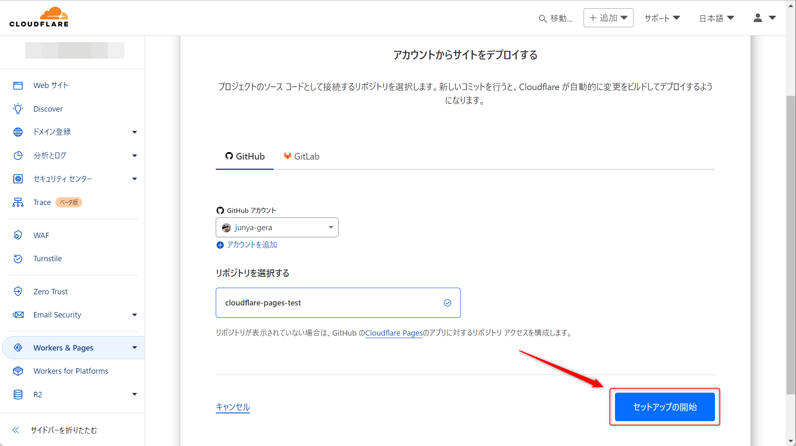

こんにちは、じゅんじゅんです。

Cloudflare Pages を使い、 Next.js で作成した静的サイトをデプロイしようとしたところ、以下のエラーが発生しました。

```
Error: Output directory "out" not found.
```

## 原因と解決策

Cloudflare Pages では、ビルド後に静的ファイルが生成される「出力ディレクトリ」を指定する必要があります。

Next.js の場合、静的サイトとしてエクスポートすると `out` というディレクトリがデフォルトで作成されます。このディレクトリに HTML や CSS、 JavaScript ファイルが入ります。

デプロイを試したとき、 Cloudflare Pages の「フレームワーク プリセット」で「Next.js (Static HTML Export)」を選択すると、「ビルド出力ディレクトリ」にデフォルトで `out` が入ります。これにより、 Cloudflare Pages での設定に問題はありませんでした。


ではなぜ「Output directory "out" not found.」と表示されたのかというと、 Next.js の出力モードが静的エクスポートに設定されていなかったため、ビルド時に `out` ディレクトリが作成されなかったからです。

Next.js のアプリを静的サイトとしてエクスポートするには、 `next.config.js` の `nextConfig` に以下の設定を追加して、出力モードを静的エクスポートに変更する必要があります。

```js:title=next.config.js
const nextConfig = {
  output: "export"
};
```

初期状態だと `nextConfig` は空のため、この設定を追加する必要があります。追加すると `npx next build` を実行した際に静的ファイルを含んだ `out` ディレクトリが自動的に作成されます。

ちなみにビルドコマンドを `npx next build && npx next export` とすることでも静的エクスポートが実行されます。しかし、設定ファイルに記載しておくほうがビルド時にコマンドを気にする必要がないので効率的です。

原因は以上ですが、せっかくなのでデプロイまでの手順を記載します。

## Next.js のセットアップ

まずは Next.js のセットアップを行います。以下のコマンドを実行してください。ディレクトリ名は `cloudflare-pages-test` としました。

`npx create-next-app@latest`

Cloudflare Pages にホスティングする際、 GitHub のリポジトリが必要になるので作成しておきます。

`page.tsx` の内容はとりあえず以下のようにしておきます。

```js:title=page.tsx
export default function Home() {
  return (
    <main className="p-24">
      <div className="text-2xl">
        cloudflare test
      </div>
    </main>
  );
}
```

原因に記載した next.config.js の修正をします。

```js:title=next.config.js
/** @type {import('next').NextConfig} */
// const nextConfig = {};
const nextConfig = {
  output: "export",
};

export default nextConfig;
```

## Cloudflare のアカウント作成

[Cloudflare のサインアップ画面](https://dash.cloudflare.com/sign-up)にアクセスし、メールアドレス、パスワードを入力してサインアップします。


入力したメールアドレス宛に認証メールが届くので、有効化します。

## Pages の作成

「Workers & pages」を開きます。


「Pages」タブを選択し、「Git に接続」をクリックします。


「GitHub」タブの「GitHub に接続」をクリックします。


GitHub のアカウントを選んだら「Select repositories」をクリックし、先ほど作成したリポジトリを選択します。選択できたら「Save」をクリックします。


Pages に戻り、「セットアップの開始」をクリックします。



「ビルドの設定」の「フレームワーク プリセット」の部分は「Next.js (Static HTML Export)」を選択します。

すると「ビルド コマンド」には「npx next build」が、ビルド出力ディレクトリには「out」が自動で入力されます。「保存してデプロイ」をクリックします。


しばらく待つとデプロイが成功します。


cloudflare-pages-test1-8g2.pages.dev にアクセスするとページが表示されました。


## 参考

- [Cloudflare Docs - Static Site](https://developers.cloudflare.com/pages/framework-guides/nextjs/deploy-a-static-nextjs-site/)

- [Next.js - Static Exports](https://nextjs.org/docs/pages/building-your-application/deploying/static-exports)
