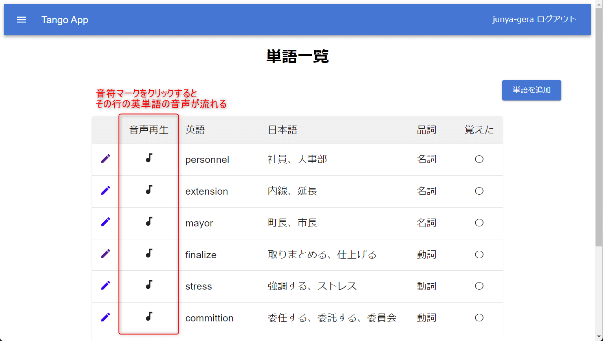

こんにちは、じゅんじゅんです。

先日、社内の勉強会で開発している英単語暗記アプリに英語の音声を再生する機能を追加しました。その方法について紹介します。

実装は以下のようにしました。

1. AWS Polly のテキストを音声に変換する機能を使って音声データを返す Lambda 関数を Serverless Framework で作成
2. Lambda 関数 URL を使用してアプリから Lambda 関数を呼び出し、取得した音声データを再生

以前 Lambda 関数 URL について紹介した[記事](https://mseeeen.msen.jp/how-to-execute-lambda-from-line-using-function-urls/)ではコンソール画面から作成していましたが、今回は Serverless Framework で作成しています。

最後に AWS Polly ではなく Web Speech API を使って音声再生機能を実装する方法についても紹介しています。

## AWS Polly とは

[AWS Polly](https://aws.amazon.com/jp/polly/) について、公式では以下のように説明されています。

> Amazon Polly は深層学習技術を使用し、人間の声のような音声を合成します。そのため、記事を音声に変換することができます。幅広い言語に対応したリアルな音声を多数搭載しており、Amazon Polly を使用して音声起動型アプリケーションを構築することができます。

テキストデータを深層学習技術により音声データに変換してくれるサービスです。

AWS Polly は何十種類もの言語や声を選択できます。音声の速さ・高さ・大きさも調節でき、ニュースキャスターのような話し方をさせたりもできます。

今回は Lambda 上で SDK を使って使用しています。

## serverless.yml の作成

Serverless Framework のサービス作成については以前の記事「[[Serverless Framework] S3 に保存した画像から Amazon Textract でテキストデータを取得する](https://mseeeen.msen.jp/serverless-framework-s3-image-textract-text/)」の「サービスの作成」の部分を参考にしてください。

serverless.yml の中身は以下のようにします。

```yml:title=serverless.yml
service: wordMemorizationApp

provider:
  name: aws
  runtime: nodejs18.x
  region: us-west-2
  iamRoleStatements:
    - Effect: Allow
      Action:
        - polly:SynthesizeSpeech
      Resource: "*"

functions:
  generateSpeech:
    handler: handler.generateSpeech
    url:
      cors:
        allowedOrigins:
          - http://localhost:3000
        allowedHeaders:
          - Content-Type
        allowedMethods:
          - POST
    layers:
      - { Ref: AwsLayerLambdaLayer }

layers:
  awsLayer:
    path: aws-layer
```

`iamRoleStatements` の部分で AWS Polly の `SynthesizeSpeech` を使用する許可を与えています。

[SynthesizeSpeech](https://docs.aws.amazon.com/polly/latest/dg/API_SynthesizeSpeech.html) は Lambda 内で使用する、音声を合成する関数です。

`functions` に Lambda 関数の設定を記述しています。

今回は関数名を `generateSpeech` としています。

`url` を記述することで Lambda の関数 URL を作成できます。 CORS の設定が不要な場合は `url: true` だけでも大丈夫です。

`cors` の部分で CORS の設定をしています。すべてのリクエストを許可する場合は `cors: true` と記載できます。

細かい Lambda 関数 URL の設定内容については公式ドキュメント「[AWS Lambda Function URLs with Serverless Framework](https://www.serverless.com/blog/aws-lambda-function-urls-with-serverless-framework)」を参考にしてください。

`layers` の部分については以前の記事「[[AWS] Lambda レイヤーの node_modules が読み込まれないときの解決法](https://mseeeen.msen.jp/how-to-solve-lambda-layer-error-in-serverless-framework/)」を参考にしてください。

## index.mjs の作成

Lambda 関数の処理を記述する `index.mjs` は以下のようにします。

```js:title=index.mjs
import AWS from 'aws-sdk';

const polly = new AWS.Polly({
  region: 'us-west-2',
});

export const generateSpeech = async event => {
  const word = event.body;

  // Polly で音声を合成する
  const params = {
    Text: word,
    OutputFormat: 'mp3',
    VoiceId: 'Joanna' // 音声の種類を指定（例: 'Joanna' は女性の英語）
  };

  try {
    const data = await polly.synthesizeSpeech(params).promise();
    if (data.AudioStream instanceof Buffer) {
      // バイナリーデータを Base64 エンコードして文字列に変換
      const audioBase64 = data.AudioStream.toString('base64');
      // 音声ファイルの URL を生成
      const audioUrl = `data:audio/mpeg;base64,${audioBase64}`;
      return {
        statusCode: 200,
        headers: {
          'Content-Type': 'application/json'
        },
        body: JSON.stringify({ url: audioUrl })
      };
    } else {
      return {
        statusCode: 500,
        body: JSON.stringify({ message: 'Error: Unexpected audio stream format' })
      };
    }
  } catch (error) {
    return {
      statusCode: 500,
      body: JSON.stringify({ message: `Error: ${error.message}` })
    };
  }
};
```

`synthesizeSpeech` に渡す `params` を定義します。

`word` が音声に変換するテキストデータです。

`VoiceId` には、用意されている音声の種類から好きなものを設定します。今回は女性かつ英語の音声である `Joanna` を選択しています。

用意されている音声の種類は [Amazon Polly features](https://aws.amazon.com/polly/features/?nc=sn&loc=3) を参照してください。

`params` を `synthesizeSpeech` に渡し、音声データを取得します。

```js:title=synthesizeSpeechで音声データを取得
const data = await polly.synthesizeSpeech(params).promise();
```

取得した音声データはバイナリー形式のため、ブラウザ上で再生可能な Base64 形式に変換します。

```js:title=Base64形式に変換
// バイナリーデータを Base64 エンコードして文字列に変換
const audioBase64 = data.AudioStream.toString('base64');
```

`data:audio/mpeg;base64,` プレフィックスを追加することで、ブラウザがこのデータを音声データとして認識し、再生できるようにします。

```js:title=data:audio/mpeg;base64,プレフィックスを追加
const audioUrl = `data:audio/mpeg;base64,${audioBase64}`;
```

これで音声データを取得する処理ができましたので、 Serverless Framework のサービスをデプロイします。

```
sls deploy
```

デプロイが完了すると、作成された Lambda 関数 URL が表示されます。

```:title=デプロイ後のコンソール{5}
Deploying wordMemorizationApp to stage dev (us-west-2)

✔ Service deployed to stack wordMemorizationApp-dev (102s)

endpoint: https://xxxxxxxx.lambda-url.us-west-2.on.aws/
functions:
  generateSpeech: wordMemorizationApp-dev-generateSpeech (6 kB)
layers:
  awsLayer: arn:aws:lambda:us-west-2:xxxxxxxx:layer:awsLayer:18
```

## アプリ側の実装

アプリ側では以下のようなコンポーネントを作成しました。

```ts:title=Audio.tsx
import AudiotrackIcon from "@mui/icons-material/Audiotrack";

export default function Audio(props: { phrase: string }) {
  const handlePlayButtonClick = async () => {
    const url = await getAudioUrl(props.phrase);
    const audio = new Audio(url);
    audio.play();
  };

  return (
    <>
      <AudiotrackIcon
        sx={{ cursor: "pointer" }}
        onClick={handlePlayButtonClick}
      />
    </>
  );
}

const getAudioUrl = async (phrase: string) => {
  try {
    const lambdaFunctionUrl = process.env.AUDIO_LAMBDA_URL;
    if (!lambdaFunctionUrl) {
      throw new Error("AUDIO_LAMBDA_URL is not defined in .env file");
    }

    const response = await fetch(lambdaFunctionUrl, {
      method: "POST",
      headers: {
        "Content-Type": "application/json",
      },
      body: phrase,
    });

    if (!response.ok) {
      throw new Error("Network response was not ok");
    }

    const responseData = await response.json();
    return responseData.url;
  } catch (error) {
    console.error("Error calling Lambda function:", error);
  }
};
```

このコンポーネントに渡した Props の `phrase` を `getAudioUrl` に渡します。

```ts:title=phraseをgetAudioUrlに渡す
const url = await getAudioUrl(props.phrase);
```

`getAudioUrl` では環境変数に記載した Lambda 関数 URL を `fetch` 関数で実行し、 `body` で `phrase` を渡します。

```ts:title=関数URLを叩く
const lambdaFunctionUrl = process.env.AUDIO_LAMBDA_URL;
if (!lambdaFunctionUrl) {
    throw new Error("AUDIO_LAMBDA_URL is not defined in .env file");
}

const response = await fetch(lambdaFunctionUrl, {
    method: "POST",
    headers: {
    "Content-Type": "application/json",
    },
    body: phrase,
});
```

返ってきた `responseData.url` を HTML の `Audio` を使って再生します。

```ts:title=audio.play()で音声を再生
const audio = new Audio(url);
audio.play();
```

これで AWS Polly を使った音声再生機能が実装できました！実際の画面では `Audio` コンポーネントを単語一覧画面の列に表示しています。



## Web Speech API で音声再生機能を実装

同様の機能を Web Speech API を使って実装すると、 `Audio.tsx` は以下のようになります。

```ts:title=Audio.tsx
import AudiotrackIcon from "@mui/icons-material/Audiotrack";

export default function AudioPlayback(props: { phrase: string }) {
  const handlePlayButtonClick = async () => {
    // Web Speech API のサポートを確認
    if (window.speechSynthesis) {
      const utterance = new SpeechSynthesisUtterance(props.phrase);
      utterance.lang = "en-US";
      window.speechSynthesis.speak(utterance);
    }
  };

  return (
    <>
      <AudiotrackIcon
        sx={{ cursor: "pointer" }}
        onClick={handlePlayButtonClick}
      />
    </>
  );
}
```

音声にしたい `props.phrase` を [`SpeechSynthesisUtterance`](https://developer.mozilla.org/ja/docs/Web/API/SpeechSynthesisUtterance) のコンストラクターに渡してインスタンスを作成します。

`utterance.lang = "en-US"` で言語を英語に設定します。

このインスタンス (`utterance`) を [speechSynthesis.speak()](https://developer.mozilla.org/en-US/docs/Web/API/SpeechSynthesis/speak) に渡すことで音声を流します。

Web Speech API ではたったこれだけで音声再生機能が実装できました。

## AWS Polly か、 Web Speech API か

上記のように Web Speech API であれば Lambda 関数を用意せずとも簡単に実装ができます。また、 Web Speech API は無料で使えるのに対し、 Lambda や AWS Polly は無料枠もありますが使い続けるといつかは料金が発生します。

加えて Web Speech API でも音程、速度、音量の調整ができます。

ただし、 **Web Speech API はブラウザ準拠の機能であるため、対応しているブラウザでないと使用できません** (現在は Chrome、Edge、Firefox、Safari と主要なブラウザは対応しています) 。

音声についてもブラウザごとに決められていて、聴き比べてみると音の高さなど結構違いがありました。今回の英単語暗記アプリの場合、もしかしたらリスニングの上達度に差が生まれるかもしれません。

そのため、環境に左右されたくない場合は AWS Polly を使用することも選択肢に入りそうです。

## 感想

一度使ってみたかったので AWS Polly で実装してみましたが、 Web Speech API のほうがはるかに簡単でした。

Serverless Framework で Lambda 関数 URL を作成する際の CORS の設定など、新しく知れたこともあったのでよかったです。