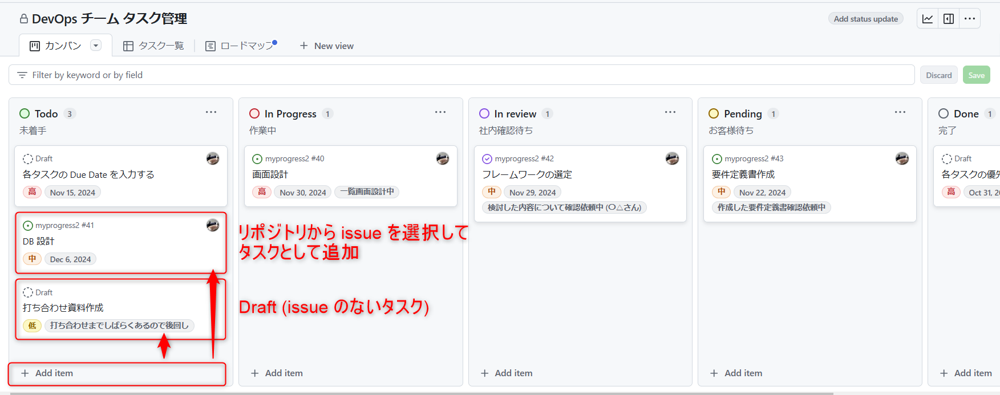
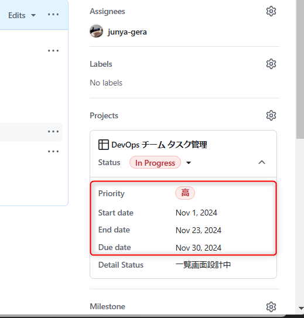
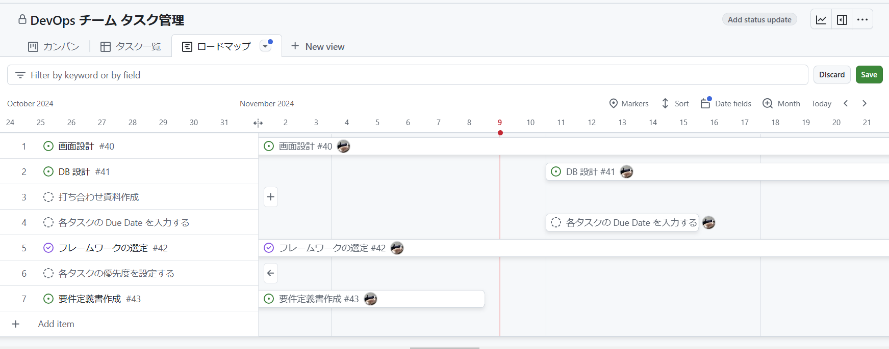
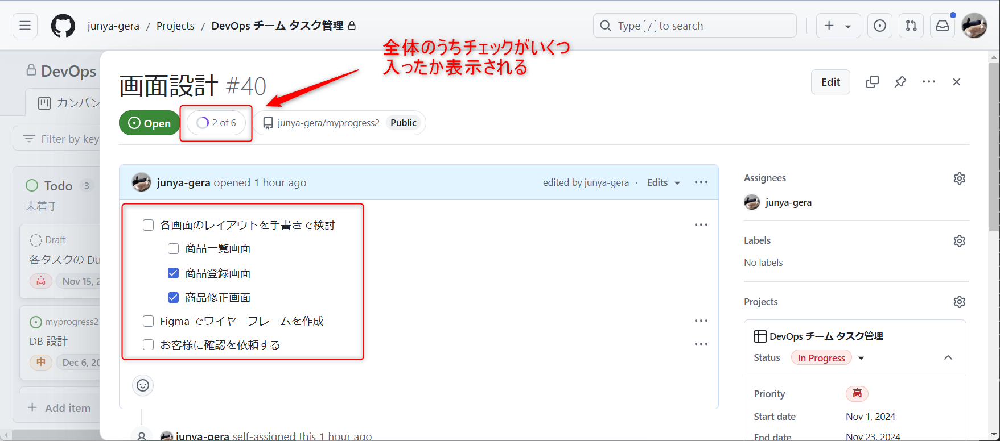
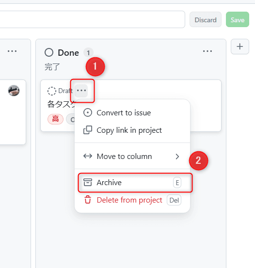
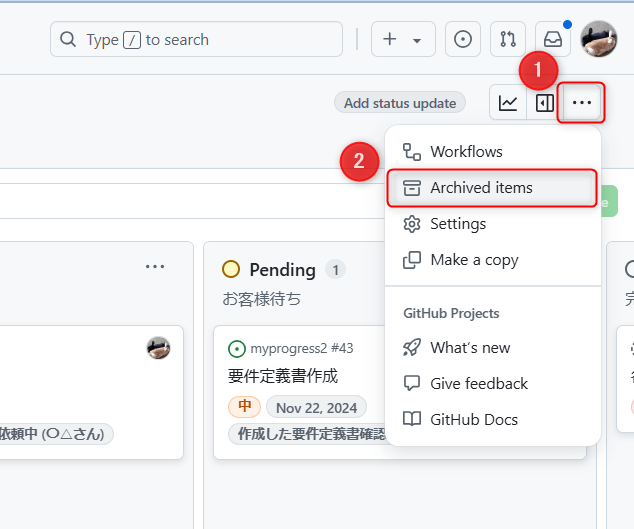

こんにちは、じゅんじゅんです。

8 月より DevOps チームのサブリーダーを務めることになり、この機会にチーム内のタスク管理方法を刷新しました。

チーム全体の作業状況が一目で把握でき、タスク管理の効率化にも優れた [GitHub Projects](https://docs.github.com/ja/issues/planning-and-tracking-with-projects/learning-about-projects/about-projects) を採用しました。

## GitHub Projects とは

GitHub Projects は、以下のように公式ドキュメントに記載されているとおり、 issue や Pull Request を使って GitHub 上でプロジェクト管理をするための機能です。

> プロジェクトは、作業の計画と追跡を効果的に行えるように GitHub 上の issue および pull request と統合できる、適応性のあるスプレッドシート、タスク ボード、ロード マップです。 issue と pull request をフィルター処理、並べ替え、グループ化することで複数のビューを作成してカスタマイズしたり、構成可能なグラフを使って作業を視覚化したり、team 固有のメタデータを追跡するためのカスタム フィールドを追加したりすることができます。 プロジェクトには、特定の手法を適用するのではなく、チームのニーズやプロセスに合わせてカスタマイズできる柔軟な機能があります。
<cite>[GitHub Projects について](https://docs.github.com/ja/issues/planning-and-tracking-with-projects/learning-about-projects/about-projects)</cite>

## タスク管理のルール

タスク管理をするうえで、各メンバーにやってもらうことは以下になります。

1. タスクの追加
    - 優先度・期日の設定
    - サブタスクの作成

2. タスク作業中
    - ステータスの変更
    - Detail Status の更新

## 1. タスクの追加

まずはタスクの追加について説明します。基本的に issue がタスクの単位です。追加するタイミングは以下の 3 点です。

1. お客様よりチケットが発行されて issue が作成される
2. サブリーダーが issue を作成する
3. サブリーダーの指示により作業者が issue を作成される

1 について、弊社はお客様との課題管理を [Redmine](https://redmine.jp/) で行っています。お客様からチケットが発行されると、対応する GitHub のリポジトリへ issue が作成されるようにしています。

2・3 についてはチケットが発行されていない、社内で発覚したバグや機能追加のためにタスクを作成する場合が多いです。

issue が追加されたら、プロジェクト上に追加します。 Assignees は、サブリーダーが対応をしてもらうメンバーをアサインします。

また、 issue を立てるほどでもない作業については draft でタスクを追加します。

### ステータスの種類

タスクの状態によって、ステータスを以下の 5 つに分けています。

- 「To Do」: 未着手のタスク
- 「In progress」: 現在作業中のタスク
- 「In review」: 他者にレビューを依頼しているタスク
- 「Pending」: 何らかの理由で作業が進められないタスク
- 「Done」: 作業が完了したタスク

追加したばかりのタスクは、すぐ着手できないものは「To Do」に、着手できるものは「In progress」に置きます。

### 優先度・期日の設定

タスクが追加できたら、そのタスクの優先度・期日を設定します。これは Assignees にアサインされた各作業者自身が設定します。

優先度は「高」・「中」・「低」を用意しています。これを設定していると優先度の高い順にタスクが並んでくれるので便利です。

また、タスクごとに以下の 3 種の期日を設定してもらいます。

- 「Start Date」：作業に着手する予定の日付
- 「End Date」：作業を完了させる予定の日付
- 「Due Date」：絶対越えてはいけない日付

「Start Date」・「End Date」は自身で決めた作業期間です。「Due Date」はお客様から決められた納期など、絶対に越えられない日付を入れます。

「Due Date」ギリギリにならないよう、できるだけ余裕をもった「End Date」を設定するようにしています。

期日を設定すると「Roadmap」というレイアウトで WBS のようにスケジュールを確認できます。

### サブタスクの作成

追加したタスクの issue の最初のコメントにチェックリストでサブタスクを作成します。すると issue の上部に「2 of 6」のように全体のうちいくつチェックが入ったか表示されます。

このようなサブタスクを作成する理由は 2 つあります。

- 作業者としては着手前に必要な作業を細かく列挙することでタスク全体の作業や進め方のイメージがつきやすくなり効率アップ

- サブリーダーとしては具体的な作業内容や進捗状況が把握しやすくなる。サブタスク単位で他者に作業を依頼しやすくなる

課題解決の手法として「分割統治法」というものがあります。**大きな問題を小さな問題に分割し、それぞれ個別に解決していくことで元の問題を解決する方法**です。

解決の糸口が見えない問題でも、小さな問題に分割していくことでどこから手をつければいいかがわかったり、どの部分につまずいているのかが把握できます。この方法でタスクに取り組んでもらえるようにしました。

また、**タスクが細かく分割されていることで分担しやすく、必要に応じてサポートしたり作業を引き継ぐことができます。よってチーム全体で作業効率が上がります。**

Issue 単位という違いはありますが、似たようなことが公式ドキュメントにも書かれていました。

- [Projects のベスト プラクティス - 大きなIssueを小さなIssueに分割する](https://docs.github.com/ja/issues/planning-and-tracking-with-projects/learning-about-projects/best-practices-for-projects#break-down-large-issues-into-smaller-issues)

サブタスクの内容が完了したらリアルタイムでチェックを入れていきます。

## 2. タスク作業中

### ステータスの変更

タスクが進み、状態が変わるごとにステータスを変更します。

すべてのサブタスクにチェックが入り、チケットがクローズされたタスクは「Done」に移します。

その後の「朝会」または「夕会」で Done になったことを報告したら、サブリーダーがそのタスクを Archive します。

Archive したタスクはタスク一覧に表示されなくなりますが、 Archived items で確認できます。

### Detail Status の更新

各タスクに Detail Status というテキスト入力欄を用意しています。このタスクが今どういう状態なのかを記載してもらい、サブリーダーや他のメンバーが一目で把握できるようにしています。

たとえばステータスごとに以下のような内容が考えられます。

- 「To Do」: 優先度「高」完了後に着手予定
- 「In progress」: ～機能実装中
- 「In review」: コードレビュー依頼中 (〇〇さん)
- 「Pending」: 画面案を担当者に確認依頼中
- 「Done」: 〇月△日リリース済

「In review」のタスクについては誰がレビュアーかわかりやすくするため、レビューを依頼しているメンバーの名前を記載します。

## 朝会・夕会でタスクを確認

毎日の朝会・夕会で各メンバーのタスクを GitHub Projects で確認しています。

カンバンやタスク一覧から issue のタイトルをクリックすると、ページ遷移もせず別タブも開かずに中身が確認できるので便利です。このままチェックリストにチェックを入れたり内容の修正もできます。

## 2ヵ月運用してみた感想

これまでは各メンバーがその日に着手するタスクしか聞いていなかったので、作業中のタスクしかわかりませんでした。

この管理方法により着手予定やレビュー中のものも含めて各々抱えているタスクが把握できるようになったことで、進捗状況がわかりやすくなり、メンバー間でタスクを効率的に分担できるようにもなりました。

[分析情報](https://docs.github.com/ja/issues/planning-and-tracking-with-projects/viewing-insights-from-your-project/about-insights-for-projects)の活用など、まだまだ改善の余地はありそうなので、よりよいタスク管理方法を追求していきます。
