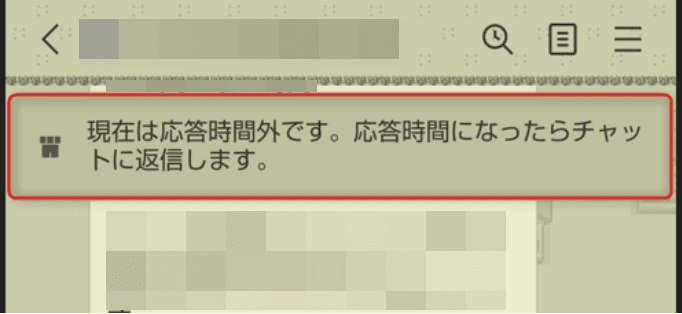
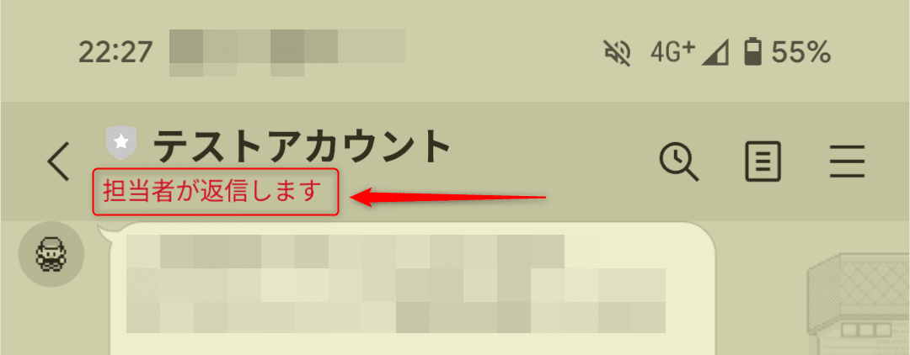
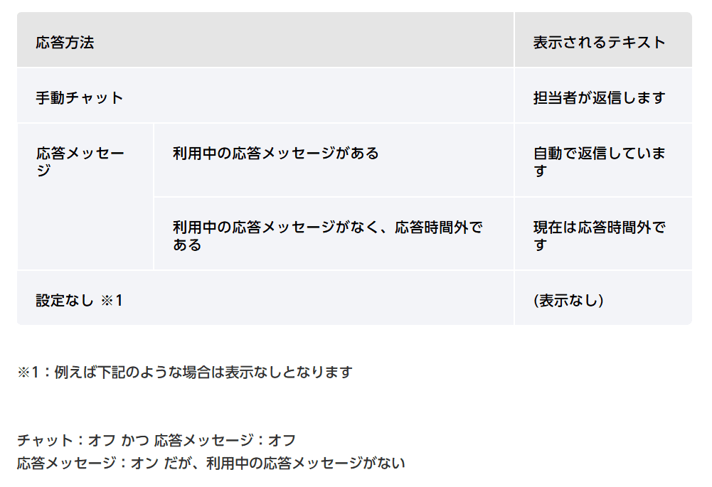
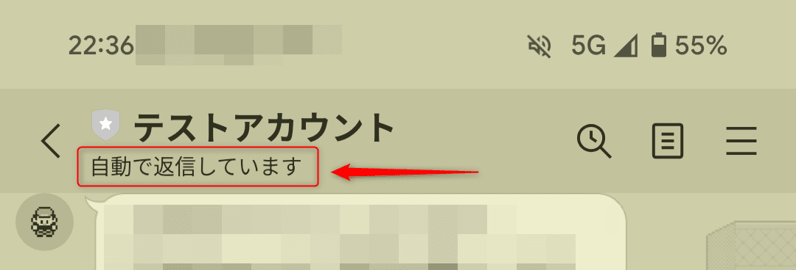
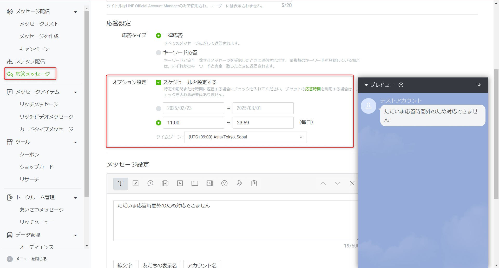
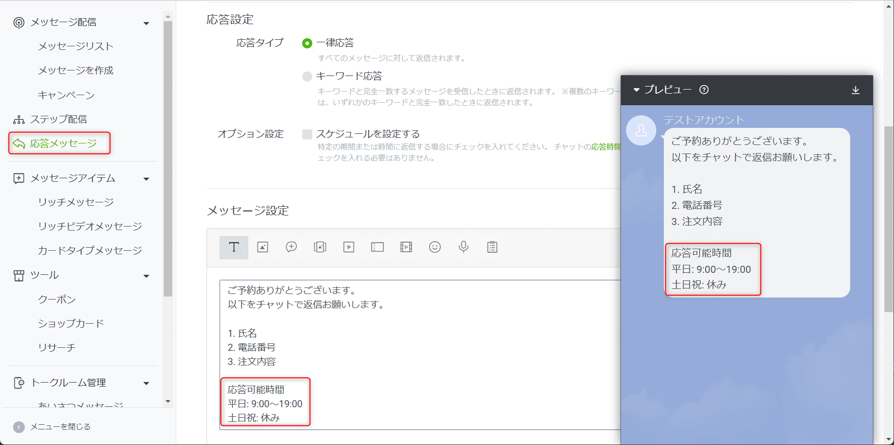
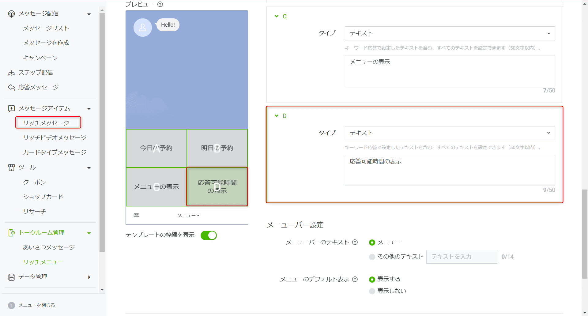
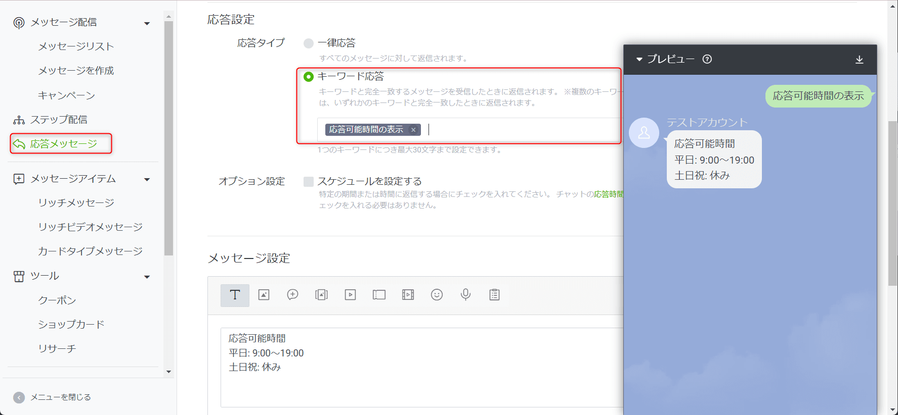
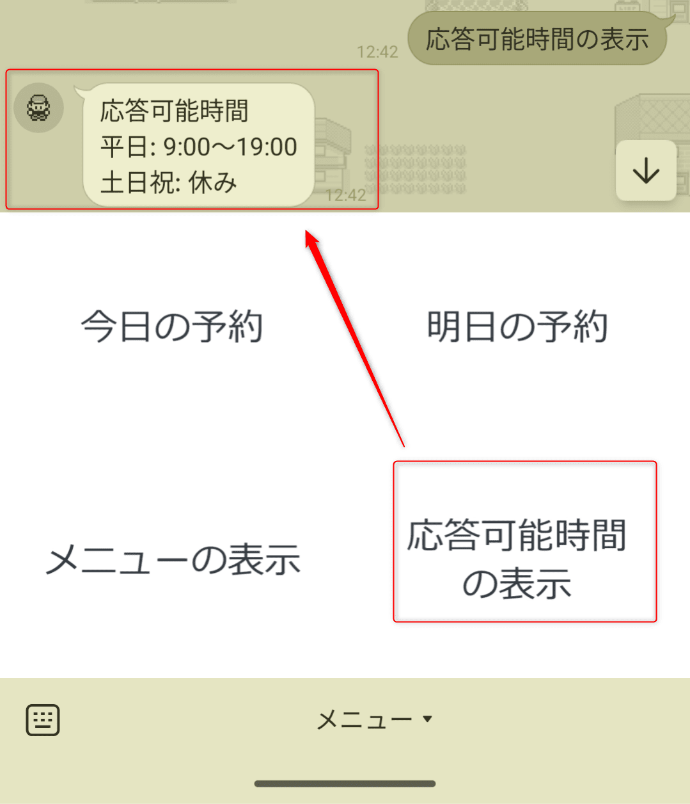

こんにちは、じゅんじゅんです。

LINE の公式アカウントでユーザーに応答時間外であることを知らせたい場合、以前までは以下のようなステータスバーが使えました。

しかし、**ステータスバーは 2025 年 2 月時点ですでにサービス終了しており、新たに「応答状況」という表示が追加されています**。

今回はステータスバーの代わりに、ユーザーへ応答時間外であることを知らせる方法を紹介します。

## 応答状況とは

応答状況とは、LINE 公式アカウントのチャット画面上部に表示される以下のようなメッセージのことです。

この表示内容は、[応答機能・チャットの応答方法](https://www.lycbiz.com/jp/manual/OfficialAccountManager/account-settings_response/)によると「応答方法」と「応答時間」によって以下のように分岐します。

ステータスバーであれば表示するテキストを自由に変更できましたが、応答状況は固定メッセージのようです。

また、**「利用中の応答メッセージがある」場合、応答時間外であろうと「自動で返信しています」という表示になります**。

困るのは、営業時間内のみ応答メッセージを使って LINE での注文を受け付けている店舗などの場合です。

**応答時間外 (営業時間外) にチャットで注文が送られても「自動で返信しています」というメッセージのみで応答時間外という情報がお客様に伝わりません。**

そのため、応答状況以外の方法を考える必要があります。

## 応答時間外に表示する応答メッセージを用意する

1 つは、応答時間外に表示する応答メッセージを用意する方法です。

応答メッセージはスケジュールの設定ができるため、応答時間外は一律応答で「ただいま応答時間外のため対応できません」のようなメッセージを返せば良さそうです。

ただし、**指定できるのは曜日単位ではなく時間単位のみ**となっています。

毎日この設定が反映されるため、たとえば以下の設定では土日も通常の応答メッセージが返ることになります。

## 通常の応答メッセージに応答が可能な時間を明記する

もう 1 つは、普段返している応答メッセージの中に応答が可能な時間を明記してしまう方法です。

この方法だと、応答メッセージが流れてしまった場合はスクロールで戻って確認するか、再度メッセージを送る必要があります。

## リッチメニューで応答が可能な時間を表示する

最後はリッチメニューを使って応答可能時間を表示する方法です。

リッチメニューでタイプをテキスト、送信されるテキストを「応答可能時間の表示」に設定します。

次に「応答可能時間を表示」というキーワードに対する応答メッセージを設定します。

こうすることで、ボタン 1 つで応答可能時間を確認できます。

## あとがき

個人的には、ステータスバーのほうが応答状況より見やすく、営業時間外のお知らせを明確に伝えられたので使いやすかったなと思いました...。

