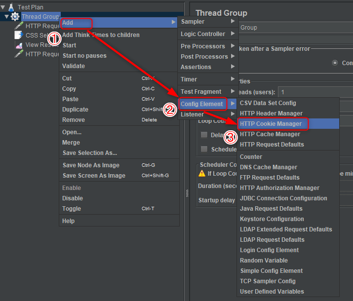

こんにちは。最近、 運転免許証の AT 限定を解除するために自動車学校に通っている k-so16 です。クラッチの操作が結構難しく感じますが、挑戦してみると楽しいものですね（笑）

現在携わっている業務で、負荷テストに **JMeter** を利用することになり、試しにローカル環境で色々使っていたのですが、ログイン認証が通らず悩んでいました。 JMeter の HTTP レスポンスのステータスコードが 400 を返していて、何か POST するキーを間違えているのかと思い、開発用サーバーのログを調べてみると、 CSRF[^csrf] 保護のフィールドを送っていないことが分かりました。 CSRF 保護フィールドはフォームの中の隠しフィールドに埋め込まれているので、この値を取得して POST データとして送れば解決できそうです。

本記事では、 **JMeter を使って CSRF 保護のフィールドで認証を通す方法**について紹介します。

本記事の想定読者は以下の通りです。

- CSS セレクタについて知っている
- JMeter の基礎的な使い方を知っている

## CSRF 保護フィールドの値を取得
レスポンスで返された **HTML から CSRF の値を埋め込んでいる隠しフィールドの値を取得**し、変数に格納する方法を説明します。

手順は以下の通りです。

1. HTTP Request の Sampler を追加
    - 認証ページの URL を指定
        - HTTP メソッドには GET を指定
        - リダイレクトで遷移する場合は **Follow Redirects** をチェック
    

1. 追加した HTTP Request に **CSS Selector Extractor** を追加
    - 右クリックして Add > Post Processor > CSS Selector Extractor を選択
    

1. CSS Selector Extractor の項目欄に入力
    - Name of created variable: 任意の変数名
    - CSS Selector Expression: 取得する隠しフィールドの CSS セレクタ
        - 例. `<input type="hidden" name="csrf_token" value="hoge">` → `input[name=csrf_token]`
    - Attribute: 取得したい属性
        - 隠しフィールドの値を取得するので `value` を指定
    

## CSRF 保護フィールドの値を POST データに埋め込み
前節で取得した CSRF の値を POST に埋め込む方法を説明します。

手順は以下の通りです。

1. CSS Selector Extractor を追加した Sampler の下に認証ページにアクセスする HTTP Request Sampler を追加
    

1. **Send Parameter with the Request** の Name と Value を入力
    - Name に隠しフィールドの `name` プロパティの内容を入力
    - Value に CSS Selector Extractor で指定した変数名を `${変数名}` の形で入力
    

1. 他に送信する内容を入力
    - 必要に応じて Send Parameter with the Request に送信データを追加
        - ユーザー名やパスワードなど

## Cookie の利用
**認証の状態を維持するためには、 Cookie を有効にする**必要があります。 JMeter では **HTTP Cookie Manager** を利用することで、 Cookie の情報を維持できます。

Thread Group を右クリックし、 Add > Config Element > HTTP Cookie Manager を選択すると JMeter で Cookie が有効になります。

これでテストを実行すると、認証が通るようになります。認証を通す Sampler に Listener の **View Results Tree** を追加すると、 Response data の Response Header や Reponse Body などで結果を確認できます。

手順は以下のサイトを参考にしました。

> [JMETER + POST + anti-forgery token - Stack Overflow](https://stackoverflow.com/questions/53034969/jmeter-post-anti-forgery-token)

> [JMeterを使ってログインが必要なサイトにアクセスする，JSON形式のデータをPOSTする - yuu_nkjm blog](https://yuu.nkjmlab.org/diary/20140725.html)

## 注意点
HTTP Request Sampler で 2 回認証ページにアクセスしていて、無駄なことをしているように見えますが、 CSS Selector Extractor を持つ Sampler ではデータを POST する際に **変数を参照できません** 。名前の通り **Post Processor** は **後処理** なので、  POST リクエストを送った段階では変数は未定義となり、CSRF 保護のトークンを POST リクエストに埋め込むことはできません。

未定義の変数を Send Parameter with the Request に指定すると、 `${変数}` という文字列をエスケープしたものが送られます。 View Results Tree の Response data を確認すると、変数が正しく展開されて送信されているかを確認できます。

## 総括
本記事のまとめは以下の通りです。

- JMeter で CSRF 保護つきの認証を通す方法を紹介
    - 認証ページから CSRF 保護の隠しフィールドの値を取得
    - 取得した CSRF 保護のフィールドの値を 送信データに追加
    - Cookie を追加

以上、 k-so16 でした。 JMeterist への道のりはまだ長そうです（笑）

[^csrf]: Cross Site Request Forgery の略