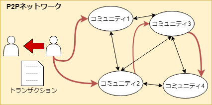

こんにちは。最近、気が向いた時に、5分程度のジョギングをしている k-so16 です。

4/17に開催された、『[ブロックチェーン :「書き換え不可能な記録」によって社会はどう変化するか? @ 大阪](https://techplay.jp/event/723550)』という勉強会に参加させていただきました。ブロックチェーンについての説明が非常に丁寧で、ブロックチェーンという名前くらいしか聞いたことがないといった人でも理解しやすい内容でした。また、会場では非常に熱い議論が交わされ、充実した勉強会でした。

本記事では、自分の備忘録も兼ねて、私が勉強会で得た知識に基づいてブロックチェーンの概要を紹介します。

本記事の対象読者は以下の通りです。

- ブロックチェーンという言葉は聞いたことがあるが、内容は全く知らない
- ビットコインや仮想通貨という言葉を聞いたことがある
- ハッシュ関数が何かを知っている

## ブロックチェーンの概要
### ブロックチェーンとは
ブロックチェーンという言葉を聞くと、おそらくビットコインや仮想通貨という言葉が一緒に思い浮かぶのではないでしょうか。ブロックチェーンは、ざっくり言うと、名前の通り、「ブロック」を「チェーン」で繋いだものです。

では、「チェーン」で繋がれている「ブロック」とは何でしょうか。仮想通貨を例に考えると、仮想通貨の送金のやり取り(以降、トランザクションと表記)の集合が「ブロック」に相当します。このトランザクションのブロックを繋いだものがブロックチェーンです。

### ブロックチェーンの目的
ブロックチェーンは、トランザクションが書き換え不可能なことを実現することを目的とします。

仮想通貨を例とすると、送金のやり取りが後から書き換えられては大変です。ブロックチェーンを用いることで、仮想通貨の送金のやり取りが後から誰にも書き換えられていないことを保証できます。

### ブロックチェーンの生成方法
ブロックチェーンを生成するにあたり、以下の登場人物が出現します。

- ユーザー: ブロックチェーンを使う人
- マイナー: トランザクションをブロックチェーンに記録する人

ユーザーのトランザクションをマイナーが集めて、それをもとにブロックを生成してチェーンに結びつけることで、ブロックチェーンが生成されていきます。詳細な手順を以下に示します。

1. マイナーがユーザーのトランザクションを集める
1. 集めたトランザクションの集合をもとに[マークル木](https://bitlife.cryptopie.com/virtual-currency-markle-tree/)を作成し、マークルルートを求める
  - 例. 図1.3.2のトランザクションのハッシュ値をもとに、図1.3.1のようにマークルルートを求める
1. マークルルートと乱数の和をハッシュ化して、先頭に0がn個連続して出現するような乱数を探す
  - 例. 図1.3.1で求めたマークルルートと乱数の和のハッシュ値から、0が先頭に4つ並ぶ値を探す
    - hash(0x3ee3 + 1201) = 0xfb8a0c09
    - hash(0x3ee3 + 58037) = 0x0c9abbb9
    - hash(0x3ee3 + 334) = 0x0000580a &emsp;&emsp; (0が先頭に4つ並ぶので、乱数が見つかった)
1. 条件を満たす乱数を見つけたマイナーは、新たにトランザクションのブロックを生成してチェーンに繋ぎ、コミュニティ全体に拡散する
1. 新たに生成されたブロックを受け取ったユーザーは、ブロックの正当性をハッシュ値から検証する

### ブロックチェーン上の記録が書き換え不可能な理由
ブロックチェーンでは、P2P[^1]ネットワークにおいて、トランザクションがコミュニティ全体に拡散されます。ここで、トランザクションの内容を書き換えると、トランザクションのハッシュ値が変わります。すると、図1.3.1で求めたマークルルートの値も異なったものとなり、整合性が取れなくなります。書き換えようとすると、再度マークルルートを求め、条件を満たす乱数を探さなければなりません。一般的に、ハッシュ関数の出力が同じになるような、異なる入力値を求めることは困難です。このことから、ブロックチェーン上のトランザクションの書き換えは不可能といえます。

## Blockchain 2.0
ブロックチェーンといえば、仮想通貨に関連する技術だという印象を持っている方は多いと思います。私も最初は、ブロックチェーンは仮想通貨に関する技術だと思っていました。しかし、ブロックチェーンでプログラムを記録しようという考え方があります。それがBlockchain 2.0です。

- Blockchain 1.0: 金銭のトランザクションを記録 (Bitcoin)
- Blockchain 2.0: プログラムを記録 (Smart Contract)

プログラムをブロックチェーンに記録することで、書き換え不可能なプログラムが実現出来ます。これによって、アプリケーションは書き換え不可能なプログラムの上で動作するので、プログラム上の規則が変更されることがありません。例えば、電子投票のプログラムをブロックチェーン上で動かすことで、投票の規則を書き換えられることなく、平等な運用が実現できます。

## 所感
ブロックチェーンがどのような仕組みで動いているのかを知ることが出来て、非常に良い機会となりました。マイニングがどういった理由で計算量が必要なのかという理由を知れたのも非常に興味深かったです。最も驚いたのは、ブロックチェーンが仮想通貨以外にも適用可能ということでした。今まで、漠然と仮想通貨の技術ということしか知らなかったので、非常に大きな知見となりました。

会場での議論も非常に白熱していました。ブロックチェーンが可能にすることだけでなく、ブロックチェーンの限界についても充実した議論がなされました。新しく出現して、注目されている技術は、どうしても銀の弾丸のように扱われてしまいます。ブロックチェーンも同様で、万能だと思われがちですが、あくまでブロックチェーンが果たす役割は **トランザクションが書き換え不可能であることを担保すること** であり、そもそも記録する段階で間違っていたり、悪意のある記録をつけられることに対しては、ブロックチェーンだけでは対応出来ないことを知っておくことが重要です。記録された情報が正しいことを担保するためには、また別の技術が必要となると思われます。

以上、少し賢くなったk-so16でした。初心者にも分かりやすい勉強会は本当にありがたいですね(^^)

[^1]: Peer to Peerの略。両者がサーバを介さず直接通信する方式
