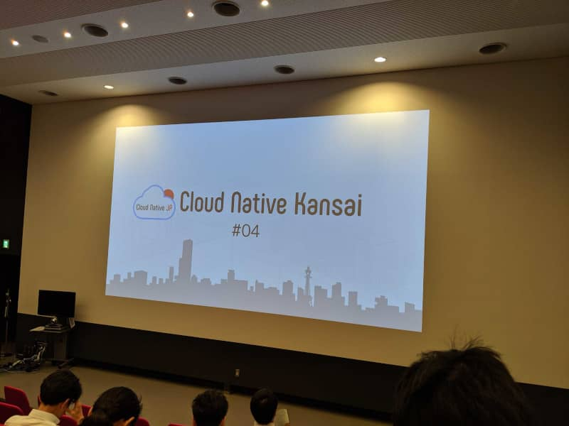

こんにちは。最近、 [海遊館](https://www.kaiyukan.com/) に初めて遊びに行ってきた k-so16 です。

2019/7/5に開催された [Cloud Native Kansai #04](https://cnjp.connpass.com/event/132102/) に参加してきました。本記事では、そのイベントの概要について紹介します。

私自身は、現在 Laravel と Vue.js を使った開発に携わっていますが、 [Kubernetes](https://kubernetes.io/ja/) (以降 k8s と表記) や、その周辺技術にも興味があったので、参加することにしました。

## 概要
Cloud Native Kansai は、関西で k8s や Rancher, AWS などの技術についての勉強会です。 Cloud Native や、その関連技術に興味がある人なら、初心者でも Welcome な勉強会です。

[caption id="attachment_10284" align="alignnone" width="800"] Cloud Native Kansai #04 のオープニング[/caption]

今回は以下の発表を聴講しました。

- Openshift 4 の紹介
- Packer, Ansible, Terraform を使って AWS Fargate へデプロイする方法
- 機械学習の運用に関する技術
- OSSを利用した CI/CD の環境構築について
- minikube の紹介
- Cloud Run の紹介

基本的には、運用に携わっている方々が、運用技術に関する概念やツールについて発表されていました。初心者でも Welcome ということで、minikube を触り始めて3日ほどの方が、 k8s などのハードルを下げるために、 LT枠で登壇されていました。プレゼンテーションも面白く、特に楽しんで聞けました。

Packer, Ansible, Terraform を使った AWS Fargate へデプロイの方法の発表では、 GitHub のリポジトリに Push されてから、 Pull → ビルド → デプロイ までの自動化の方法が説明されていました。

- CodeBuild を用いてコンテナをビルド
    - ビルドの処理を buildspec.yml に記述
        - 前処理としてビルド用のコンテナにPacker, Ansible をインストール
    - プロジェクトを Terraform で作成
- CodeDeploy を用いて Fargate にデプロイ
    - Fargate とデプロイに必要なものを Terraform を用いて作成
- ソースコードの取得からデプロイまでを Pipeline で自動化
    - パイプラインを Terraform を用いて設定

## 所感
k8s などの運用に使われるツールについて、様々な知見を得られました。私自身、 CI/CD ツールや k8s など、運用に関わる技術については全くの素人ですが、今回の勉強会をきっかけに、少しずつ運用についても学びたいと思いました。現在は開発 (Dev) を中心に業務に携わりつつ、個人でも勉強していますが、運用 (Ops) についても勉強して、円滑な DevOps を実現できるようになりたいと思います。

今回の勉強会では、正真正銘の初心者の方も登壇されていて、とにかく触ってみること、そしてアウトプットすることの重要性を強く感じました。私自身、まだまだ学ぶことはたくさんあるので、ある程度インプットしたら、なんらかの形でアウトプットする習慣を身に着けたいと思います。