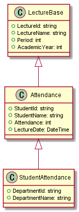
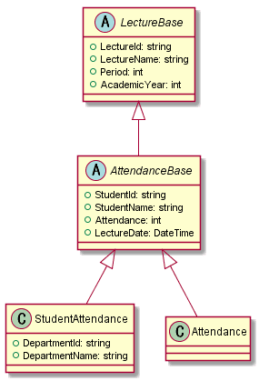

こんにちは。最近、私有のディスプレイが寿命を迎えつつある k-so16 です。新しいディスプレイの購入を検討しないといけませんね。

Entity Framework Core 3.0 (以下 EF Core 3.0 と表記) で **派生クラスのモデル** を利用してデータベースにアクセスしようとすると、以下のようなエラーが出ました。

> A key cannot be configured on 'Attendance' because it is a derived type. The key must be configured on the root type 'LectureBase'.

すべてのモデルクラスが別のクラスの親クラスにならないようにクラスを定義すればエラーは出力されないのですが、 **複数のモデルで共通するプロパティの定義は親クラスにまとめておきたい** ところです。

本記事では、 EF Core 3.0 で **派生クラスのモデル** を使用する方法を紹介します。

## 想定するモデル
本記事では、講義の出席状況データの取得を想定してデータ構造やモデルを定義します。 **複数のモデルで共通するプロパティ** を持つ場合は、 **親クラスのプロパティとして定義** して共通化します。

### 取得するデータの構造
講義に関する基本的な情報のデータ構造を以下のように定義します。

|カラム名|型|説明|
|---|---|---|
|`lecture_id`|`nvarchar`|講義ID|
|`lecture_name`|`nvarchar`|講義名|
|`period`|`int`|開講時限|
|`academic_year`|`int`|開講年度|

出欠情報と詳細な出欠情報のデータ構造をそれぞれ以下のように定義します。

- 出欠情報の取得

    |カラム名|型|説明|
    |---|---|---|
    |`lecture_id`|`nvarchar`|講義ID|
    |`lecture_name`|`nvarchar`|講義名|
    |`period`|`int`|開講時限|
    |`academic_year`|`int`|開講年度|
    |`student_id`|`nvarchar`|学籍番号|
    |`student_name`|`nvarchar`|氏名|
    |`attendance`|`int`|出欠|
    |`lecture_date`|`datetime`|開講日|

- 詳細な出欠情報の取得

    |カラム名|型|説明|
    |---|---|---|
    |`lecture_id`|`nvarchar`|講義ID|
    |`lecture_name`|`nvarchar`|講義名|
    |`period`|`int`|開講時限|
    |`academic_year`|`int`|開講年度|
    |`student_id`|`nvarchar`|学籍番号|
    |`student_name`|`nvarchar`|氏名|
    |`attendance`|`int`|出欠|
    |`lecture_date`|`datetime`|開講日|
    |`department_id`|`nvarchar`|学科ID|
    |`department_name`|`nvarchar`|学科名|

### 取得対象のデータのモデル定義
上記で定義したデータ構造に基づいてモデルを定義します。講義の基本的な情報を取得するためのクラスを `LectureBase`, 出欠情報を取得するためのクラスを `Attendance`, 詳細な出欠情報を取得するためのクラスを `StudentAttendance` とします。

`LectureBase` を基底クラスとして、 `Attendance` は `LectureBase` を派生することで講義情報に学生と出欠の情報を加えます。詳細な出欠情報を取得するために `StudentAttendance` は `Attendance` を派生して追加するプロパティを定義します。



```CSharp
/// <summary>
/// 講義情報
/// </summary>
public class LectureBase
{
    /// <summary>
    /// 講義ID
    /// </summary>
    /// <value></value>
    public string LectureId { get; set; }
    /// <summary>
    /// 講義名
    /// </summary>
    /// <value></value>
    public string LectureName { get; set; }
    /// <summary>
    /// 開講時限
    /// </summary>
    /// <value></value>
    public int Period { get; set; }
     /// <summary>
    /// 開講年度
    /// </summary>
    /// <value></value>
    public int AcademicYear { get; set; }
}

/// <summary>
/// 出欠情報
/// </summary>
public class Attendance : LectureBase
{
    /// <summary>
    /// 学籍番号
    /// </summary>
    /// <value></value>
    public string StudentId { get; set; }
    /// <summary>
    /// 氏名
    /// </summary>
    /// <value></value>
    public string StudentName { get; set; }
    /// <summary>
    /// 出欠
    /// </summary>
    /// <value></value>
    public int Attendance { get; set; }
    /// <summary>
    /// 開講日
    /// </summary>
    /// <value></value>
    public DateTime LectureDate { get; set; }
}

/// <summary>
/// 学生の出欠情報詳細
/// </summary>
public class StudentAttendance : Attendance
{
    /// <summary>
    /// 学科ID
    /// </summary>
    /// <value></value>
    public string DepartmentId { get; set; }
    /// <summary>
    /// 学科名
    /// </summary>
    /// <value></value>
    public string DepartmentName { get; set; }
}
```

### DbContext の設定
`DbContext` の `OnModelCreating()` の定義は以下の通りです。

```CSharp
protected override void OnModelCreating(ModelBuilder builder)
{
    base.OnModelCreating(builder);
    builder.Entity<LectureBase>()
        .HasKey(x => new { x.LectureId, x.Period, x.AcademicYear });
    builder.Entity<Attendance>()
        .HasKey(x => new { x.LectureId, x.Period, x.LectureDate, x.StudentId });
    builder.Entity<StudentAttendance>()
        .HasKey(x => new { x.LectureId, x.Period, x.LectureDate, x.StudentId });
}
```

上記のモデル定義と `DbContext` の `OnModelCreating()` の定義ではコンパイルは通るのですが、 `OnModelCreating()` が実行される際に冒頭に示したエラーが発生します。エラーメッセージには、 **キーは派生元のルートクラスのプロパティが利用されなければならない** と書かれていますが、 `Attendance` や `StudentAttendance` のキーを定義するには、 `LectureBase` のプロパティでは不十分です。

## 解決方法
継承されているクラスを **抽象クラスとして定義** することで解決します。 **継承がネストしている場合は、継承されているクラスすべてを抽象クラスとして定義** します。この解決方法は [kenzauros](https://github.com/kenzauros/) さんに教えていただきました。

### モデルの修正
本記事の例では、 `LectureBase` と `Attendance` が継承されているので、それらのクラスを抽象クラスとして定義します。ただし、 `Attendance` はエンティティとして取得したいので、抽象クラスを `AttendanceBase` として定義します。 `AttendanceBase` の定義内容は修正前の `Attendance` のものと同じです。

```CSharp
public abstract class LectureBase
{
    /* 省略 */
}

public abstract class AttendanceBase : LectureBase
{
    /* 省略 */
}
```

`StudentAttendance` の継承先を `AttendanceBase` に修正します。 `StudentAttendance` はモデルのインスタンスを生成するので抽象クラスにはしません。

```CSharp
public class StudentAttendance : AttendanceBase
{
    /* 省略 */
}
```

抽象クラス `AttendanceBase` は **インスタンス化できない** ので、`Attendance` を `AttendanceBase` の **具象クラス** に変更します。プロパティは `AttendanceBase` と同じものを利用するので、 `Attendance` 内で **プロパティを宣言する必要はありません。**

```CSharp
public class Attendance : AttendanceBase
{
}
```

これらの変更に基づいて修正したクラス図は以下の通りです。



### DbContext の修正
モデルの定義を修正したら、 `DbContext` の `OnModelCreating()` の定義を変更します。

`LectureBase` は **モデルのインスタンスを生成しない** ので、 **`builder.Entity<LectureBase>()` を削除** します。

```CSharp
protected override void OnModelCreating(ModelBuilder builder)
{
    base.OnModelCreating(builder);
    builder.Entity<Attendance>()
        .HasKey(x => new { x.LectureId, x.Period, x.LectureDate, x.StudentId });
    builder.Entity<StudentAttendance>()
        .HasKey(x => new { x.LectureId, x.Period, x.LectureDate, x.StudentId });
}
```

これで `OnModelCreating()` が実行された際に生じていたエラーが解消して、データベースからデータを取得できるようになります。

## 総括
本記事のまとめは以下の通りです。

- 継承するモデルは抽象クラスとして定義
- `OnModelCreating()` ではインスタンス化可能なモデルをエンティティとして設定

以上、 k-so16 でした。 EF Core を使いこなすにはまだ時間がかかりそうです。