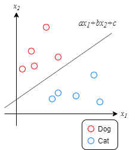

こんにちは。最近 TOEIC の参考書を購入した k-so16 です。今まで TOEIC を受験したことがないので、英語の勉強のきっかけとして受験したいなと思います。

11/30 に開催された、**[【AI×顔認識×IoT】Raspberry Piで稼働する人工知能を使って顔認識を実践するハンズオン](https://monoxit.connpass.com/event/153411/)** に参加してきました。このハンズオンでは、 Raspberry Pi 上で **[OpenCV](https://opencv.org/)** や **[Dlib](http://dlib.net/)** を用いて人工知能を動かし、顔認識や個人の顔を識別させました。

本記事ではハンズオンで学んだことについて紹介します。

## 人工知能で顔認識を実現する手法
### CNN による深層学習
機械学習の手法の中でも、最近ブームになっている **深層学習** を用いて顔のデータを学習させます。深層学習にもいくつか手法があるようですが、今回のハンズオンでは **CNN**(Convolutional Neural Network: 畳み込みニューラルネットワーク) を用いて学習させる手法を学びました。

CNN を利用して顔を検知する手順は以下の通りです。

1. 画像のピクセル単位で明るさを入力として受け取る
1. 各入力にそれぞれ重みをそれぞれ乗算する
1. 2 で得られた値の総和を取る
1. 3 で得られた総和を入力として活性化関数の解を求める
1. 2~4の手順を層の数だけ繰り返す
1. 5 で得られた解が顔の画像に近いかを判定する

正解の値は人工知能の作成者が任意に設定できます。学習させる際に正解の画像と不正解の画像を用意し、正解の画像が人工知能の作成者が設定した値に近づくように重みの値を決定します。

活性化関数は得られた重みの和が正の数ならその解を、負の数なら 0 を返す関数です。これは人間の神経を模したもので、入力に対して反応があれば正の数を、なければ 0 を返すことで表現しています。

3 つの手法の中で最も負荷がかかりますが、高い精度で顔を認識できます。

### HOG 特徴量 + SVM 分類
深層学習では、膨大な量のデータを用いて学習させましたが、 **HOG特徴量** (Histograms of Oriented Gradients) を用いることで、顔の特徴に着目して学習させることができます。特徴量を **明暗の勾配の大きさと向き** を求め、ある範囲について明暗の角度と大きさの **ヒストグラム** を求めます。

得られた HOG 特徴量が顔であるか判定するために、 **SVM 分類** (Support Vector Machine：サポートベクトルマシン) を利用します。SVM 分類では、 n 次元の線形式の解を求め、その値が正になるか負になるかを判定することで分類します。例えば、正の値になれば顔であり、負の値であればそれ以外として分類されます。

学習させる際には、正解の画像と不正解の画像を用意し、正解の画像を入力した際に n 次元の線形式の値が 0 になるように、各係数を調整します。例えば特徴量が 2 次元で表される時、 ax1+bx2+c=0 が成り立つように係数 a, b, c を調整します。

### HAAR Like 特徴 + CASCADE 分類
HAAR Like 特徴では、白黒の矩形をフィルタとして、フィルタに合致する部分が画像内にあるか判定します。フィルタは複数の組み合わせから構成されます。

フィルタを用いる例として、眉毛を検出するフィルタを考えます。眉毛は暗く、眉毛の上は明るいので、眉毛の位置に黒いフィルタを、その上に白いフィルタを左右に 1 つずつ置き、画像内に合致する箇所があるか調べます。目を検出するフィルタは中心が黒で両脇が白のフィルタが左右に 1 つずつ、口を検出するフィルタは黒いフィルタの下に白いフィルタといった具合に、顔の特徴に基づいて複数のフィルタを設置します。

顔認識の判定を高速化するために、 **CASCADE 分類** を用いて特徴の判定を複数の段階に分けて行います。特徴に合致するかの判定を複数に分けることで、 **顔の特徴からかけ離れた画像を早い段階で排除** できます。顔でない部分の判定を早い段階で排除することで、高速に顔認識が実現できます。

HAAR Like 特徴と CASCADE 分類を用いた方法は、 3 つの手法の中で最も精度は低いですが、顔の検知処理が最も速いので、 **リアルタイムに顔を検知する際には有用** な手法です。

## 前編まとめ
本記事のまとめは以下の通りです。

- CNN による深層学習による顔検出
    - 正解の値から重みを導出
- HOG 特徴量と SVM 分類による顔検出
    - 明暗の向きと大きさのヒストグラムを導出
    - n 次元の特徴量による線形式を用いた分類
- HAAR Like 特徴量と CASCADE 分類による顔検出
    - 顔の特徴に合わせたフィルタを利用して判定
    - フィルタを段階に分けて検出を高速化

後編では個人の顔認識や、エッジコンピューティングとしての顔認識と MQTT について紹介します。お楽しみに。

以上、 k-so16 でした。

[^svm]: SVM: Support Vector Machine