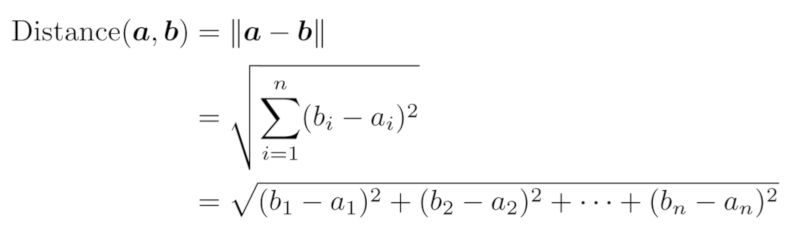
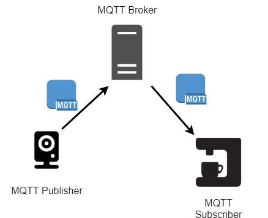

こんにちは。最近、人生で初めて [矢場とん](https://www.yabaton.com/) の本店に行った元愛知県民の k-so16 です。味噌カツを美味しく頂いてきました。

[前編](/face-recognition-ai-on-raspberry-pi_prequel/) では顔認識の手法を 3 つ紹介しました。本記事では、 **個人の顔を識別する手法** と、 **IoT** における顔識別の応用例について紹介します。

## 個人の顔識別と IoT
OpenCV や Dlib を用いれば簡単に顔を検知することはできますが、 ライブラリに含まれる人工知能のサンプルには当然私の顔のデータは入っていないので、写っている顔が私か識別することはできません。カメラに写った顔が特定の個人に合致するかを判定するためには、人工知能に個人の顔を学習させる必要があります。

### 顔識別の手法
個人の顔を識別させるためには、まず人工知能に顔を学習させる必要があります。個人を識別するための学習の手順は以下の通りです。

1. 個人の顔が写っている写真から HOG 特徴量と SVM 分類器を用いて顔の部分を切り出す
1. 1 で切り出した顔の特徴量を求める
1. 2 で求めた特徴量を名前などのラベルとともにディスクなどに保存する

個人の顔を学習させる際はリアルタイム性は必要ないので、顔の検出に HOG 特徴量を採用します。

HOG 特徴量は色の明暗の勾配の向きと大きさを用いるので、 **顔の特徴量** は求められますが **個人の顔の特徴量** を抽出することはできません。人工知能に個人の顔を学習させるために CNN を用いて特徴量を求めます。 

特徴量が求まったら、写っている個人の名前などのラベルとともに、メモリやディスクなどの記憶媒体に保存します。学習した特徴量と検出された顔の特徴量の差が閾値以下であれば、結びついているラベルを利用して個人を識別できます。

個人の顔を人工知能に学習させたら、カメラに写っている人物の顔と学習済みの顔データの特徴量を **ユークリッド距離** を用いて比較します。求まった距離が閾値以下であれば同一人物の顔として識別され、閾値を超えたら異なる人として認識されます。

特徴量を比較する他の手法として、 **k-近傍法** が挙げられていましたが、ユークリッド距離を用いるほうが精度が上がるとのことでした。比較の指標に何を用いれば良いかは試行錯誤して見つけるしかないようです。

### IoT としての顔認識の応用
個人の顔識別の応用例として、オフィスに入った際に、個人を識別して好みのコーヒーをいれる **IoT** (Internet of Things: モノのインターネット) システムを考えます。このシステムでは、個人の顔は既に学習済みであることを前提とします。

オフィスに入ってきた人の顔をリアルタイムに識別するためには、その都度カメラに写った画像を解析して顔を検出し、個人を識別する必要があります。リアルタイムな顔検出は、 HAAR Like 特徴量と CASCADE 分類によって実現します。検出された顔の特徴量を求め、学習済みの特徴量と比較して個人を識別します。

IoT で小さなデータ通信を行う場合、 **MQTT** というプロトコルが利用されます。 MQTT には通信を発行する **Publisher**, 購読する **Subscriber**, Publisher と Subscriber を仲介する **Broker** の 3 つのロールがあります。カメラで個人を識別して好みのコーヒーを淹れるシステムを考える場合、 カメラが Publisher, コーヒーマシンが Subscriber にあたります。 Broker はクラウドで提供されているサービスを利用することが一般的です。

クラウド側で顔識別の処理を行う場合、画像のようなサイズの大きいデータを端末からクラウドに送らなければならず、通信に時間がかかります。 **エッジコンピューティング** によって、顔識別のような解析をエッジ側の端末で行うことで、クラウドに送信するデータ量を少なくできます。

解析を行う端末を大量生産するためには、安価なコンピューターで解析させて **コストを抑える** 必要があります。 Raspberry Pi のような性能の高くないコンピューター[^1] を使って解析することで、 
 **IoT 製品の大量生産** が実現できます。

## 所感
最近流行っていることもあり、人工知能に興味があったので、学ぶきっかけとして非常に有意義なハンズオンセミナーでした。一口に顔認識をする人工知能といっても、手法が複数あり、それぞれ特徴に合わせて使い分けることが重要だということを実際に人工知能を動かすことで実感しました。

今回参加したハンズオンでは、人工知能を **使う** ことにフォーカスを当てていましたが、より深く学ぶためには、人工知能を **作る** 方法の勉強も必要だと感じました。実際に精度の高い人工知能を一から作成するには、高いマシンスペックと時間のコストがかかるので、実現は難しいですが、手法は理解しておくべきと思います。

今回のハンズオンでは、事前に準備されたサンプルのコードを動かして顔検出や顔識別をしました。今回のハンズオンでは MQTT についても触れたので、実際に自分自身で何か IoT システムを作ってみたいと感じました。私個人で VPS の契約をしているので、私のサーバーの上で **[Mosquitto](https://mosquitto.org/)** を用いて MQTT Broker を動かし、簡易的な IoT システムを実現してみたいと思います。

## 後編まとめ
本記事のまとめは以下の通りです。

- 個人の顔を人工知能によって識別
    - CNN による個人の顔の特徴量の抽出
- 顔検出を用いた IoT への応用例
    - MQTT とエッジコンピューティングを用いた通信量の小さい IoT システムの実現

以上、 k-so16 でした。

[^1]: Raspberry Pi は PC より安価ではあるが、組み込み製品の製造の観点では非常に高性能かつ高価である
