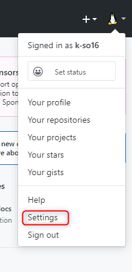
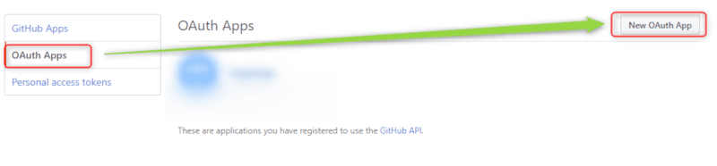
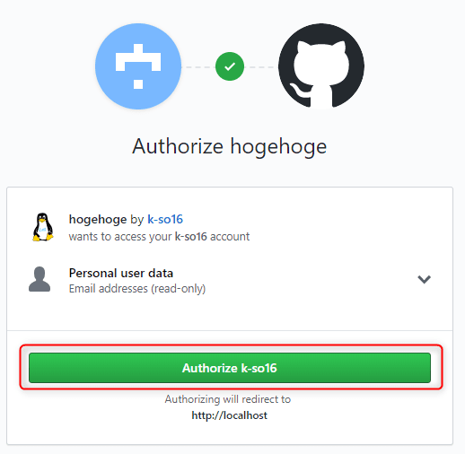

こんにちは。最近、 [スヌーピーミュージアム展](http://www.snoopymuseum.tokyo/) の大阪会場に行った k-so16 です。

業務で SNS アカウントを用いたログインの実装を検討した際に、Laravelで SNS 認証を実現する方法として [kenzauros](https://github.com/kenzauros) さんに **[socialite](https://github.com/laravel/socialite)** というパッケージがあることを教えていただきました。

Laravel で Facebook や Google などのソーシャルアカウントを連携してログインする機能を実装するには、 socialite というパッケージがとても便利です。

本記事では、 socialite の簡単な使い方について紹介します。本記事で使用する Laravel のバージョンは5.8系です。ログインする Web サーバのドメインは localhost とします。

本記事で想定する読者層は以下の通りです。

- Laravel の Auth の基礎知識を有している
- OAuth による認証が可能な SNS アカウントを有している


## socialite のインストールと設定
`composer` コマンドを用いて、 `laravel/socialite` パッケージをインストールします。

```bash
composer require laravel/socialite
```

インストールが終わったら、サービスプロバイダとエイリアスの設定をします。以下のように `config/app.php` に追加します。

- サービスプロバイダの設定
    ```diff
    'providers' => [
      /* 中略 */

      App\Providers\RouteServiceProvider::class,
    + Laravel\Socialite\SocialiteServiceProvider::class,
    ],
    ```

- エイリアスの設定
    ```diff
    'aliases' => [
      /* 中略 */
      'Session' => Illuminate\Support\Facades\Session::class,
    + 'Socialite' => Laravel\Socialite\Facades\Socialite::class,
      'Storage' => Illuminate\Support\Facades\Storage::class,
      /* 中略 */
    ],
    ```

これで socialite を利用する準備が完了しました。


## socialite の利用
実際に socialite を使う手順を紹介します。本記事では、 GitHub を用いた SNS ログインの実装を説明します。

### GitHub の OAuth 設定
1. GitHub のメニューから、 Settings を選択します。

  

1. Developer settings を選択します。

  

1. OAuth Apps を選択し、 New OAuth App をクリックします。

  

1. Application name, Homepage URL, Authorization callback URL を入力します。
    - Authorization callback URL は Laravel に返すためのパスを設定します。

  

    本記事では、例として以下のように入力します。

    |項目名|入力する内容|
    |:--|:--|
    |Application name|hogehoge|
    |Homepage URL|`http://localhost`|
    |Authorization callback URL|`http://localhost/login/github/callback`|

1. Client ID と Client Secret を Laravel 側に反映させます。

    入力が完了すると、 Client ID と Client Secret が発行されます。それぞれの値を Laravel に設定します。


    - `.env` に環境変数を作り、 Client ID と Client Secret を代入します。

        ```
        GITHUB_CLIENT_ID=[Client ID をコピペ]
        GITHUB_CLIENT_SECRET=[Client Secret をコピペ]
        ```

    - `config/service.php` を以下のように変更します。

        ```diff
        return [
          /* 中略 */

        + 'github' => [
        +   'client_id' => env('GITHUB_CLIENT_ID'),
        +   'client_secret' => env('GITHUB_CLIENT_SECRET'),
        +   'redirect' => env('APP_URL') . '/login/github/callback',
        + ],
        ];
        ```

    `config/service.php` に直接 Client ID と Client Secret の値を書いてしまうと、 GitHub などでソースコードを公開する際に、キーが漏れてしまうので、 `.env` に実際の値を記述し、 `config/service.php` からは `.env` の値を参照するようにしています。

これで GitHub の OAuth の設定が完了しました。


### 認証の実装
GitHub の OAuth の設定が完了したので、実際に簡単なログインフォームを作成します。今回は、 Auth で生成されるログインフォームに、 SNS 認証のリンクを付け足していきます。

1. ログインユーザーを登録するための users テーブルを作成します。

    ```bash
    php artisan migrate
    ```

1. Auth でログインフォームを生成します。

    ```bash
    php artisan make:auth
    ```

1. 自動生成された `LoginController` に GitHub の認証ページに飛ばすメソッドと GitHub からのコールバックを扱うメソッドを実装します。

    - `app/Http/Controllers/Auth/LoginController.php`


        ```diff
          /* 中略 */
          use Illuminate\Foundation\Auth\AuthenticateUsers;

        + use Hash;
        + use Auth;
        + use Socialite;
        + use App\User;

          class LoginController extends Controller
          {
            /* 中略 */

        +   // GitHub の認証ページへ遷移 
        +   public function redirectToProvider()
        +   {
        +       return Socialite::driver('github')->redirect();
        +   }
        +
        +  public function handleProviderCallback()
        +  {
        +      $socialUser = Socialite::driver('github')->stateless()->user();
        +      $user = User::where([ 'email' => $socialUser->getEmail() ])->first();
        +
        +      if ($user) {
        +          Auth::login($user);
        +          return redirect('/home');
        +      } else {
        +          $user = User::create([
        +              'name' => $socialUser->getNickname(),
        +              'email' => $socialUser->getEmail(),
        +              'password' => Hash::make($socialUser->getNickname()),  // 例としての記述なので、マネしないように
        +          ]);
        +          Auth::login($user);
        +          return redirect('/home');
        +      }
        +    }
           }
        ```

        [Laravel の公式ドキュメント](https://laravel.com/docs/5.8/socialite) によると、以下のメソッドは socialite が対応している SNS 全てに用意されているとのことです。

        - `getId()`
        - `getNickname()`
        - `getName()`
        - `getEmail()`
        - `getAvatar()`

---

**2020/5/31 追記**

SNS に登録されているメールアドレスは、ユーザーによって変更される可能性があり、ユーザーの識別には不適切であるとのご指摘をいただきました。

メールアドレスを利用する代わりに、 **SNS から受け取った ID (`getId()`) を利用してダミーのメールアドレスを作成する方が好ましい** です。 SNS 名とユーザーの ID を連結するなどしてダミーのメールアドレスを自動生成すれば、異なる SNS で同一の ID の場合でも、一意にダミーのメールアドレスを生成できます。 

例えば、 `[SNS名].[ユーザーID]@[ダミーのドメイン]` のような規則で、ダミーのメールアドレスを作成することが考えられます。

```php
"{$snsName}.{$socialUser->getId()}@example.com"
```

追記を加えるにあたり、以下のページを参考にさせていただきました。

> [Devise/OmniAuthを使ってSNSログイン実装しました系記事で気になる3つのこと - Qiita](https://qiita.com/ritou/items/3bc545ec397f43e5e65a)

---

1. ログインフォームのビューに SNS 認証のリンクを追加します。

    - `resources/views/auth/login.blade.php`

    ```diff
      <!-- 中略 -->
      <form method="POST" action="{{ route('login') }}">
        @csrf

    +   <div class="form-group row">
    +     <label for="github" class="col-md-6 col-form-label text-md-right">
    +         <a href="{{ url('login/github') }}">Login with GitHub</a>
    +     </label>
    +   </div>
    ```

1. ルーティングの設定をします。

    - `routes/web.php`

    ```diff
      /* 中略 */

      Route::get('/home', 'HomeController@index')->name('home');

    + Route::get('/login/github', 'Auth\LoginController@redirectToProvider');
    + Route::get('/login/github/callback', 'Auth\LoginController@handleProviderCallback');
    ```

### 動作確認
GitHub アカウントと連携してログインができることを確認します。

1. `http://localhost/login` にアクセスして "Login with GitHub" をクリックします。

  

1. GitHub との連携を認証します。

  

1. ログインが完了しました。

  


## 総括
本記事のまとめです。

- socialite を利用することで Laravel で SNS 認証が手軽に実装可能
- 実例として GitHub による認証を実装

以上、 k-so16 でした。読者の皆さんもお気に入りの SNS で認証機能を実装してみてはいかがでしょうか?