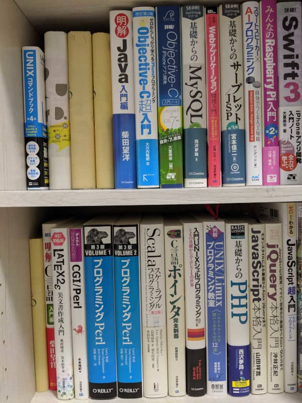

こんにちは。最近、リアスポイラー付きでボディーカラーが青の [SUBARU WRX STI](https://www.subaru.jp/wrx/sti/) に憧れている[^1] k-so16 です。

社会人 1 年目も、折り返しに差し掛かってきました。初心を忘れないためにも、自分がプログラマーになるまでの経緯を紹介したいと思います。

本記事では以下について記述しています。

- プログラマーを志したきっかけとプログラマーになるまでの経緯
- 大学時代のプログラミング経験
- 大学入学以前のプログラミング経験

## プログラミングに興味を持ったきっかけ
プログラミングに興味を強く興味を持ったのは、小学校 6 年生の時でした。当時、コンピューターの授業があり、ホームページの作成に取り組んでいました。 GUI ベースで自己紹介のホームページを作っていくという内容でしたが、ある時、先生が HTML のソースを直接操作しているのを見て、カッコいいと感じ、自分も将来カッコよく何かを作れるようになりたいと思うようになったのがきっかけです。

HTML はプログラミング言語ではないので、厳密にはプログラミングに興味を持ったとはいえないかもしれませんが、当時は HTML でページを書くのもプログラミングだと思っていました。 HTML でホームページを書けるということを知ったのが、今の私の原点だと思っています。

## プログラマーになるまでの経緯
高校までは普通科のコースに所属し、専門的なことは学んでいませんでしたので、プログラマーを本格的に目指すスタートラインは大学に入学してからです。私がプログラマーになるまでの略歴は以下の通りです。

1. 情報系学部の大学に進学
    - 学士: ソフトウェア工学 を取得
1. 同大学大学院に進学
    - 修士: ソフトウェア工学 を取得
1. MSEN に入社

### 大学入学以前
大学入学以前は、プログラミングを教わる機会こそありませんでしたが、インターネットで調べながら独自に学ぼうとしました。プログラミング言語に含まれないものもありますが、当時はそこまでの区別はなかったので、以下にまとめて記述しています。 (時期等は少しうろ覚えです)

- 中学時代
    - インターネットで C++ について調査
        - そもそもコンパイラの準備が出来ず断念
- 高校時代
    - iPhone のアプリケーション開発の調査
        - 当時所有していた MacOS に XCode が入れられず断念
    - HTML, CSS, JavaScript を Web ページを使って独学
        - HTML, CSS を記述して静的なページの書き方を習得
        - JavaScript は理解出来ず断念

実際にプログラミングがどんなものかを知ることが出来なかったのもあり、この頃はプログラマーになれたらカッコいいな、というぼやっとした憧れ程度の夢でした。私自身、理数科目が苦手で、親にも「 *お前はプログラマーに向いてない* 」と言われたので、自分には向いてないのかなと思ったりもしました。 (今では、理数科目の得手不得手はそこまで関係ないように思います)

自身で向いていないのではと思いましたが、コンピューターを触るのが好きで、依然としてプログラミングに興味はあったので、情報系の大学に進学することにしました。

### 大学入学後からの経歴
大学では、プログラミングの講義で C と Java を学び、独学で他の言語も勉強しました。講義の演習課題だけでなく、実際に **自分で何か動くものを作っていた** こともあり、 **プログラミングを楽しみながら学べた** のだと思います。特に Web で動くプログラムに興味があったので、 CGI/Perl, PHP, JavaScript を使って、何かしらのツールを作ったりしていました。

全てが手元に残っているわけではありませんが、覚えている限りでは、いくつか自力でツールを作成したりしていました。独学で作成したプログラムの例は以下の通りです。

- iPhone カレンダーアプリ
    - Objective-C で実装 (2 年次前半)
- アンケートフォーム
    - Perl で実装 (2 年次後半)
- 神経衰弱
    - JavaScript で実装 (3 年次夏休み)
- [タイピングゲーム](https://github.com/k-so16/jsTyping)
    - JavaScript で実装 (3 年次後半)
- [お絵描きツール](https://github.com/k-so16/doodler)
    - JavaScript, PHP で実装 (修士 1 年春休み)
- CSV エディター
    - JavaScript で実装 (修士 2 年後半)

本格的に作ったわけではないので、決してクオリティは高くありませんでしたが、動いた時の感動は大きいものでした。特にプログラミングを始めて 1, 2 年目は、少ない知識ながら、自分で何かを作れたのが非常に楽しいと感じていたことを、今でも鮮明に覚えています。今でも、ちょっとしたプログラムで、動いて当たり前のレベルでも、動くのが嬉しかったりします (笑)

## MSEN のプログラマーになってから
相変わらずプログラミングを楽しんでいます。業務にしても、個人の趣味としても、自主的かつ継続的に技術を **楽しみながら学べている** と思っているので、これからも自分の技術力を磨き続けたいと思います。ただ、最近、一気に色々吸収しようとしていると思うこともあるので、無理のないペースで、焦らず頑張っていきたいと思います。

実務の経験値こそ低いですが、これまで学んできた技術を業務に生かせているので、未経験からのスタートよりはスムーズに実務をこなせていると思います。

研究室で文章の書き方や発表資料の作り方を学んだおかげで、ブログの記事や、勉強会の発表資料などでも読みやすさや見やすさを多少なりとも意識出来ているのではないかと思います。分かりやすい文章を書くのは昔から非常に苦手でしたが、最近は悩みながらも、どう書いたら分かりやすいかを考えるのが楽しく感じるようになりました。

研究室の課題で、 [Coreutils](https://www.gnu.org/software/coreutils/) のコードリーディングをした経験も活きていると思っています。 Laravel の動作をドキュメントだけで把握しきれない時に、 Laravel のソースコードを読んだりするので、コードリーディングの経験のおかげでソースコードを読むことに対するハードルが低くなったように感じています。

これまで色々学んできたことが活きていると同時に、 **まだ学ぶべきことがたくさんあり、技術力も磨く必要がある** ということも、改めて感じました。大学院までは、主に UNIX 系の OS を主として扱ってきましたが、業務によっては Windows での開発もあるので、 C# や PowerShell などの言語や、 Windows というシステムについても勉強が必要だと感じています。他にも複雑なデータベース処理や CI/CD に関する技術、 Laravel や Vue.js で技術的に複雑な部分など、既に勉強したいことが山のように出てきました。

インプットだけでなく、社内、外部問わず積極的にアウトプットも出来ていると思っています。積極的に外部の勉強会に参加し、今年 (2019年9月現在) で既にセッション 1 回、 LT 2 回登壇しました。まだまだ発表慣れしていないこともあり、自分の理想とする発表には程遠いですが、少しずつ経験を積んで、聞き手が面白いと感じる発表がしたいと思います。

大学に入るまでは、プログラミングを知っている人に関われる機会が皆無でしたが、大学で学んだことで、プログラミングの楽しさを知ることができました。すごいアルゴリズムの発見をしたわけでも、画期的なソフトウェアを作ったわけでもありませんが、 **好きでプログラミングを続けられている** ので、プログラマーは私に向いている仕事だと思っています。

## まとめとメッセージ
本記事では、私がプログラミングに憧れてから、大学でプログラミングを学び、 MSEN に入社するまでの経緯について紹介しました。大学在学中の経験を経て、現在は充実した日々を過ごしています。

子供の頃は、単にコンピューターを触るのが好きな人間で、プログラマーになれるとは到底予想だにしませんでした。実際に大学でプログラミングを学び、プログラミングの楽しさを知ることが出来たのは大きな経験でした。この経験から、次の 2 つの事柄を強く感じるようになりました。

- 心から楽しめることを知ることの重要性
- 挑戦することの重要性

ごく当たり前のことを書いているように見えるかもしれませんが、実践しようと思うと意外と難しいのではないでしょうか。興味はあるけれど、自分には難しそうだからと、挑戦する前から不向きと決めつけていませんか。挑戦しないことには、自分が本当に好きで楽しいと思えるものは見つかりませんし、向き不向きも分かりません。少しでも何か興味があるものがあれば、 **まず挑戦しましょう。** 

以上、 k-so16 でした。失敗を恐れず積極的に挑戦しましょう。

[^1]: 私が子供の頃にカッコいいと思ったインプレッサのモデルに近い車種。自動車免許は AT 限定なので、運転はできない。