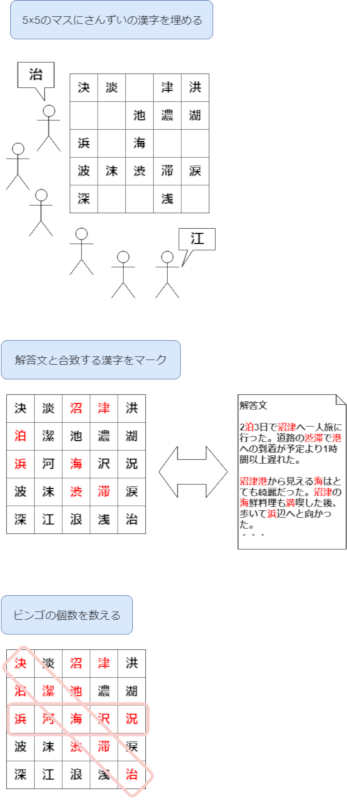
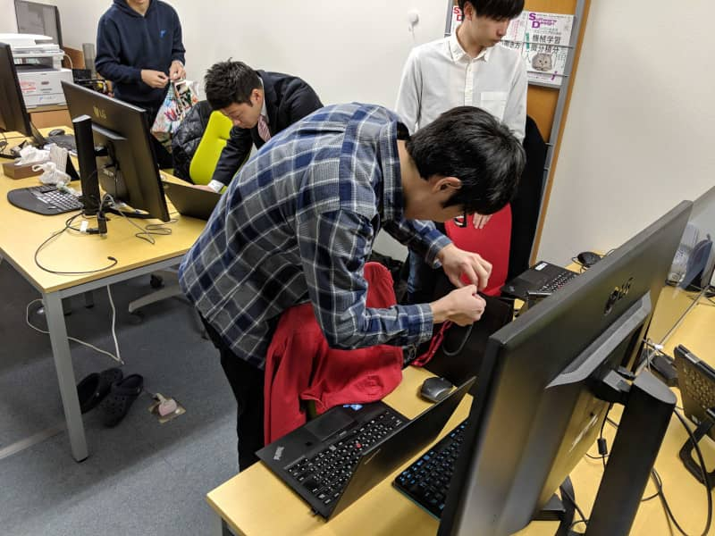
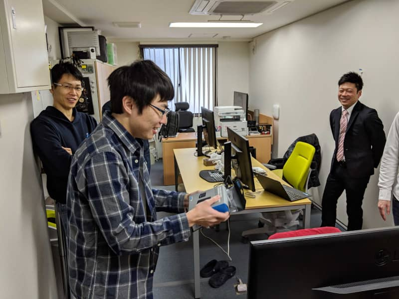

こんにちは。先日誕生日を迎えた k-so16 です。

[前記事](/new-employee-training-2019-prequel/) では、参加した研修の前半戦について紹介しました。本記事は前記事の続きとなっております。ぜひ前編をご覧になってから後編である本記事をお読みください。

## 研修2日目
### 講義
2日目の講義では、「報・連・相」について学びました。講師の先生が非常に力を入れられている箇所だったので、2日目の講義では「報・連・相」を重点的に学びました。非常に人生経験豊富な講師の先生の実体験のお話も印象に残りました。今回の研修では、「報・連・相」を以下のように掘り下げて学びました。

- 報告
  - 結果報告
  - 経過報告
  - トラブル報告
  - 変更報告
  - 情報報告
- 連絡
  - 部署内連絡
  - 部署間連絡
  - お客様・取引先との連絡
- 相談
  - 相談時のマナーやエチケット

### グループワーク
2日目のグループワークは、5×5のマスに、お題のワードを入れ、解答文に現れるワードとどの程度一致するかを競いました。手順は以下の通りです。

1. お題に対するワードを25個、5×5のマスに書き出し
1. 解答文に合致するワードをマーク
1. 縦横斜めでビンゴになった個数を算出

1日目同様に2回行いました。1回目はさんずいの漢字、2回目は花の名前をグループで考えて25個書き出し、読み上げられる文章に含まれるものをマークし、どれだけビンゴになったかを競いました。さんずいの漢字はたくさんあれど、いざ言われるとすぐに出てこないと感じました。それでも、人数がいる分、誰かが発した漢字から芋づる式に連想したりできたので、チームワークが重要でした。2回目の花の名前については、想起すること自体がかなり大変でした。

## 研修3日目
3日目では特に講義はなく、2日間の振り返りをした後、決意表明として、5年後の目標と1年目の目標について考え、1人ずつ全体に発表をしました。私が掲げた目標は以下の通りです。

- 5年以内: 各都道府県にソフトウェア技術者の知り合いを3人以上作る
- 1年以内: 外部カンファレンスに発表者として登壇する

同じチーム内の人と共有した際に、「イージーすぎない?(笑)」と言われ、正直自分自身もそう思いました。変えなかった理由として、登壇について、 **何について** 発表するために登壇するかを考えるのが意外と時間がかかりそうという見込みがあったので、少し余裕をもたせることにしました。また、人脈について、外部カンファレンスでエンジニアの方々と知り合う際に、都道府県によってソフトウェア技術者の人数の偏りなどがあるかもしれないので、こちらも少し余裕をもたせることにしました。

## 所感
今回の研修に参加して、最も大きな収穫は、様々な業種の方々と交流できたことだと思っております。今回の研修は様々な企業様の新入社員の方々と合同で参加したのですが、建築系であったり、造船関連であったり、事務であったりと、非常に多種多様な業種の新入社員の方々が参加されていました。初対面の人と話すことが苦手な私ですが、今回の研修ではそこそこ積極的にたくさんの方々と話すことが出来たのではないかと思っています。

社会人マナーについても、学生時代に見聞きした知識だけでなく、より詳細なマナーやその意義、意味について学ぶ良い機会になったと思っております。3日間という非常に短い期間だったので、参加した研修だけで完璧ということはありませんが、普段から意識して、1日でも早く常識として身に着けたいと思います。

## 謝辞
今回の研修を実施してくださった講師および大阪商工会議所の皆様方、研修時に互いに切磋琢磨した参加者の皆様方、今回の研修に参加させてくださった弊社MSENへ、この場をお借りして御礼申し上げます。

---

## おまけ
誕生日に、MSENのみなさんから誕生日プレゼントを頂きました。なんと、Go Proの予備バッテリと充電器、リュックなどにGo Proを取り付けるためのアクセサリを頂きました。ちょうど欲しかったものでニッコリ(笑)

非常に良い誕生日でした。MSENのみなさんに、再度この場を借りてお礼申し上げます。