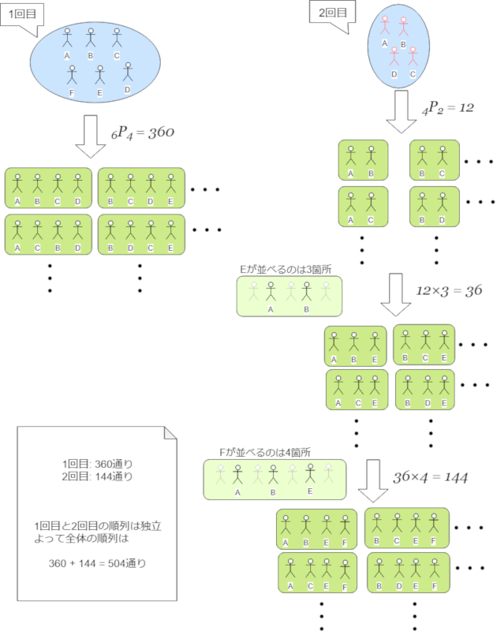

こんにちは。最近運転免許証を更新してゴールド免許になった k-so16 です。

[大阪商工会議所](http://www.osaka.cci.or.jp/)様主催の新入社員合宿訓練に、4/4~4/6の3日間参加してきました。本記事では、新入社員合宿訓練(以降「研修」と記す)の内容の概要と感想について述べていきます。

## 研修概要
研修では、[勝尾寺](http://www.katsuo-ji-temple.or.jp/)で2泊3日で、講師の先生をお招きして、社会人マナーの基礎について学びました。午前中から夕方にかけては講義形式で、夕方以降はグループに分かれてグループワークを行いました。参加人数はおよそ70名ほどで、複数の企業様の新入社員の方々と合同での参加となりました。

## 研修1日目
### 講義
1日目の講義では、以下について学びました。

- お辞儀
  - 会釈
  - 敬礼
  - 最敬礼
- 敬語
  - 尊敬語
  - 謙譲語
  - 丁寧語
- 電話の対応
- ビジネス文書の書き方

敬語は義務教育でも学びましたし、お辞儀やビジネス文書についても、学生時代に何らかの形で軽く触れたりはしましたが、知らないことや、曖昧な認識だったものを改めてしっかり学ぶことができました。例えば、ビジネスにおけるお辞儀の作法であれば、場面によって角度が違う、という知識はなんとなく持っていましたが、種類が3つ、それぞれ名前もあり、どのような場面で行われるかなどは研修で新しく学びました。

### グループワーク
夕方以降は事前に決められた6, 7人のグループに分かれ、ゲーム形式のグループワークを行いました。内容は、グループから4人を選出し、描かれた図形を伝言ゲームで伝えるというものでした。手順を以下に示します。

1. チームから4人を選出し、順番を決定
1. 先頭の人が2分間描かれた図形を見て記憶
1. 1人目から2人目に、2人目から3人目に、3人目から4人目に、描かれた図形を *口頭* で伝達
1. アンカー(4人目)が伝達された内容に基づいて図形を描画

正解の図形とアンカーの描いた図形がどの程度一致しているかを基準に競い、正確性が同点の場合は、速さを基準に競いました。ゲームは2回行われ、私は2回目に参加しました。1回目は聞き手は質問できないというルールでしたが、2回目は話し手に質問ができる(ただしジェスチャーは禁止)というルールだったので、少し楽でした（笑）全体的にかなり盛り上がった内容でした。

---

## おまけ
余談ですが、2回のゲームについて、4人の選出と並び方の組み合わせ(順列)について計算してみました。今回の研修では、チーム編成は6人グループと7人グループがありました。それぞれのグループについて、順列を求めてみます。

6人グループの1回目の選出方法は、 *6P4* で求まります。 *6P4* を計算すると、360通りとなります。続いて2回目は、1回目で出場していない2人が選ばれることは確定しているので、まず1回目出場者から2回目も出場する2人の順列を求めます。順列は *4P2* で求まり、12通りとなります。さらに、参加していない2人のうち、1人は先ほどの2人の先頭、2人の間、後ろの3通り、もう1人は3人の先頭、間2通り、アンカーの4通りとなります。これより、2回目の全体の順列は *4P2×3×4*=144通りとなります。1回目と2回目の結果から、全体で*360+144*=504通りの順列の求め方が考えられます。

7人グループの場合も考え方は6人グループの場合と同じです。1回目は *7P4* =840通り、2回目は *4P1×2×3×4* =96通り、全体で *840+86* =926通りとなります。

高校数学で習う順列や組み合わせは、グループワークで選出する際に、組み合わせがどの程度か測りたい時に役立ちます。

---

余談を入れたら記事が長くなってしまったので、2日目および3日目は後編に回します(笑) 後編もお楽しみに(^^)
