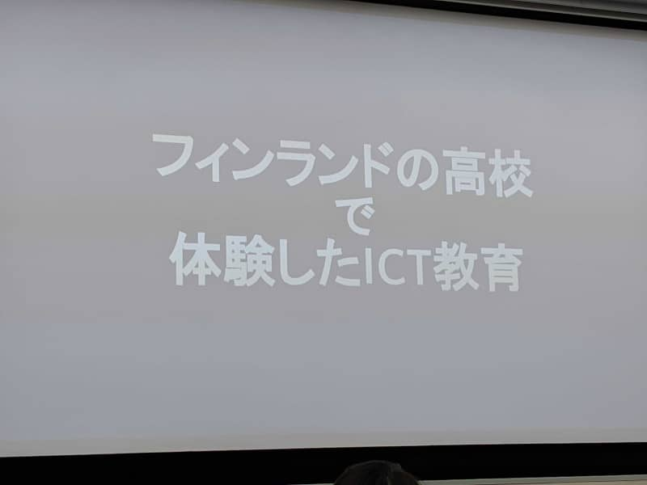

こんにちは。最近、 [激辛つけ麵](https://prtimes.jp/main/html/rd/p/000000012.000039951.html) を食べて、辛さが耳にまで到達した k-so16 です。おそらく、激辛の粉末が固まっていて、それに気づかず一気に口に入れたのが原因だと思います（笑）ちなみに、辛さは 1 辛を注文しましたが、途中から辛さより痛みに耐えながら食べていました。

8/3 (土) に京都で開催された、オープンソースカンファレンス (以下 OSC と表記) の LT にて発表をしてまいりました。また、招待講演も聴講してきました。本記事では、 登壇した LT の感想と、 OSC で聴講した招待講演について紹介します。

## 発表内容
FreeBSD にデスクトップ環境を構築する方法について発表しました。発表資料は [こちら](https://speakerdeck.com/azuki/freebsddedesukutotupu-huan-jing-gou-zhu) から閲覧できます。

発表概要は以下の通りです。

- デスクトップ環境を構築するために必要なパッケージ例の紹介
    - X System Window の導入は必須
    - パッケージのインストールには `pkg` コマンドを利用
- 電源制御の設定の概要
    - 電源制御用のグループを作成
    - シャットダウン・再起動・ハイバーネーションの設定
- デーモンの起動設定方法
- デスクトップ環境起動時の設定スクリプトの記述例
- 実際の起動画面の例示

私個人が FreeBSD を利用していて、他の方々にも FreeBSD への興味を持ってもらえたら良いなと思い、さらにハードルを下げるために、デスクトップ環境が構築できることを発表することにしました。 FreeBSD は、インストールした段階ではデスクトップ環境が用意されていませんが、 FreeBSD のパッケージマネージャー `pkg` を用いることで、 Ubuntu の `apt` や CentOS の `yum` のように、簡単にデスクトップ環境の構築に必要なパッケージをインストールできます。

設定に関しては、決して簡単とはいえませんが、 OS まわりの技術について学ぶきっかけになると思います。例えば、電源の制御権限には、 Polkit と呼ばれる、権限を制御する技術が用いられています。これは Linux でも利用されるので、 FreeBSD 以外でも使える技術です。 `/etc/group` は Linux だけでなく、 UNIX でもグループ権限の設定に使うので、非常に汎用性の高い技術です。 OS 回りの奥深さと面白さについても知ってもらえれば良いなと思います。

## 招待講演
招待講演は、現役の情報科教員による情報教育の展望についてと、現役高校生がフィンランドで体験したICT教育についての紹介の 2 つのセッションがありました。どちらの発表も非常に内容が濃く、とても興味深いものでした。

### 学校教育における情報教育の今後
小学校から高校までの教育は、学習指導要領に基づいて授業が行われます。その学習指導要領はおよそ 10 年に 1 度大きく改訂されるらしく、その改訂が近くなっているとのことです。学習指導要領が大きく変わることで、情報教育の内容も大きく変わっていくとのことでした。それぞれ小学校、中学校、高校で以下のようなレベルが求められるようになるとのことでした。

- 小学校
    - プログラミングを実際に触って楽しさを体験
    - ロジックを順序立てて組み立てる能力をつけることが教育目標
- 中学校
    - 基礎的な技術を教育
        - 通信の特性
        - セキュリティ
        - IP, DNS など
- 高校
    - 応用的な技術を教育
        - PDCA サイクルやセキュリティなどの復習
        - 情報デザインの考え方
        - 応用的なプログラミング
            - API呼び出し
            - アルゴリズム
            - デバッグ
            - センサなどを用いたプログラミング

今後の情報科教育は、ツールの使い方を覚えるのではなく、何かを実現するための手段を身に着けることが目標となってくるようです。私が覚えている限りでは、学校では表計算やスライド作成ソフトなどのツールの使い方を学んでいたので、学習指導要領の改訂で、今後の情報科の内容が大きく変わりそうだと感じました。また、内容が大きく変わることから、教員だけでは実現が難しいので、産学連携でプログラミング教育が行われることが期待されます。

非常に内容が濃く、ボリュームも多い発表だったので、時間の都合上、省略された内容もありましたが、情報教育の必修化について知ることが出来て、大変面白かったです。学習指導要領や学校教育の立場からの視点は、普段の生活で知ることは難しいので、大変参考になりました。

[caption id="attachment_10441" align="alignnone" width="800"] 現役情報科教員による講演[/caption]

### フィンランドでのICT教育の体験記
フィンランドで行われているICT教育がどのようなものか、実際に留学した現役の高校生の体験に基づいて紹介されていました。実際に使われていたツールとして、以下のものがあるとのことです。

- Wilma: 生徒・保護者と学校のオンライン連絡サービス
    - 成績表・連絡事項・出欠表の閲覧・管理が可能
    - 授業で利用する資料の配布も可能
    - フィンランドの学校のほとんどすべてが導入
- G Suite Education: 教育用の G Suite
    - 小テストを Google Form で実施
        - 理解力を図るために小テスト中でもインターネットで調べても良い授業もある
        - リアルタイムに統計からクラスの回答の傾向が分かる
    - Docs, Spreadsheet, Slide
        - レポート作成や発表資料などの作成
    - Google Classroom
        - 授業資料や授業概要の共有・配布
        - クラスアンケートとしても利用可能
- Otava: 教科書の出版社が提供する定期試験のためのソフトウェア
    - 教科書に沿ったテストを作成
        - 独自の問題を作成することも可能
    - 自動採点
        - 先生が模範解答以外の正解も手動で正解に調整可能
- Digabi OS: 国が提供する Debian ベースの試験用OS
    - ブータブルな USB 経由で起動
    - オープンソースで GitHub 上に公開
- Abitti: 国が提供する試験のためのソフトウェア
    - 内容は Otava とほぼ同じ役割

フィンランドでは、IT機器を教育の現場でも便利なツールとして取り入れているようです。例えば、授業用ノートは、自分が使いやすい媒体であれば、なんでも良いようで、紙以外に、PCやスマホで授業メモを取っても良いとこのことでした。実際に、授業ノートをスマホでとる生徒もいるとのことです。

先生と保護者・生徒の連絡をオンラインでできるのは非常に便利そうだと感じました。導入した当初は、紙で印刷したものを配布するということもあったようなのですが、最近はインターネットに繋がった端末が増えてきているということもあり、 Wlima が当たり前のように使われているとのことです。これによって、保護者が学校で配布された資料を子供から渡されていなくて、連絡事項が届かないという問題が解決されます。インターネットに繋がっていれば、いつでも連絡事項が確認できるというのも利点です。成績も Wilma で確認できるので、成績が振るわなかった生徒にとっては、少し辛いシステムでもあります（笑）

定期試験もソフトウェア経由で行われるのは非常に画期的に感じました。国が定期試験用の OS や定期試験の問題作成のプラットフォームを用意しているのも大変興味深かったです。ブータブルな USB を受け取るので、 BYOD (Bring Your Own Device) での受験できます。受験時は、テスト受験用のネットワークに接続するので、カンニングの対策もされています。また、自動採点機能が入っており、さらに教員が回答を確認して、模範解答以外の正解の回答を、不正解から正解に修正することも可能です。採点作業がスムーズに進むだけでなく、教員の負担も軽減できるのが魅力だと感じました。当然、採点がスムーズに進むので、結果が早く Wlima に反映されるとのことです。

[caption id="attachment_10442" align="alignnone" width="800"] 現役高校生による講演[/caption]

## 所感
今回の発表は LT ということで、 5 分という非常に短い時間での発表でしたが、時間内に発表を収められたので、自分の中では今回の発表は及第点かなと思っております。まだ発表慣れしていないということもあり、結構緊張もしましたが、場数を踏んで徐々に慣れていけたらと思います。いつかは、技術的に面白く、笑いも取れるような発表が出来るようになりたいと思います。

招待講演の聴講も大変勉強になりました。教育の現場に現役で携わっている人の目線から見たプログラミング教育の展望はなかなか聞く機会がないと思い、非常に貴重な機会でした。また、実際に留学した生徒が体験した、フィンランドの ICT 教育についても聞く機会も滅多にないので、こちらも非常に有意義な時間を過ごせたと思います。私も技術者の端くれとして、プログラミング教育に少しでも貢献し、たくさんの人々にプログラミングの面白さを伝えていけたらと思います。