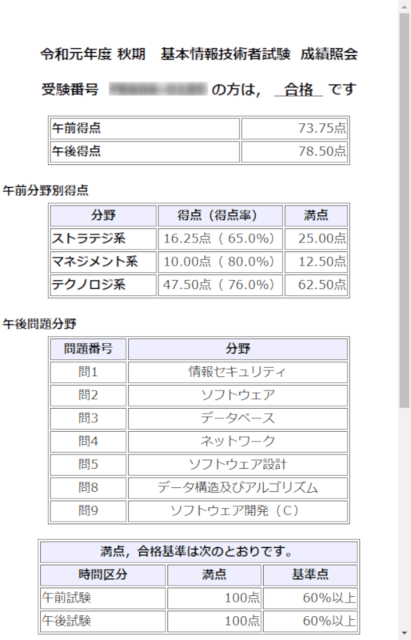
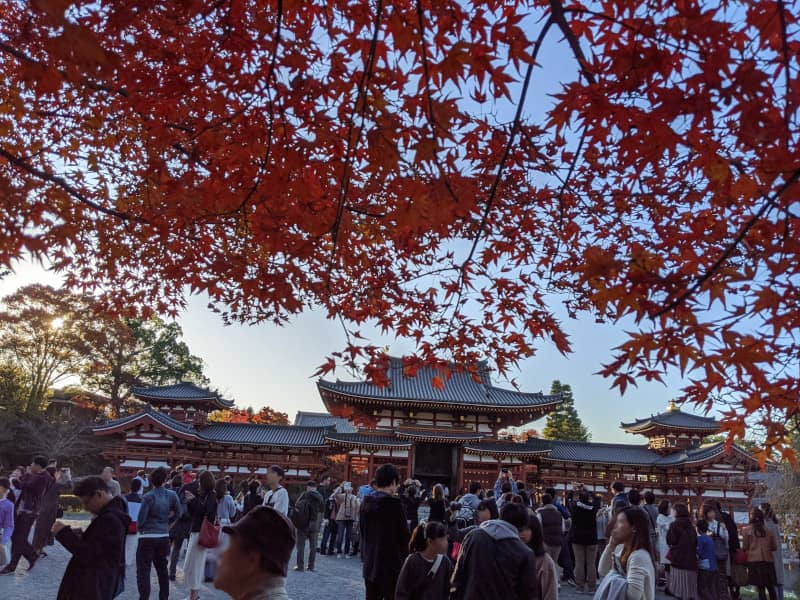
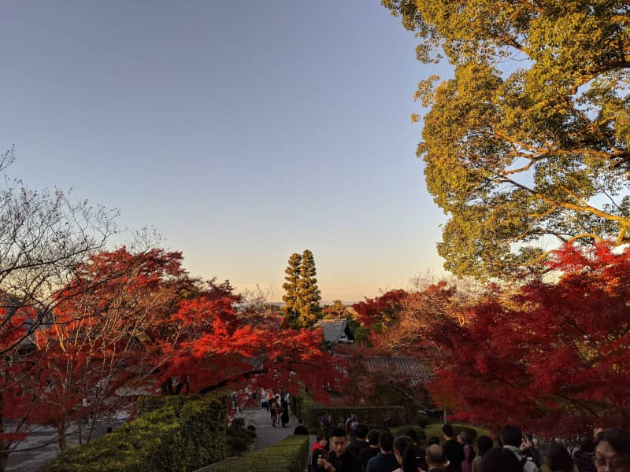
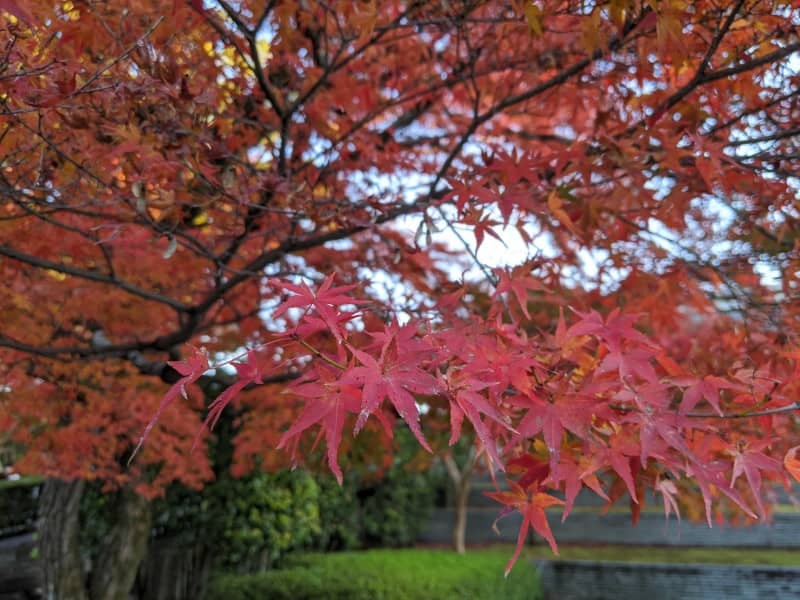

こんにちは。最近、平等院鳳凰堂の紅葉を見に行った k-so16 です。夕暮れ時に見る紅葉は紅さが際立ち、非常に綺麗でした。

[基本情報技術者試験を受験](https://mseeeen.msen.jp/took-fe-2019-autumn-exam/) してから 1 ヵ月、合否結果が出ました。本記事では合否結果や、成績内容に関する所感について述べていきます。

## 成績内容
タイトルにも記述したように、無事 **合格** しました。午前試験は配点が公開されているので、自己採点でパスしていたのは分かっていたのですが、午後試験は配点が不明なので合否が分からず、合否発表の日までのお楽しみになっていました。

成績照会の画面には午前試験、午後試験それぞれの得点と、午前試験の問題の分類 (ストラテジ系、マネジメント系、テクノロジ系) それぞれの得点が表示されます。午後試験は選択した問題の分野が表示されます。配点が公開されていないからかもしれませんが、午後試験の点数は表示されません。 **午後も問題ごとに点数を知りたかった** ので、少し残念でした。

## 所感
合否だけで見れば、ひとまず合格できたので良かったのですが、点数を見ると **勉強不足** を改めて感じさせられます。 [以前の記事](https://mseeeen.msen.jp/took-fe-2019-autumn-exam/) にも記載しましたが、午前試験は直近の過去問を 3 回分、午後に関しては直近の過去問を 1 回分しか解いていなかったので、勉強量が足りなかったことをまざまざと実感する結果でした。私自身、大学で **ソフトウェア工学** を学んでいたので、多少の基礎知識は身についているつもりでしたが、出題範囲が広く、自身の知識量や理解がまだ十分ではないと実感しました。

試験を受験した際や自己採点をした際に、いくつかの分野について、理解が浅いと感じました。私の場合、今回の試験で以下の内容について理解が浅いように感じました。

- 数学・統計学
- ハードウェア (回路素子) の特性
- データベースの 2 相ロック
- 公開鍵暗号方式の仕組み
- セキュリティマネジメント・経営戦略全般

理解が浅い分野が浮き出たので、試験対策としてではなく、 **本質の理解** を目指したいと思います。試験の合否も重要ですが、それ以上に出題内容について本質を理解していることが大切だと考えています。本質を理解していれば応用も効きますし、技術を適材適所で利用できるようにもなります。技術者試験に合格した技術者としてではなく、 技術者試験を合格して **内容を活用できる技術者** になれるよう、精進していきたいと思います。 **応用情報技術者試験** を受ける際には、対策をしつつ、どのような知識や理解が不足しているかを把握して、きちんと身につけていきたいと思います。

## おまけ
平等院鳳凰堂の紅葉が非常に綺麗だったので、紅葉の様子を掲載します。秋は夕暮れ。

シーズンということもあり、平等院鳳凰堂は夕方頃であるにも関わらず、観光客で賑わっていました。本来は昼頃に見に行く予定でしたが、出発が遅くなったので夕方ごろの到着になりました。非常に綺麗な夕暮れとモミジの紅さを見ることができたので、到着が後ろにずれたのはラッキーだったかもしれません（笑）