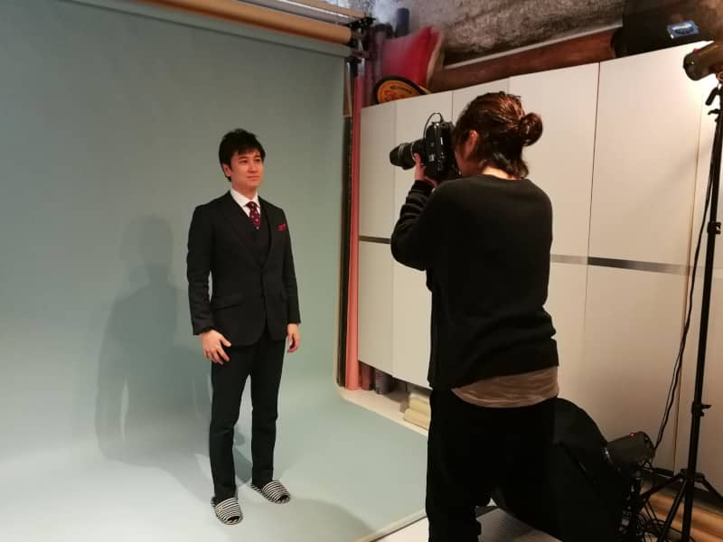

はじめまして。
2月から新しくMSENのメンバーに加わった **k-so16** と申します。

それぞれの名刺に貼るための個人写真と、MSENメンバー全員の集合写真を撮影してまいりました。
本記事では、その撮影時の雰囲気を写真を添えてお伝えします。

## 撮影風景
まずは撮影場所に向かうために、オフィスで集合し、心斎橋にある [スタジオリブ](https://www.studio-lib.com/) さんまで全員で移動しました。
撮影の準備ができるまでしばらく待機。

### 個人撮影
先にそれぞれ個人の写真を撮影しました。
カメラマンの方に体の角度や表情などの指示を受けながら撮影をし、それぞれ良いと思った2枚を選択しました。
私自身はカメラに映りなれてなくて、ちゃんと口角が上がっているか不安でしたが、実際に撮影されたものを見たらいい表情になっていて安心しました。

### 集合写真
メンバー全員の個人撮影が終わったあと、集合写真を撮影しました。
全員いい笑顔で撮影できたのではないかと思います。

## 昼食
撮影後、写真が出来上がるまでに少し時間があったので、心斎橋にある「[アマーク・ド・パラディ｜Hamac de Paradis](https://www.hamac-de-paradis.jp/)」というビストロで昼食をとりました。
メニューはどれも美味しそうで、何を注文するか悩ましかったです(笑)

ちなみに、私は日替わりパスタランチのナポリタンを注文しました。

## 写真の確認
写真を受け取った後は、オフィスに戻り、選んだ2枚のうち、どちらを名刺に使用するかの確認をしました。
名刺のデザインは [kenzauros](/category/articles-kenken-wrote/) さんが作成し、みんなでそれぞれの名刺の出来上がりのイメージを確認しました。

## 夕食
写真の確認と業務を終えて、全員で「[和牛焼肉 布上](http://nunogami.jp/)」で夕食をとりました。
美味しい焼肉とお酒とともに雑談をし、楽しい時間を過ごしました。

## まとめ

和気藹々とした雰囲気で写真撮影ができたと思います。

新たにMSENのメンバーとして加わった私ですが、みなさんが非常にフレンドリーで、すぐにMSENの輪に入れたように感じます。

MSENでの業務を通じて、頼られる人材に成長したいと考えております。
そのために、まずは一歩ずつ着実に業務をこなせるように頑張っていきたいと思います。
まだまだ未熟な自分ですが、自分がすべきこと、自分に何ができるかを考えて、自発的に行動できるよう精進して参ります。

### 謝辞
今回の撮影で [スタジオリブ](https://www.studio-lib.com/) さんに大変お世話になりました。
この場を借りて感謝申し上げます。

---

## おまけ
撮影スタジオの待合室に、お風呂のアヒルが置いてあったので、[じんない](/category/articles-jinnai-wrote/) さんが手に乗せて1枚パチリ。

