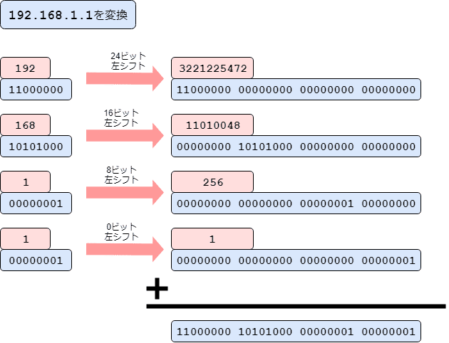

こんにちは。k-so16です。

現在、社内のネットワークで利用されているIPアドレス[^1]の情報を管理するツールを作成しています。そのツールを作成するにあたって、IPアドレスを10進ドット表記と、それを数値に変換したものをデータとして持っておくと、計算処理の際に便利ではないかということで、10進ドット表記から数値に変換する方法を考えてみました。

本記事では、10進ドット表記から数値に変換する方法を紹介していきます。諸事情でIPアドレスから数値に変換しなければいけない方々の参考になればと思います。

本記事で想定する読者層は以下の通りです。

- IPアドレスとサブネットマスクがそれぞれ何かを知っている
- プログラミングでのビット演算について知っている
- ライブラリ関数 `reduce()` の使い方を知っている (言語不問)

## 10進ドット表記から数値に変換
以下では、実際に私が考えついた2つの方法について、それぞれ説明します。

本記事では実装にPHPを用いていますが、他の言語でも同様に実装が可能です。なお、変数  `$ip` は10進ドット表記の文字列が入っている変数とします。

### 手法1: 書式指定と型変換でゴリ押し
#### 実装
```PHP
intval(vsprintf("%02x%02x%02x%02x", explode(".", $ip)), 16);
```

#### 解説
1. IPアドレスの文字列をドットで分割し、各オクテットが入った配列を生成
  - PHPでは、[`explode()`](https://www.php.net/manual/ja/function.explode.php)を利用することで、指定したセパレータによって文字列を分割できます。
    - `explode(".", "192.168.1.1")` → `[ 192, 168, 1, 1 ]`
2. 各オクテットの数値が入った値を16進数に書式指定して、文字列として連結
  - [`sprintf()`](https://www.php.net/manual/ja/function.sprintf.php)では、第2引数以降は可変長引数なので、配列を可変長引数の代わりにするために、[`vsprintf()`](https://www.php.net/manual/ja/function.vsprintf.php)を利用します。
    - `vsprintf("%02x%02x%02x%02x", [ 192, 168, 1, 1 ])` → `"c0a80101"`
3. 2.で得られた16進数の文字列を数値変換
  - [`intval()`](https://www.php.net/manual/ja/function.intval.php)を用いることで、文字列を数値に変換します。デフォルトでは10進数の文字列をパースしようとするので、16進数であることを伝えるために、第2引数に `16` を与えます。
    - `intval("c0a80101", 16)` → `3232235777`


### 手法2: オクテットごとに分解して再帰的にビット演算で変換
#### 実装
```PHP
array_reduce(explode(".", $ip), function($carry, $octet) {
  $carry <<= 8;
  
  return $carry | intval($octet);
}, 0);
```

#### 解説
1. IPアドレスの文字列をドットで分割し、各オクテットが入った配列を生成
  - 手法1の手順1と同じなので、省略します。
2. 再帰的に前のオクテットまで数値化したものを8ビット左シフトし、現在のオクテットを数値化したものとのビット論理和を算出
  - [`array_reduce()`](https://www.php.net/manual/ja/function.array-reduce.php)を利用して、各オクテットに分割した配列の要素ごとに次の処理を行います。
    1. 前までの計算結果(実装例では `$carry`)を8ビット左シフト
    2. `$carry` の下位8ビットに現在のオクテット(実装例では `$octet`)を適用するためにビット論理和を算出 (算術演算の `+` でも可)

例として、 `192.168.1.1` を数値に変換します。図1は、上記の手法の挙動を図示したものです。

 によるIPの数値化方法")

#### Collectionによる実装 (Laravel版)
[kenzauros](https://github.com/kenzauros)さんに、ナウでいかしたプログラマ風の実装として、Collectionを利用する方法についても教えてもらいました。
```PHP
collect(explode(".", $ip))->map(function ($octet, $index) {
  return $octet << (24 - 8 * $index);
})->sum();
```

#### 解説
1. IPアドレスの文字列をドットで分割し、各オクテットが入った配列をCollectionに変換
  - Laravelでは、 [`collect()`](https://readouble.com/laravel/5.5/ja/collections.html)を用いることで、配列をCollectionに変換できます。
2. 各オクテットがそれぞれのビットの範囲に来るように左シフト
  - [`map()`](https://readouble.com/laravel/5.5/ja/collections.html#method-map)によって、第1オクテットが先頭8ビット、第2オクテットがその次の8ビットに、というように各オクテットを左シフトします。
3. 左シフトした各オクテットの総和を算出
  - [`sum()`](https://readouble.com/laravel/5.5/ja/collections.html#method-sum)で第1オクテットから第4オクテットまでのそれぞれの数値の総和を求めます。

`array_reduce()` と同様に `192.168.1.1` をCollectionを用いて数値に変換する挙動を図2に示します。




## 誰かライブラリ化してないのか
頑張って10進ドット表記から数値に変換する方法を考えましたが...

なんと、すでにPHPの標準ライブラリで [`ip2long()`](https://www.php.net/manual/ja/function.ip2long.php)[^2]という関数が準備されていることを、[きよしん](/category/articles-kiyoshin-wrote/)さんに教えてもらいました... (トホホ)

わざわざPHPで実装したくない方は、 `ip2long()` を利用しましょう(笑)

[^1]: 本記事でのIPアドレスは、IPv4のみを扱うものとする
[^2]: IPアドレスとして不正確でも動作するので、ちゃんとバリデートしたい場合は避けたほうが無難 (詳細は[ドキュメント](http://publibn.boulder.ibm.com/doc_link/en_US/a_doc_lib/libs/commtrf2/inet_addr.htm)を参考のこと)