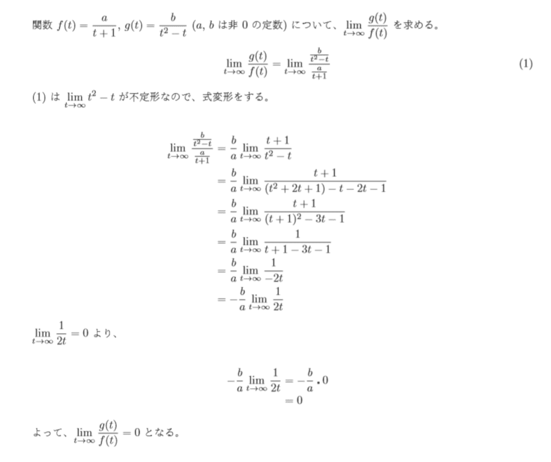
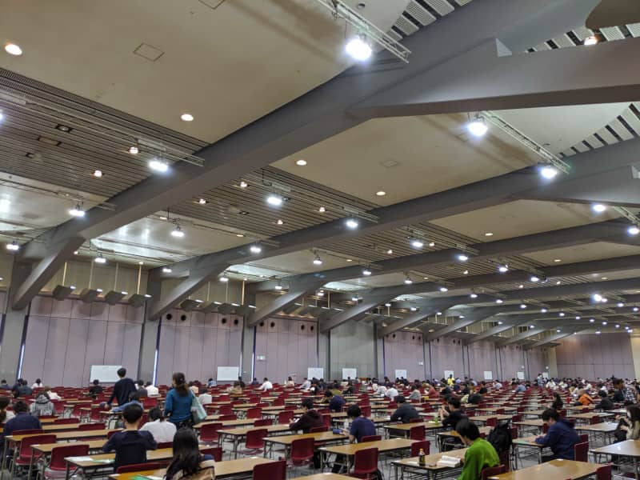

こんにちは。最近、 [Blender](https://www.blender.org/) を使って 3D モデリングに挑戦してみたいと思っている k-so16 です。スポーツカーの 3D モデルを自作して、 Unity 上でモデルを動かしてみたいなぁと考えています。

10/20 に実施された [基本情報技術者試験](https://www.jitec.ipa.go.jp/1_11seido/fe.html) (以下、基本情報と記述) を受験してきました。本記事では、私が基本情報を受験した感想と、苦戦したことについて紹介します。

## 事前対策
試験に備えて、試験 1 週間前の連休の 1日と、 前日の土曜日に過去問を解いて対策しました。午前試験に関しては、出題範囲が思った以上に広く、技術系の知識を問う問題でも分からないものもあったりしました。マネジメント系とストラテジ系に関しては、知識不足が如実に現れました。知識不足を補うためにも、午前試験の過去問は 3 回分解きました。

午後試験については、時間の兼ね合いもあり、 1 回分しか過去問を解けませんでした。解いた時は、文章の内容と文意がちゃんと読み取れれば、そこまで難しい問題ではなさそうと感じました。アルゴリズムの問題では、文意が読み取れなかったり、記述されているアルゴリズムの文法が若干読みにくかったりで、意外と苦戦しました。

申し込んでから試験直前までの間、色々とやりたいことの誘惑に駆られていたので、事前対策がかなり疎かになっていました。それでも、午前試験に関しては事前知識と補完した知識でそこそこなんとかなるだろうし、午後もなんとかなるだろうと思い、試験に臨みました。

## 試験当日
### 午前試験
算数や数学の問題が結構大変でした。特に、高校数学の極限を求める問題の計算が大変でした。多項式の式変形の計算が苦手なので、かなり大変だなぁと思いながら解いていました。計算が非常に苦手なことが起因して、数値計算や多項式の変形であったり、連立方程式を解いたりで思ったより体力と時間を消費しました。

知識を問う問題は、そこそこ解けたと思います。幾つかは初めて聞いた用語で、完全に勘に頼ったりもしましたが、感触は悪くありませんでした。回答の見直しも含めて、 2 時間半丸々利用しました。

### 午後試験
日本語の読解と算数と数学が非常に難しかったです。文意を理解するまでに少し時間がかかった上、計算で値を求めたり、選択肢から正しいものを導き出すために計算が必要だったりしたので、時間は足りませんでした。文章の読解と計算の両方が遅いと、かなり骨の折れる試験内容だったように感じます。

問題の内容としては、ゆっくり文章を読み込んで、電卓などで正しく計算できれば解けそうかなとは感じました。ただ、悠長に問題文をゆっくり読む暇はないので、かなり急いで解いたのと、計算に手間取ったことから、正解を選べている自信はあまりありませんでした。見直す時間もなかったので、かなりいっぱいいっぱいでした。アルゴリズムの問題に関しては、文意が読み取れきれず、完全には解けませんでした。

計算で手間取ったこととしては、テストケースの値をそれぞれ求める計算 (問 5) が大変だったことと、極限の問題 (問 2) とアルゴリズムの問題 (問 8) で値の計算が合わない焦りで、試験終了時は完全に疲れ切っていました。脳がオーバーヒートしたような感じでした。

## 所感
午前試験の手応えは悪くありませんでした。一方、午後試験については、問題をしっかり読み込めていないことと、時間に余裕がなかったことから、あまり自信はありません。答え合わせはしましたが、午後試験の配点が分からないので、合否判定の日までのお楽しみです。

今回が初めての情報技術者試験の受験でしたが、技術より国語と算数で苦戦していたように感じました。基礎学力がいかに大事か、よく分かりますね（笑） 私は大学でソフトウェア工学を学んでいたので、基本情報くらいは余裕だろうと高を括っていましたが、出題範囲が広いこともあり、意外と侮れないと感じました。

次の基本情報に関する記事は、「基本情報技術者試験に合格しました」または「基本情報技術者試験にリベンジしてきました」のどちらかを執筆予定です。前者が執筆できることを祈っていますが、それは試験の結果次第です（笑） お楽しみに。