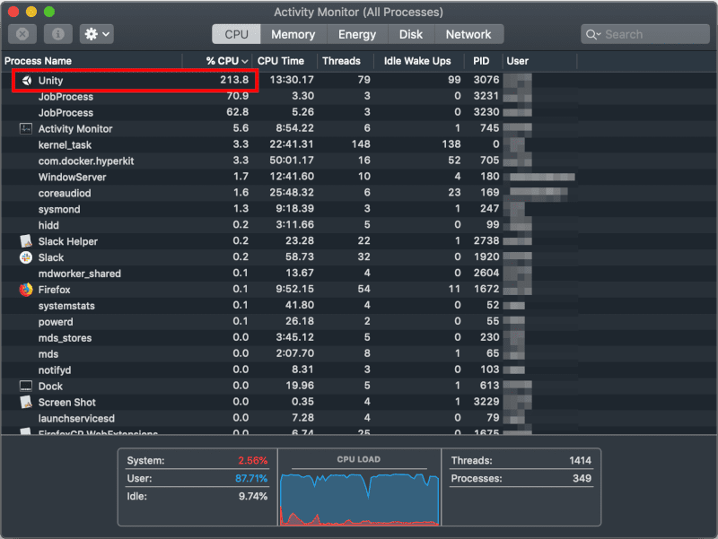

こんにちは。最近、久々に [バッティングセンター](https://www.daitoyo.co.jp/business/amusement/batting/) に行ってきた k-so16 です。 1 ゲーム 20 球で、各ゲームの間に休憩を挟みながら 3 ゲーム打ってきたら、翌日筋肉痛になりました（笑）

個人的な興味で、最近 [Unity](https://unity.com/ja) を触り始めました。開発環境には [Macbook Pro](https://www.apple.com/jp/macbook-pro/) を利用しているのですが、 Terrain という要素を入れると、どうにもファンが急にうるさくなり、気になってしかたありません。アクティビティーモニタを確認すると、 Unity のプロセスが CPU を 200% 以上も食いつぶしていました。これでは MacBook Pro が心配すぎて私の心臓にも悪く、 Unity の勉強が捗りません。

本記事では、 Terrain を導入した際に CPU の使用率を食いつぶす時の対処法を紹介します。

本記事の想定読者は以下の通りです。

- Unity の 3D を軽く触ったことがある
- Unity の [チュートリアル](https://unity3d.com/jp/learn/tutorials/s/roll-ball-tutorial) を進める際にはマシンが重くならない

## 開発環境のスペック
私の Macbook Pro のスペックは以下の通りです。

- MacBook Pro 13-inch, 2017, Two Thunderbolt 3 ports
- CPU: Intel Core i5 2.3 GHz
- メモリー: 16GB
- GPU: Intel Iris Plus Graphics 640 

本記事執筆時に動作確認をした Unity のバージョンは 2019.2.7f2 です。

## 対処法
変更する設定は、 Lighting Setting の Auto Generate を無効にするだけです。設定手順は以下の通りです。

1. メニューバーから Window > Rendering > Lighting Setting を選択

    

1. 設定画面から Scene タブを選択して Auto Generate を無効化

    

私の環境では、 Auto Generate を無効にするだけで、 CPU の使用率が劇的に下がりました。この方法は、以下の書籍のコラムに掲載されていました。

> "[Unityの教科書 Unity2019完全対応版 &emsp; 2D&3Dスマートフォンゲーム入門講座](https://www.sbcr.jp/product/4815602543/)", 北村 愛実 著, SB Creative, 2019

## まとめ
本記事のまとめは以下の通りです。

- Unity の Terrain が重い際の改善方法を紹介
    - Lighting Setting の Auto Generate を無効化

以上、 k-so16 でした。3D を動かすと、気持ちもマシンも熱くなりますね（笑）
