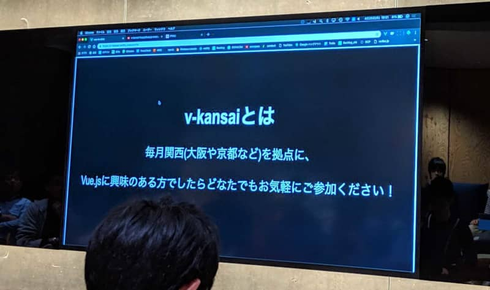
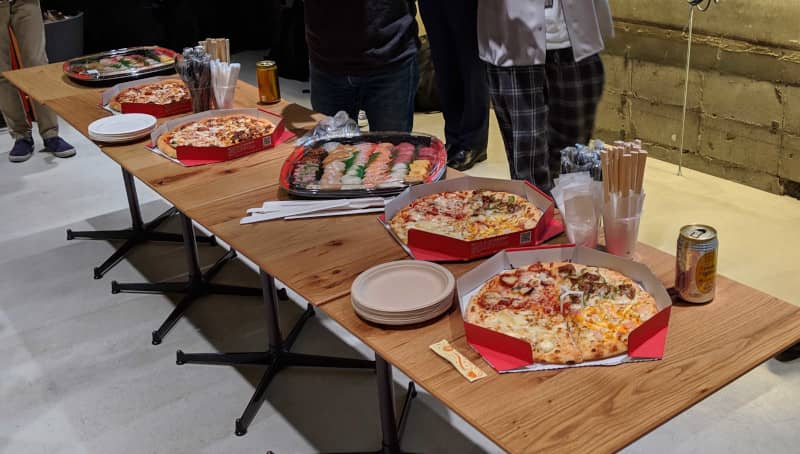

こんにちは。最近、[MacBook Pro](https://www.apple.com/jp/macbook-pro/)を購入した k-so16 です。

2019/4/25に開催された[v-kansai Vue.js/Nuxt.js meetup #5](https://vuekansai.connpass.com/event/122664/)に参加してまいりました。本記事ではそのmeetupについて紹介します。

人生初めてのmeetupへの参加で、さらにVue.jsもまだかじった程度[^skill]なので、本記事では、初心者目線から見たmeetupの紹介となっております。

## meetupの概要
v-kansaiでは、主に京都や大阪で、Vue.jsおよびNuxt.jsに関する勉強会です。初心者から尖った人まで、Vue.jsに興味を持つ人は誰でもWelcomeというスタンスのmeetupです。

[caption id="attachment_9798" align="aligncenter" width="800"] v-kansaiについての紹介 (オープニングにて)[/caption]

今回のmeetupでは、次の内容の発表を聞きました。

- CSS設計(FLOCSS)でVueコンポーネントを設計
- 登壇者にフィードバックするツールの紹介
- Vue.jsのリアクティブシステムの探求
- AMPScriptをVue.jsで試す方法の紹介
- Vue.js初心者がでSPAを作った話

他にも、色々な発表がありました。個人的に、最も面白かった発表は、Vue.jsのリアクティブシステムを探求する話でした。Vue.jsでは、リアクティブシステムを当たり前のように利用しますが、その発表者の方は、Vue.jsは本当にリアクティブシステムなのかを疑問に持ち、サンプルコードを動作させて、どのように変化するかを確認していました。この登壇者の方の探求心は、私も見習いたいと思いました。

## 懇親会
登壇者の発表が終わった後、懇親会でピザやお寿司を食べながら、参加者の方々との親睦を深めました。外部のエンジニアの方々と話すことが出来て、非常に良い機会になりました。登壇者へのフィードバックや、普段使っているフレームワークについてなどの情報交換をしました。

[caption id="attachment_9799" align="aligncenter" width="800"] 美味しくて楽しい懇親会[/caption]

参加者の方々とお話させていただいたところ、やはりLaravel と組み合わせて使用されている方が多くいらっしゃるように感じました。この点については、他の参加者も同じ感想をお持ちでした。因みに、私も個人的にLaravelとVue.jsを勉強しています。

## 所感
知らない技術が多く、話についていくのは大変でしたが、非常に良い刺激になりました。今回のmeetupで初めて聞いた技術も多かったので、少しずつ調べて、特に自分が興味を持った技術については、より深く調べたり、実際に使ってみたいと思います。

今回のmeetupでは、Vue.js初心者の方も登壇されていたので、私も積極的に登壇したいと一層強く思うようになりました。ということで、意を決して、5/22開催の[[Monaca UG 共催] v-kansai Vue.js/Nuxt.js meetup #6](https://vuekansai.connpass.com/event/126754/)に登壇します。学生時代に作成した、Vue.jsとElectronを利用したデスクトップアプリケーションについて話す予定です。参加者の方々は、当日よろしくお願い致しますm(_ _)m

[^skill]: 参考書を買ってからおよそ6ヶ月程度だが、本格的に書いたのは1ヶ月程度