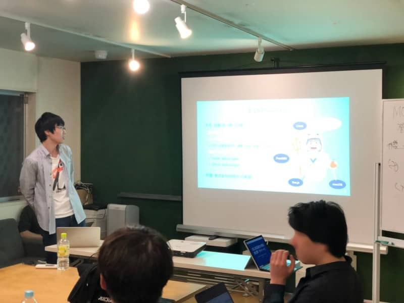

こんにちは。最近、[サーキット場でのカートの運転](https://sportskart.com/maishima.html)に興味がある k-so16 です。

[Vue.jsのmeetupに参加してきました](https://mseeeen.msen.jp/v-kansai-meetup-5th/) の記事では、登壇を宣言しました。本記事では、[[Monaca UG 共催] v-kansai Vue.js/Nuxt.js meetup #6](https://vuekansai.connpass.com/event/126754/)で登壇してきた様子を紹介します。

## 発表内容
私が大学院生の時に作成した、Vue.jsとElectronを用いたデスクトップアプリケーションについて発表してきました。発表資料は[こちら](https://www.slideshare.net/azuki-penguin/vuejselectronvue-147187848?ref=https://vuekansai.connpass.com/event/126754/presentation/)から閲覧できます。

発表した概要としては、以下の通りです。

- CSVファイルをExcelライクなUIで編集できるアプリケーションを作成
    - 作成までの経緯と動機
- 使用したフレームワーク・ライブラリの紹介
    - デスクトップ開発: [Electron](https://electronjs.org/)
    - レンダリングに用いるJavaScriptフレームワーク: [Vue.js](https://vuejs.org/)
    - ExcelライクなUIのコンポーネント: [Handsontable](https://handsontable.com/)
    - CSVのパース: [Papa Parse](https://www.papaparse.com/)
    - 文字コードの自動識別: [encoding-japanese](https://www.npmjs.com/package/encoding-japanese)
- 主要な機能と処理の流れの概要
    - CSVファイルのオープン
        1. メインプロセスからファイルオープンしてレンダラーに内容を送信
        1. レンダラーは受け取ったCSVのテキストをパースしてテーブル用のデータ構造に変換
        1. 変換したデータをExcelライクなテーブルに表示
    - 編集内容の保存
        1. テーブルのデータ構造からCSVのテキストに変換 
        1. 変換したテキストをメインプロセスに送信
        1. メインプロセスは受け取ったテキストをファイルに書き込み

因みに、私の発表順序はまさかのトップバッターでした（笑）どうやら、会場に到着した人から、何番目に発表したいかを決められたようです。私は到着が遅かったので、自動的に発表順が最初になりました。

写真は [Atsushi  🇯🇵 @DevRelCon SF 2019](https://twitter.com/goofmint/status/1131142166351208448) 様より許可を得て転載させて頂きました。この場を借りて御礼申し上げます。

## meetup全体での発表の概要
他の登壇者の方々の発表内容は以下の通りです。

- セッション枠
    - スマホアプリのテスト手法 (バルテスメソッド)
    - スマホアプリのバックエンドをサーバレスで構築
    - Vue.jsとSentryを使ったエラーハンドリング
- LT枠
    - ポートフォリオをAWS Amplifyに移行した話
    - Nuxt.jsの開発環境をVSCodeで構築
    - WebAssemblyをGoでVue.jsっぽく記述 (Vugu)

他の登壇者の方の発表で、Vue.jsとSentryを使って、クライアントサイドで発生したエラーを管理する話が最も面白いと感じました。Sentryを使うことで、どのようなOSやブラウザで発生したエラーなのか、1人のユーザが連続的に発生させたのか、複数のユーザが疎らにエラーを発生させたかなどが分かるらしく、対処すべきかどうかの判断材料にも役立ちそうです。例えば、IEだったら対応しなくて良いとか（笑）

## 懇親会
登壇者のセッション及びLT終了後、[炭火焼き鳥 ちんどん 天三店](http://www.tenjin123.com/shops/%E7%82%AD%E7%81%AB%E7%84%BC%E3%81%8D%E9%B3%A5-%E3%81%A1%E3%82%93%E3%81%A9%E3%82%93-%E5%A4%A9%E4%B8%89%E5%BA%97/)さんで飲んだり食べたりしながら、参加者の方々と様々な話をさせていただきました。実際の開発現場の実態について情報交換を行い、非常に充実した懇親会でした。

今回は[Monaca UG OSAKA #7](https://monacaug.connpass.com/event/126756/)との共催だったので、Vue.js主流の参加者だけでなく、モバイルアプリケーション開発に強い関心のある方々とも交流できる、非常に良い機会となったと思います。私は[Monaca](https://ja.monaca.io/)という技術を初めて耳にしたので、非常に勉強になりました。

## 所感
初めての登壇[^presentation]ということもあり、楽しみ半分緊張半分でした。インプットしたものを外部にアウトプットする良い経験が出来たと思います。

今回の登壇では、初心者目線での発表内容でしたが、開発の経験を重ね、よりチャレンジングな内容の発表で登壇できるようになりたいと思います。開発経験を重ねつつ、適宜インプットしたものを積極的に外部にアウトプットもしたいと考えています。もし勉強会などで、本記事の読者の方々のお世話になることがあれば、その際は何卒宜しくお願い致します。

## おまけ
実は、[きよしん](https://mseeeen.msen.jp/category/articles-kiyoshin-wrote/) さんも、一般参加枠で今回のmeetupに参加していました。

今回のmeetupは、先に [きよしん](https://mseeeen.msen.jp/category/articles-kiyoshin-wrote/) さんが聴講者として応募して、その後に私が登壇者として応募しました。4月のmeetupに参加するまで、5月のmeetupで登壇枠で参加する予定はありませんでした。4月のmeetupに参加した後、登壇できるネタがあることを思い出し、思い立ったが吉日の精神で、余っていた5月のmeetupの登壇枠に応募しました。

社内でも、登壇するということで、応援もいただけました。これからもコンスタントにアウトプットをして、「登壇はいいぞ」と社内、外部問わず <strike>布教</strike> 啓発していけたらいいなと思います。

[^presentation]: 実は5分程度のLTには[オープンソースカンファレンス2018 Nagoya](https://www.ospn.jp/osc2018-nagoya/)で1度だけ参加済み。[enchant.js でお手軽ゲーム作成](https://www.slideshare.net/azuki-penguin/enchantjs-97708013)という題目で発表