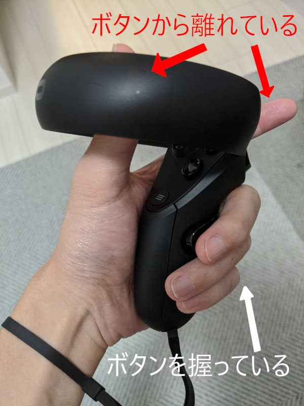

こんにちは。最近、自動車免許の AT 限定を解除した k-so16 です。遂に公道で MT 車を乗り回すことができるようになりました。 (車持ってないけれど)

先日、 Virtual Reality (以下 VR と表記) のヘッドセット ([Oculus Rift S](https://www.oculus.com/rift-s/)) と PC パーツを購入し、 VR の動作環境を整えました。 VR に初めて触れるということで、ひとまず VR の設定を済ませて Oculus のホームプログラムを動かしてみました。

本記事では、 k-so16 が VR の世界に飛び込んだ時の感想を紹介します。

## 事前準備
私の場合、 PC で VR ヘッドセットを動かすための環境が整っていなかったので、ヘッドセット以外に、以下のものを購入しました。

- [Windows 10 Pro](https://www.microsoft.com/ja-jp/p/windows-10-pro/df77x4d43rkt/48dn?icid=Cat-Windows-mosaic_linknav-2-WindowsPro-ja_jp&activetab=pivot%3aoverviewtab)
    - VR ヘッドセットの対応 OS が Windows 10 のみ
        - DSP 版として、 SSD とともに購入
- [NVIDIA GeForce GTX 1060](https://www.nvidia.com/ja-jp/geforce/products/10series/geforce-gtx-1060/)
    - VR ヘッドセットの 推奨環境

私の購入した Oculus Rift S は、 **対応する OS が Windows 10 のみ** であり、個人用の PC にはインストールされていなかったので、 SSD とともに Windows 10 のライセンスを購入しました。グラフィックボードについては、 Oculus 社が示す最小環境の性能にも届かなかったので、推奨とされるグラフィックボードを購入することにしました。個人用の Windows PC 環境を組み立ててから約 5 年ほど経過しているので、パーツの買い替えの機会としては良かったのかもしれませんね（笑）

パーツが届いてから PC の SSD と グラフィックボードを取り替えて、 Windows 10 のインストールやグラフィックボードのドライバのアップデートを行いました。 VR のドライバのインストールもし、ドライバの更新が終わった後、ヘッドセットのセットアップも行いました。

## 仮想空間の中
早速ホームプログラムを実行し、 VR ヘッドセットを被って仮想空間に入ります。 Oculus のホームプログラムは、デフォルトで 3 つのチュートリアル用のプログラムを準備してくれているので、ホーム以外で仮想空間の探検や操作の練習ができます。また、 [Google Earth VR](https://www.oculus.com/experiences/rift/1513995308673845/) が無料でダウンロードできるので、 VR でちょっとした世界旅行気分を味わってみるのもいいかもしれませんね（笑）

**仮想空間の中にいる感覚** という言葉の意味を自身の体で体感しました。単にヘッドセットの映像が振り向いた方向に合わせて見えているのではなく、実際に映像の中にいる感覚でした。例えば、壁が目の前やすぐ横に見えたら、ただ映像として見えているだけでなく、実際に壁が近くにあるように感じました。自分が仮想空間の中にいるという点で、映画 [スパイキッズ 3-D : ゲームオーバー](https://www.cinematoday.jp/movie/T0001664) の世界観が近いと思います。

仮想空間を体験して、注意すべきと感じた点を以下に列挙します。読者の方で VR を体験する機会があれば、留意して楽しんでいただければと思います。

- **仮想空間の中で見えている壁にもたれかからない**
    - 現実世界に壁はないので転倒する恐れがあり危険です。
- **コントローラーのストラップをしっかり止めて十分なプレイスペースを確保する**
    - 腕を振り回す際に手からコントローラーが離れてしまった場合に危険です。
    - プレイスペースが狭いと人や壁、物などに手が当たる恐れがあり危険です。
- **ヘッドセットと PC を繋ぐケーブルを中に浮かせない**
    - ケーブルが足に引っかかった際に転倒する恐れがあり危険です。

## Oculus Rift S のコントローラー
仮想空間の中にいる感覚を実現させているのは、ヘッドセットだけではありません。 Oculus Rift S のコントローラーは 仮想空間の中で指先の動きも現実世界とリンクします。

コントローラーは 左手用と右手用があり、ボタンもいくつか付いています。当然、ボタンを押せば操作が効くのですが、 **ボタンに触れているかを検知** するセンサもついているようです。 Oculus のホーム画面では、コントローラーを VR 越しに見ると自分の手として見えるのですが、各ボタンに触れているか否かで、指を曲げているか伸ばしているかが変わります。実際の手の動きと同じように動くのがすごいと感心していました。

[caption id="attachment_11328" align="alignnone" width="600"] ボタンに触れている指のみ曲がる (画像は笑うセールスマンのマネ)[/caption]

[caption id="attachment_11470" align="alignnone" width="600"] コントローラーのボタンに触れているかが VR にリンクしている[/caption]

[caption id="attachment_11471" align="alignnone" width="800"] 別角度から撮影[/caption]

VR の中で指を曲げることができるので、当然、 **仮想空間の中のオブジェクトを掴むこともできます。** 私の場合、操作の感覚が自身の体に馴染むまでに少し時間がかかりましたが、比較的直感的に操作できると思います。

[caption id="attachment_11472" align="alignnone" width="800"] VR の中の物を掴んでいる様子[/caption]

## 所感
実際に自分が仮想空間に入り込んでいる感覚なので、 **シミュレーション** で非常に役立つのではないかと感じました。例えば、自動車教習に運転シミュレーションがありますが、 VR を用いることで実際に車の中で運転をしているような感覚が得られそうです。

VR は自分が想像していたよりはるかに凄い技術だと実感しました。現実世界で頭を動かすと、仮想空間の視界も **現実世界で動いた分だけ変わる** ので、臨場感がありました。視界だけでなく、腕も動かした分だけ仮想空間内でも動き、指先の動作もある程度現実世界に合わせて仮想空間でも動くので、ただ仮想空間を傍観しているだけではなく、 **自分自身も仮想空間の中の構成員になった気分** が味わえました。

操作中は自室でずっと「おー」、「すごい」と独り言を呟きながら、時に感動のあまり笑いながら VR の世界を堪能していました。ヘッドセットを被って腕を奇妙に動かしながら、時折呟いたり笑ったりしている光景は側から見たら非常に怪しい光景ですが(笑)

おそらく文章やスクリーンショットだけでは伝わりづらく、大袈裟に誇張してるのではと思われるかもしれませんが、百聞一見に如かずです。 VR 体験コーナーが身近で開催されていれば、体験してみてはいかがでしょうか。

以上、興奮冷めやらぬ k-so16 でした。
