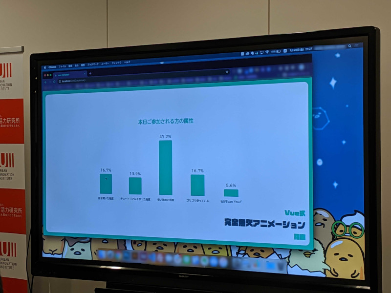

こんにちは。最近、 [愛宕神社](http://atagojinjya.jp/) に行ってきた k-so16 です。清滝の参道から歩いて参拝してきましたが、下調べが甘く、片道2時間の登山をして、しんどい思いをしました（笑）また次も参拝するかは正直微妙です...

2019/7/27 に開催された [VueJS Osaka #2](https://vuejs-osaka.connpass.com/event/136805/) に参加してきました。本記事では、そのイベントについて紹介します。

## 概要
VueJS Osaka は 今年の5月から始まった、Vue.js に関する、新しい勉強会グループです。先日参加した [v-kansai](https://vuekansai.connpass.com/) 同様、初心者も Welcome なスタンスの勉強会です。

今回は以下の内容を聴講しました。

- セッション枠
    - Transition を用いたアニメーションの動かし方
    - Vue.js と Firebase を用いたアプリケーション開発
- LT枠
    - Vue.js と TypeScript
    - Vue.js のエラーハンドリング
    - Vue.js 初心者が単一コンポーネントファイルを動かせなかった話

Vue.js と Firebase を用いたアプリケーション開発についての発表では、Firebase と Vue.js の相性の良さが説明されていました。 Firebase のストレージサービスである Firestore は、データが更新された際に、クライアントがリロードをしなくても、リアルタイムの更新内容を受け取れます。この性質を Vue.js のリアクティブシステムと組み合わせることで、サーバー/クライアント間でのデータバインディングが容易に実現出来るとのことでした。ちなみに、登壇者の方は、 Firestore とクライアントの双方向データバインディングであることと、 データとビューの双方向バインディングであることから、 Firestore と Vue.js の **超双方向データバインディング** と名付けていました（笑）

## 懇親会
懇親会では、様々なバックグラウンドのエンジニアの方々とお話させていただく機会があり、とても良い刺激になりました。中にはデザイナーの方もいらっしゃり、デザイナー界隈についても知ることが出来て、貴重な経験になったと思います。

Vue.js 以外にも、 Firebase や バックエンド (Laravel や Ruby on Rails) についての議論も白熱しました。様々な話を聞いたり、議論できたので、懇親会は自分にとって非常に有意義なものとなりました。

## 所感
今回は聴講者として参加しましたが、 v-kansai の時と同様に、知らない技術についての知見が得られて良い機会になったと思います。特に Firestore を用いることで、リアルタイムにサーバー側のデータ変更を検知出来るのは魅力的に感じ、使ってみたいと思いました。

今回は聴講側でしたが、次回以降では、 v-kansai の時と同様に、積極的にアウトプットしたいと考えております。関西のエンジニアの勉強会を盛り上げる一端を担えるよう、日々精進してまいりますので、今後とも宜しくお願い致します。