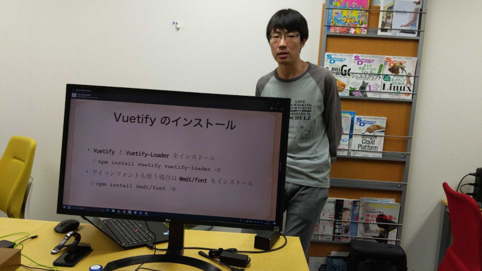

こんにちは。最近、 [久石譲](http://joehisaishi.com/index.php) の [MelodyPhony](https://www.universal-music.co.jp/hisaishi-joe/products/umck-1369/) を購入した k-so16 です。[Craig David](https://www.craigdavid.com/) や [Red Hot Chili Peppers](https://redhotchilipeppers.com/) などの洋楽も良いですが、久石譲の切ない感じの曲もまた良いものです。

10/15 に開催された [VueJS Osaka #3](https://vuejs-osaka.connpass.com/event/148709/) で「Vuetify を Laravel-Mix でコンパイルしたい」という題目で LT に登壇してきました。 VueJS Osaka は 1 回目と 2 回目はグランフロント大阪で開催されていましたが、今回は場所が変わり、難波で開催されました。私は方向音痴なので、道に迷わないか少し不安でしたが、特に迷うことなく到着できました（笑）

## 発表内容
Laravel で Vuetify を使うまでの導入方法と、実際の利用例について発表しました。 発表資料は [こちら](https://speakerdeck.com/azuki/vuetifywolaravel-mixdekonpairusitai) から閲覧できます。

発表概要は以下の通りです。

- Vuetify と Laravel-Mix の概要説明
- Vuetify の導入方法
    - Vuetify のインストール
    - Webpack の設定
    - Vuetify の設定
    - Vuetify のインポート
- 実際の利用例の紹介とデモ
    - Vuetify コンポーネントの利用例の紹介
    - Vuetify のコンポーネントを利用した Vue ファイルのコンパイルの実演

Laravel は Vue.js をサポートしており、 Laravel-Mix という Webpack のラッパーライブラリを用いることで、 Vue の Single File Component (以下 SFC と表記) を簡単にコンパイルできます。しかし、デフォルトでは Vuetify はサポートしていないので、 Vuetify のコンポーネントを SFC で利用するためには、インストールのほかに、設定もする必要があります。

私自身、 Laravel-Mix で Vuetify がインポートされた SFC をコンパイルするための設定に少し苦労した背景があったので、導入方法を発表することにしました。設定後の SFC での Vuetify の利用方法やコンパイル方法についても紹介し、実際に動作を見てもらうことで簡単に使えることを紹介しました。

## 全体の概要
セッション枠、 LT 枠ともに面白い内容の話を聞けました。新しく知ったこともあれば、まだぼんやりと知っているだけだなぁという知識もあり、自分にとって非常に勉強になる機会でした。

全体での発表の概要は以下の通りです。

- セッション枠
    - Vue3 RFC の紹介
    - Vue.js の機能の紹介
- LT 枠
    - Vue.js とデータ可視化のライブラリ
    - Rails6 で Vue.js を使う話
    - Vue Native に挑戦した話
    - Vue.js と jQuery の比較

Vue3 の RFC の紹介は非常に面白かったです。 Vue3 の RFC のうち、 Function-based Component API が非常に盛り上がっているとのことですが、この RFC の紹介では、あまり目立たない RFC を取り上げていました。

以下の RFC について、概要の紹介と Accept/Reject について説明されていて、今後 Vue3 を使う上で非常に有用な情報のように感じました。

- Global API Treeshaking
    - 利用している Vue の API のみバンドルしてビルド済みのファイルのサイズを小さくできる
        - Vue 2.x 系では利用していない API のコードも Webpack でビルドされていた
    - Accept された
- Proposal for New Slots Syntax
    - `slot-scope` ディレクティブを `v-slot` に統一する
        - props の受け取りの有無に関わらず記法を統一化してスロットの概念を統一化
    - `v-slot` は スロットを渡すコンポーネント自身からのみ定義可能にする
        - どのコンポーネントからスロットで渡された props なのかを分かりやすく記述
    - Accept された
- Proposal for New Dynamic Directive Arguments
    - ディレクティブへの動的なキーの記述を簡潔化
        - `v-on` や `v-bind` に `Object` が渡されることを知っていないと動的なキーを渡せない
        - 内部の処理を効率化可能
    - Accept された
- Implicit Return Initial Values
    - `return` を書いていないメソッドでも `value()` を利用した変数を暗黙的に返却する
    - Reject された
        - メリットが不明
- Dispatch & Broadcast API
    - `$dispatch()` で上位のコンポーネントすべてにイベントを発火させる
    - `$broadcast()` で下位のコンポーネントすべてにイベントを発火させる
    - Reject された
        - Vue1 から Vue2 に移行する際に既に廃止済み

## 所感
まだ前に立つこと自体に慣れていないようで、いざ発表となると緊張して、頭の中が真っ白になっていました。今回は社内で一旦リハーサルをさせてもらったのですが、それでも今回は緊張に押し負けてしまいました。

質疑の時も、頭の中では答えが出ているにもかかわらず、うまく言葉にまとまらなかったのが悔しかったです。あがり症がすぐに治るとは思っていないので、継続的に登壇して、少しずつでも慣れていければと思います。

何度か積極的に登壇していたこともあり、徐々にコミュニティの中で顔見知りの方がいるようになりました。少しずつですが、コミュニティの輪の中に入れているように感じられて嬉しく思います。外部の方々と話すきっかけにもなり、良い刺激を受けられていると感じております。

## おまけ
社内でのリハーサルの様子です。 [社長](https://mseeeen.msen.jp/category/articles-president-wrote/) に <del>盗撮されました</del> 撮影していただきました（笑）

