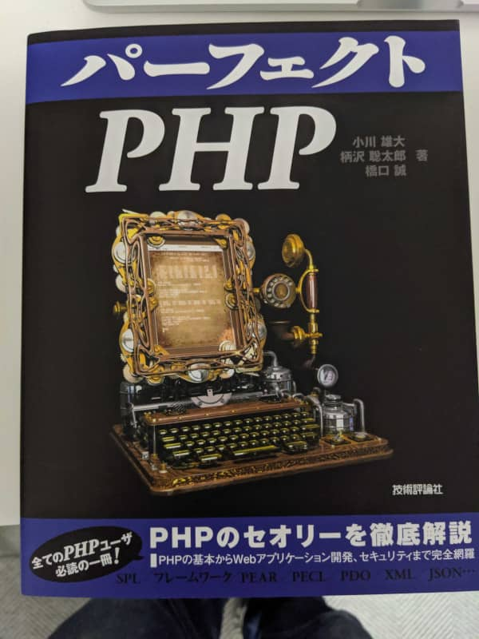

こんにちは。最近、スーパーで見かけた [じゃがりこ 激辛インドカレー味](https://www.calbee.co.jp/shohinkensaku/product/?p=20190911133745) を軽い気持ちで購入して舌が痛い思いをした k-so16 です。大衆向けだろうと油断していましたが、名前の通り激辛でした(笑)

10/30 に開催された Web×PHP TechCafe で「Laravel で Markdown をブラウザに表示する方法」という題目で LT に登壇してきました。これまでは Vue.js に関する勉強会を中心に登壇していましたが、 今回は PHP の勉強会が実施されているということで、初めて参加する勉強会で LT に登壇することにしました。

## 発表内容
PHP で Markdown を HTML に変換するパーサライブラリ [cebe/markdown](https://github.com/cebe/markdown) の紹介と Laravel への導入と使い方について発表しました。発表資料は [こちら](https://speakerdeck.com/azuki/laraveldemarkdownwoburauzanibiao-shi-surufang-fa) から閲覧できます。

発表概要は以下の通りです。

- PHP の Markdown パーサ cebe/markdown の紹介
  - 他の Markdown パーサとの比較
  - インストール方法の説明
  - Markdown を HTML に変換する方法の説明
- Markdown パーサの利用例の紹介
  - Markdown で記事を編集するブログシステムを例に説明

自身の Laravel の勉強のために、 Markdown で記事を編集できるブログシステムを作っていて、その際に利用した Markdown パーサライブラリが便利だと感じたので発表することにしました。 **複数の Markdown の書式** (Traditional / GitHub / Markdown Extra) に対応していること、 Composer 経由でのインストールで **Laravel への導入が簡単** なことが強みではないかと思います。

LT 終了後に、発表内容に興味を持っていただいた方に、実際に動くものでデモを行いました。しばらく開発が止まっている状態だったのと、発表で使ったマシンが開発を進めていたマシンと異なっていたので、ちゃんと動くか少し不安でしたが、特に問題なく動いて安心しました。

## 全体の概要
今回は私以外の発表は 2 件ありました。どちらも面白い内容で、大変勉強になりました。

2 件の発表内容は以下の通りです。

- PHP に Enum がない理由
- 書籍「[パーフェクトPHP](https://gihyo.jp/dp/ebook/2014/978-4-7741-6756-5)」のすすめ

PHP に Enum がない理由の発表では、列挙体 (Enum) がどのようなものかの説明から、 RFC での Enum に関する議論に至るまで紹介されていました。恥ずかしながら、 PHP に Enum がないことを初めて知ったので、大変勉強になりました。標準ライブラリとして `SplEnum` クラスはあるが、実験的の状態から更新されておらず、サードパーティ製の Enum が存在しているということも新しい知見となりました。

PHP に Enum が欲しいという要望は多く、 RFC で 2 回 (2012 年と 2015 年) 議論されていたことも興味深かったです。特に、2012 年の議論では **PHP は緩い型付け言語だから不要** という意見との衝突が多かった一方、 2015 年の議論では **Enum に対して前向きの議論** に変わっていたことが面白いと感じました。 PHP7 から `strict` モードが追加され、厳密な型判定ができるようになったことが起因しているのではないかと考察されていました。

「厳密な型判定が必要なら Java を使えばいいんじゃないの?」というコメントが RFC に寄せられていたように、緩い型付け言語であった PHP は、厳密な型判定が必要でないと考えられていたために Enum がなかったようです。しかし、最近は厳密な型判定にも前向きな意見が多くなったことから、 Enum が PHP に導入される日も遠くないかもしれないとのことでした。

「パーフェクト PHP」の紹介では、書籍のコンセプトについて紹介され、実際に書籍を用いて学習した所感が述べられていました。この書籍では、 PHP で **Web アプリケーションフレームワークを作る** ことでオブジェクト指向とフレームワークの仕組みについて学べるとのことでした。

私自身、 PHP フレームワークを使って開発はしたことがありますが、フレームワークを作ったことはないので、非常に興味をそそられる内容でした。何気なく利用しているフレームワークの仕組みに興味を持ったので、勉強会の帰り際に書店に寄って書籍を買ってしまいました（笑）

## 所感
今回は処理の流れ図の説明などで、説明している部分の図を指差しながら説明できた点は良かったのではないかと思います。表情や声はまだ硬いので、その点については引き続き課題点だと感じています。

発表後、資料の公開を楽しみにしているというお声をいただけたのが非常に嬉しかったです。自分の発表内容に興味を持ってもらえたことが分かり、これからも継続してアウトプットをしたいと思いました。

積極的に複数のコミュニティへ登壇していたこともあり、徐々にコミュニティの方々に顔を覚えてもらえてきたように感じます。同時に新たな繋がりもできるので、ネットワークも広がりつつあります。ネットワークを広げて、様々な知見を得たり、自身の学びを積極的に発信したりできるようになりたいと思います。