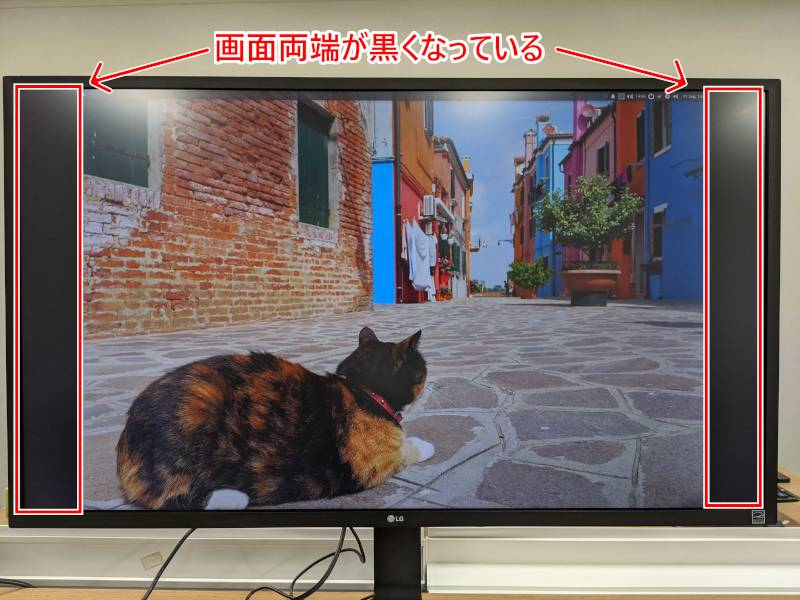
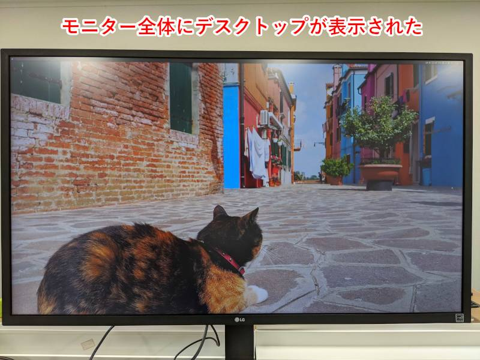

こんにちは。最近、 [GitHub Actions](https://docs.github.com/en/actions) を触ってみた k-so16 です。これを機に CI/CD についてもしっかり勉強したいと思います。

以前、 [Raspberry Pi 4 に Xfce でデスクトップ環境を構築](/setting-ubuntu-desktop-environment-on-raspberry-pi/) したのですが、 4K モニターにデスクトップを表示すると、解像度がフル HD (1920 × 1080) になっており、設定からも 1920 × 1080 以外に選択肢が表示されませんでした。せっかく 4K モニターに繋いでいるので、画面出力の解像度も 4K に対応させたいところです。

本記事では、 Raspberry Pi で解像度を 4K に対応させる方法を紹介します。

本記事で想定する読者層は以下の通りです。

- Raspberry Pi の基礎的な使い方を知っている

## 動作環境

本記事での動作環境は以下の通りです。

- ハードウェア: Raspberry Pi 4
- OS: Ubuntu Server 20.04
- モニター: LG 32UD59-B

## 設定前の画面

モニターは 4K 出力に対応しているのですが、 Raspberry Pi を接続すると以下の画像のように両端が切れてしまいます。解像度を確認したら、 1920 × 1080 になっていました。



## 解像度の設定

設定を変更するには、 **`/boot/firmware/usercfg.txt`** に以下の内容を追記します。

```
hdmi_enable_4kp60=1
disable_overscan=1
```

HDMI で 4K 出力を可能にするには **`hdmi_enable_4kp60=1`** と記述します。さらに、オーバースキャンによって自動で画面サイズを変更されないように **`disable_overscan=1`** も設定に加えます。

これらの設定を書き加えて Raspberry Pi を再起動すると、HDMI 出力での画面出力が 4K になります。



ちなみに、 Raspberry Pi 3 以前は `/boot/config.txt` と **設定ファイルのパスが異なる** ので注意が必要です。


本記事を執筆する上で、以下の記事を参考にしました。

> - [RPI 4 &amp; Ubuntu MATE - Full HD monitor shows as 1824x984 px](https://www.dedoimedo.com/computers/rpi4-ubuntu-mate-fix-screen-resolution.html)
> - [HDMI configuration](https://www.raspberrypi.org/documentation/configuration/hdmi-config.md)

## まとめ

本記事のまとめは以下の通りです。

- Raspberry Pi で 4K 出力に対応
    - 設定ファイルに 4K 出力設定の行を追加

以上、 k-so16 でした。 Raspberry Pi でも 4K をフル活用したい方のお役に立てれば幸いです。