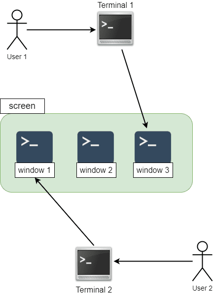

こんにちは、最近、 [Carly Rae Jepsen](https://www.carlyraemusic.com/) のアルバム [Kiss](https://www.carlyraemusic.com/music/kiss) と [Everywhere You Look (The Fuller House Theme)](https://www.carlyraemusic.com/music/everywhere-you-look-fuller-house-theme) を購入した k-so16 です。 Carly Rae Jepsen の曲を聴くと明るい気分になれますね。

リモートのコンピューターに `ssh` でログインして、時間のかかるアップデートを走らせた状態で **いつでもログアウトできる** ようにしたいことがあります。そのような場合に `nohup` コマンドを使う方法もありますが、 再接続した際にコマンドの進捗状況を確認したい場合には `screen` コマンドを利用すると、 **再接続して実行中のプロセスに入り直す** ことができて便利です。

本記事では、 `screen` コマンドとその活用例について紹介します。

本記事で想定する読者層は以下の通りです。

- UNIX/Linux の基礎的なコマンドを知っている。
- `ssh` によるリモートログインの基礎的な知識を有している

## `screen` コマンドとは

**`screen`** コマンドは **端末の画面 (ウィンドウ) を複数のプロセスで共有できるようにするための端末画面管理ソフトウェア**です。 `screen` コマンドを一言で説明するのは少々難しいので、以下では図を併用して説明します。

以下の図のように、 **screen** がそれぞれ **window 1**, **window 2**, **window 3** の 3 つのスクリーンを管理していると想定します。 User 1 は **Terminal 1** を経由して **window 3** に、 User 2 は **Terminal 2** を経由して **window 1** にアクセスするように、ユーザーは端末を経由してそれぞれのスクリーンにアクセスできます。 Terminal 1 経由でアクセスするウィンドウを window 3 から window 1 に切り替えるように、それぞれの端末でアクセスするウィンドウを切り替えることも可能です。



ウィンドウを明示的に閉じない限り、 **端末からスクリーンへのアクセスを切断してもウィンドウ自体が閉じられることはありません。** スクリーンのウィンドウ上で処理中のプロセスがある場合、 **プロセスの実行を継続したままアクセスを切断できます。** さらに、 **切断したスクリーンに再度接続することも可能** です。

例えば、先ほどの概念図の例では、 Terminal 1 から window 3 へのアクセスを切断しても、 **window 3 は閉じられることなく残ったまま** となります。アップデートなどのようにプロセスが window 3 で実行中の場合、 Terminal 1 からのアクセスが切断されても **そのプロセスは継続して実行** されます。再度 window 3 に接続した場合、そのプロセスが進行中の状態 (プロセスが完了している場合はシェルの待機状態) にアクセスできます。

`screen` コマンドはデフォルトでインストールされていない場合がありますので、インストールされていない場合はパッケージマネージャー経由などでインストールする必要があります。

- Debian 系の場合

```bash
apt install screen
```

- RedHat 系の場合

```bash
yum install screen
```

- FreeBSD の場合

```bash
pkg install screen
```

## `screen` の基本的な操作方法

`screen` コマンドの概要について説明したところで、 `screen` コマンドの基本的な操作について説明します。

スクリーンに接続するには `screen` コマンドを実行します。既にスクリーンが生成されている場合は、別のスクリーンとして新しくスクリーンが生成されます。

```bash
$ screen
```

既存のスクリーンに接続 (**アタッチ**) する場合、 `-r` オプションを利用し、アタッチ対象のスクリーンを指定します。スクリーンを指定するには、対象のスクリーンの **PID** を `-r` オプションの引数に渡します。スクリーンが 1 つしか存在しない場合はアタッチ対象を省略できます。スクリーンが既に存在するかを確認するためには `-ls` オプションを利用します。スクリーン名は **`PID.TTY.ホスト名`** の形式で表示されます。

```bash
$ screen -ls
There is a screen on:
        2812.tty0.local        (Detached)
1 Socket in /path/to/socket/screen.

$ screen -r
# PID を指定する場合
$ screen -r 2812
```

既存のスクリーンにアタッチした場合、そのスクリーンでプロセスが実行中であれば、そのプロセスの実行中の出力内容が表示され、特にプロセスが動作していなければシェルのプロンプトが表示されます。

スクリーンとの接続を切断 (**デタッチ**) する際は、 `Ctrl-A` を押した後、 `d` または `Ctrl-D` を押します。 スクリーン内のシェルでプロセスが実行中でも、 **そのプロセスの実行を止めずにデタッチ** できます。例えば、スクリーン上でアップデートが実行中の際にスクリーンをデタッチした場合、アップデートのプロセスの実行は継続されたまま、スクリーンからデタッチされます。

スクリーンを新しく生成したり、スクリーンを切り替えたりするためには、スクリーンのコマンドによって操作します。スクリーン上で `Ctrl-A` を入力することで、スクリーンのコマンドの入力に入ります。

以下の表に基本的なスクリーンの操作コマンドを記載しました。なお、 `Ctrl-A` のように、 Ctrl キーと文字キーを同時に押す場合は、 `C-a` のように表記し、大文字と小文字を区別します。

|コマンド|操作内容|
|:--|:--|
|`C-a` `C-c`|新しいウィンドウの作成|
|`C-a` `p`|前の番号のウィンドウに切り替え|
|`C-a` `n`|次の番号のウィンドウに切り替え|
|`C-a` `d`|スクリーンをデタッチ|
|`C-a` `'`|切り替えるウィンドウの番号を問い合わせ|
|`C-a` `"`|選択可能なウィンドウの一覧を表示 (切り替えるスクリーンの選択も可能)|
|`C-a` `N`|現在のウィンドウの番号とタイトルを表示|

より詳細な操作方法を知りたい方は、 `screen` の man ページをご参照ください。

`screen` コマンドの概要および操作方法については以下の記事を参考にしました。

> [Man page of SCREEN](https://linuxjm.osdn.jp/html/GNU_screen/man1/screen.1.html)

## `screen` の活用例

冒頭でも挙げたように、リモートのコンピューターに `ssh` で接続して、アップデートなどの時間のかかる処理の実行を継続したままログアウトしたい場合に `screen` コマンドを利用すると便利です。プロセスの実行を継続するだけでなく、リモートコンピューターに再接続した際に、スクリーンにアタッチすることで、そのプロセスのウィンドウを再表示できるので、状況確認をしたり、アップデートの途中で設定などの選択肢を問われている際に入力することもできます。

1. リモートコンピューターに SSH などでログイン
1. `screen` コマンドを実行してスクリーンを生成
1. アップデートなどの処理に時間のかかるコマンドを実行
1. `C-a d` を押下してスクリーンをデタッチ
    - 実行中のコマンドの処理は継続される
1. 接続先からログアウト
    - 再接続時に再度スクリーンにアタッチすることでスクリーンのウィンドウが再度表示される

例として、リモートコンピューター (`example.com`) に接続してソフトウェアアップデート (`apt update`, `apt upgrade`) を実行し、アップデート処理を継続したまま一旦ログアウトし、再度ログインしてアップデートの進捗状況を確認するまでの一連の操作を考えます。実行する一連のコマンドおよび操作は以下の通りです。

```bash
[k-so16@local ~] $ ssh example.com # リモートコンピューターに接続
[k-so16@example.com ~] $ screen # 新たにスクリーンを作成
[k-so16@example.com ~] $ sudo apt update
[k-so16@example.com ~] $ sudo apt upgrade # ソフトウェアアップデートを実行
# アップデートの実行中に C-a d を押下
[k-so16@example.com ~] $ exit # リモートからログアウト
[k-so16@local ~] $ ssh example.com # リモートコンピューターに再接続
[k-so16@example.com ~] $ screen -r # スクリーンに再度アタッチ
# 現在のスクリーンのウィンドウの状態が表示される (アップデートが終わっていなければ実行中の出力内容が表示される)
```

## まとめ

本記事のまとめは以下の通りです。

- `screen` コマンドの紹介
    - `screen` の動作概要の説明
    - `screen` の基本的な操作方法の説明
- `screen` コマンドの活用方法の紹介

以上、 k-so16 でした。本記事がリモートコンピューターでの作業をより快適にする手助けになることを願います。