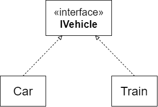

こんにちは。最近、 [Hacknet](https://store.steampowered.com/app/365450/Hacknet/?l=japanese) というゲームを購入した k-so16 です。 [Steam](https://store.steampowered.com/) のウィンターセールで 80% オフで購入できました（笑）

同じ基底クラスを持つ派生クラスや同じインタフェースを実装するクラスについてリストを作成する際に、同じ変数に、条件分岐に応じてリストのジェネリクスに指定する実装クラスを変えたい場合があります。例えば、 `IVehicle` を実装する `Car` と `Train` のリストを条件分岐に応じて代入することを考え、以下のようなコードを記述しました。

```csharp
List<IVehicle> list;
if (Type == "Car")
{
    list = new List<Car>();
}
else
{
    list = new List<Train>();
}
```

このコードに対してコンパイルを通すと、以下のようなエラーが出力されました。

> `型 'System.Collections.Generic.List<Car>' を 'System.Collections.Generic.List<IVehicle>' に暗黙的に変換できません`

実装クラス `Car` のインスタンスをインタフェース `IVehicle` の変数に代入する場合は問題ないのですが、リストの場合は `List<IVehicle>` 自体が **インタフェースではない** ので、 `List<Car>` を代入できません。

本記事では、 **実装クラスのリスト** を **インタフェース型や基底クラスのリスト** として扱う方法を紹介します。以降は実装クラスのリストをインタフェース型のリストとして扱う方法について記述しますが、継承関係についても同様に実現できます。

本記事で想定する読者層は以下の通りです。

- オブジェクト指向のポリモーフィズムについて知っている
- C# のリストについて知っている

## 想定するインタフェースと実装クラス
車両を表すインタフェースを `IVehicle` とし、実装クラスをそれぞれ `Car`, `Train` とします。



**インタフェースのポリモーフィズム** で `Car` または `Train` のインスタンスを `IVehicle` 型として扱うように、 `List<Car>` または `List<Train>` 型のリストを `List<IVehicle>` 型のリストのように扱うことを考えます。


## Linq と IEnumerable&lt;T&gt;
実装クラス `Car` または `Train` のリストをインタフェースのリスト `List<IVehicle>` として扱うためには、リストの各要素を `IVehicle` に変換する必要があります。各要素をキャストするメソッドは `List` にはありませんが、 **[LINQ](https://docs.microsoft.com/ja-jp/dotnet/csharp/linq/)** を利用することで実現できます。

LINQ (Language Integrated Query) は、 **複数のデータ型の操作を、統一的なクエリで記述** することができます。 LINQ を利用することで、配列やコレクション、 XML などそれぞれ構造の異なるデータを同じクエリ式やメソッドチェーンで操作できます。

LINQ で複数のデータを同じクエリで操作するためには、データ型のインタフェースを統一する必要があります。 LINQ では、配列やリストなどのイテレータブルなデータを統一的に扱うために、 `IEnumerable<T>` というインタフェースを利用します。

## 解決方法
実装クラスのインスタンスのリストを、 `IEnumerable<T>` のメソッド **`Cast<TResult>()`** を利用して **リスト内の各インスタンスをキャスト** することで、リストの各要素を `TResult` 型に変換できます。 `Cast<TResult>()` は `IEnumerable<TResult>` を返すので、 `ToList()` で `List<TResult>` 型に変換する必要があります。

```csharp
List<IVehicle> list = new List<Car>()
    .Cast<IVehicle>()
    .ToList();
```

上記のコード例の場合、`Cast<IVehicle>()` によって、 `List<Car>` の各要素が `Car` から `IVehicle` にキャストされます。 `Cast<IVehicle>()` によって `IEnumerable<IVehicle>` が返されるので、 `ToList()` を用いて `List<IVehicle>` に変換します。これで、変数 `list` に `Car` のリストが格納できました。

## まとめ
本記事のまとめは以下の通りです。

- LINQ の `Cast<TResult>` を用いてリストのポリモーフィズムを実現
    - リストの各要素を `TResult` 型に変換
- `ToList()` で `IEnumerable<TResult>` から `List<TResult>` に変換

以上、 k-so16 でした。オブジェクト指向は奥が深いですね。